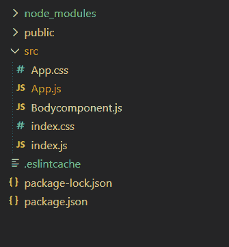
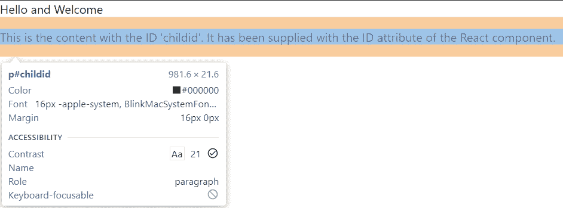

# 如何将 id 属性应用于 ReactJS 组件的子元素？

> 原文:[https://www . geeksforgeeks . org/如何将一个 id 属性应用到一个 reactjs 组件的子元素/](https://www.geeksforgeeks.org/how-to-apply-an-id-attribute-to-a-child-element-of-a-reactjs-component/)

我们可以从 ReactJS 组件的道具中获取 ReactJS 组件的 ID 属性。当我们在 ReactJS 组件中时，我们将使用 *this.props* 代替 props。如果 id 属性已经作为 ID 传递给了 ReactJS 组件，那么我们可以使用下面的方法来传递 ID 属性:

```jsx
this.props.id
```

一旦我们获得了 ID 属性，我们就可以很容易地将它传递给我们希望传递给它的任何子元素，如下所示。

```jsx
<child_element_name id = {this.props.id}>
```

**创建反应应用程序:**

*   **步骤 1:** 使用以下命令创建一个反应应用程序:

    ```jsx
    npx create-react-app foldername
    ```

*   **步骤 2:** 创建项目文件夹(即文件夹名**)后，使用以下命令移动到该文件夹中:**

    ```jsx
    cd foldername
    ```

**项目结构:**如下图。



**示例:**现在在 **App.js** 文件中写下以下代码。在这里，App 是我们编写代码的默认组件。

## App.js

```jsx
import BodyComponent from './Bodycomponent.js';

function App() {
    return (
        <div>
            <header>Hello and Welcome</header>
            <BodyComponent id='childid' />
        </div>
    );
}

export default App;
```

## Bodycomponent.js

```jsx
import React from 'react';

function BodyComponent(props) {
    return (
        <p id={props.id}>
            This is the content with the ID 'childid'.
            It has been supplied with the ID attribute of 
            the React component.
        </p>

    );
}

export default BodyComponent;
```

**运行应用程序的步骤:**从项目的根目录使用以下命令运行应用程序:

```jsx
npm start
```

**输出:**现在打开浏览器，转到***http://localhost:3000/***，会看到如下输出:

