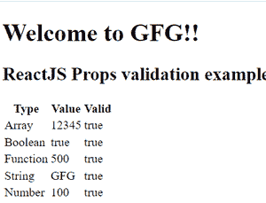

# 如何在 ReactJS 中对道具进行验证？

> 原文:[https://www . geeksforgeeks . org/如何在道具上应用验证-in-reactjs/](https://www.geeksforgeeks.org/how-to-apply-validation-on-props-in-reactjs/)

**React JS 中验证道具的需要:**道具用于将只读属性传递给 React 组件。为了组件的正常运行和避免未来的错误和故障，道具必须正确传递。因此，需要使用道具验证来提高 react 组件的性能。

React JS 有一个用于验证道具数据类型的内置功能，以确保通过道具传递的值是有效的。React 组件有一个名为 *propTypes* 的属性，用于设置数据类型验证。

**语法:**使用*类型*的语法如下所示。

```
class Component extends React.Component {
  render() {}
}

Component.propTypes = {/* definition goes here*/};
```

**验证器:**propTypes 对象包含基本数据类型的验证器列表，其中一些是:

*   **PropTypes.any :** 这意味着该道具可以是任何数据类型。
*   **PropTypes.bool:** 这意味着道具应该是布尔值。
*   **道具类型.编号:**这意味着道具应该是一个数字。
*   **道具类型.字符串:**这意味着道具应该是字符串。
*   **PropTypes.func:** 这意味着道具应该是一个函数。
*   **道具类型.数组:**这意味着道具应该是一个数组。
*   **道具类型.对象:**这意味着道具应该是一个对象。
*   **道具类型符号:**这意味着道具应该是一个符号。
*   **PropTypes.instanceOf:** 这意味着该道具应该是特定 JavaScript 类的实例。
*   **道具类型。要求:**这意味着应该提供道具。
*   **PropTypes.oneOf():** 这意味着道具应该是指定值的几种类型之一。
*   **道具类型.元素:**这意味着道具必须是元素。

**创建反应应用程序并安装模块:**

**步骤 1:** 在终端中键入以下命令，创建一个 React 应用程序:

```
npx create-react-app PropValidation
```

**第 2 步:**创建项目文件夹(即 PropValidation)后，使用以下命令移动到该文件夹:

```
cd PropValidation
```

**步骤 3:** 创建 ReactJS 应用程序后，使用以下命令安装所需的模块。

```
npm install prop-types
```

**项目结构:**如下图。


项目结构

**示例:**现在在 **App.js** 文件中写下以下代码。在这里，App 是我们编写代码的默认组件。这里我们已经为我们的组件定义了道具类型以及默认道具。

## java 描述语言

```
import React from 'react';
import PropTypes from 'prop-types';
class App extends React.Component {
  render() {
    return (
      <div>
        <h1>Welcome to GFG!!</h1>
        <h2>ReactJS Props validation example</h2>
        <table>
          <tr>
            <th>Type</th>
            <th>Value</th>
            <th>Valid</th>
          </tr>
          <tr>
            <td>Array</td>
            <td>{this.props.propArray}</td>
            <td>{this.props.propArray ? "true" : "False"}</td>
          </tr>
          <tr>
            <td>Boolean</td>
            <td>{this.props.propBool ? "true" : "False"}</td>
            <td>{this.props.propBool ? "true" : "False"}</td>
          </tr>
          <tr>
            <td>Function</td>
            <td>{this.props.propFunc(5)}</td>
            <td>{this.props.propFunc(5) ? "true" : "False"}</td>
          </tr>
          <tr>
            <td>String</td>
            <td>{this.props.propString}</td>
            <td>{this.props.propString ? "true" : "False"}</td>
          </tr>
          <tr>
            <td>Number</td>
            <td>{this.props.propNumber}</td>
            <td>{this.props.propNumber ? "true" : "False"}</td>
          </tr>
        </table>
      </div>
    );
  }
}

// Prop types for our Component
App.propTypes = {
  propArray: PropTypes.array.isRequired,
  propBool: PropTypes.bool.isRequired,
  propFunc: PropTypes.func,
  propNumber: PropTypes.number,
  propString: PropTypes.string,
}

// Default Props for our Component
App.defaultProps = {
  propArray: [1, 2, 3, 4, 5],
  propBool: true,
  propFunc: function (x) { return x * 10 },
  propNumber: 1,
  propString: "GFG",
}

export default App;
```

**运行应用程序的步骤:**从项目的根目录使用以下命令运行应用程序:

```
npm start
```

**输出:**现在打开浏览器，转到***http://localhost:3000/***，会看到如下输出:



输出图像

**参考:**T2】https://reactjs.org/docs/typechecking-with-proptypes.html