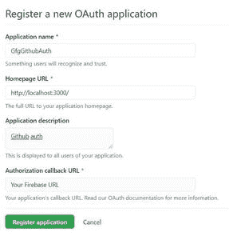
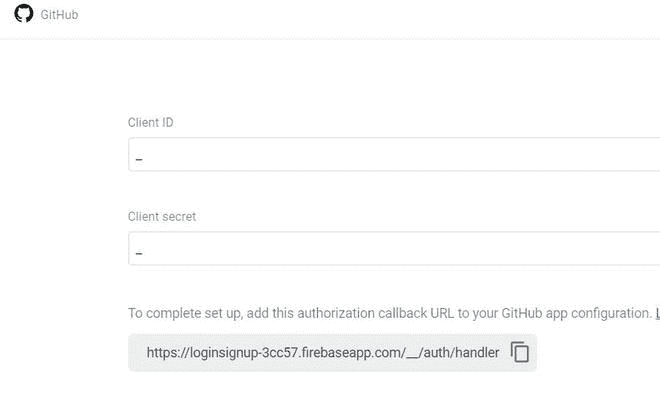
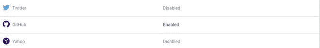
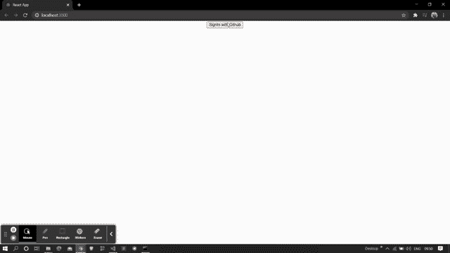

# ReactJS 中如何用 GitHub 认证 firebase？

> 原文:[https://www . geeksforgeeks . org/如何验证-firebase-with-github-in-reactjs/](https://www.geeksforgeeks.org/how-to-authenticate-firebase-with-github-in-reactjs/)

下面的方法介绍了如何在反应中用 GitHub 认证 firebase。我们使用了 firebase 模块来实现这一点。

**创建反应应用程序并安装模块:**

**步骤 1:** 使用以下命令创建一个 React 应用程序:

```jsx
npx create-react-app gfgapp
```

**步骤 2:** 创建项目文件夹(即 gfgapp)后，使用以下命令移动到该文件夹:

```jsx
cd gfgapp
```

**项目结构:**我们的项目结构会是这样的。


**步骤 3:** 创建 ReactJS 应用程序后，使用以下命令安装 firebase 模块:

```jsx
npm install firebase@8.3.1 --save
```

**第 4 步:**转到你的 firebase 仪表盘，创建一个新项目并复制你的凭证。

```jsx
const firebaseConfig = {
      apiKey: "your api key",
      authDomain: "your credentials",
      projectId: "your credentials",
      storageBucket: "your credentials",
      messagingSenderId: "your credentials",
      appId: "your credentials"
};
```

**第 5 步:**通过用以下代码创建 Firebase.js 文件，将 Firebase 初始化到您的项目中。

## 火库. js

```jsx
import firebase from 'firebase';

const firebaseConfig = {
    // Your Credentials
  };

firebase.initializeApp(firebaseConfig);

var auth = firebase.auth();
var provider = new firebase.auth.GithubAuthProvider();
export {auth , provider};
```

**第六步:** [在 GitHub 上将你的应用](https://github.com/settings/applications/new)注册为开发者应用，获取你的应用的 OAuth 2.0 **客户端 ID 和客户端密码**。



对于**授权回拨 URL** 转到您的认证部分，点击 Github 登录方式。之后复制回调网址。



**第 7 步:**现在通过输入您的**客户号和客户密码来启用 Github 登录方法。**



**步骤 8:** 现在使用以下命令安装 npm 包，即[反应-火焰-钩子](https://www.npmjs.com/package/react-firebase-hooks)。

```jsx
npm i react-firebase-hooks
```

这个包帮助我们倾听用户的当前状态。

**第九步:**创建两个文件，即 **login.js** 和 **main.js** ，代码如下。

## log in . js-登入

```jsx
import {auth , provider} from './firebase';
const Login = ()=>{

    // SignIn with GitHub
    const submit = ()=>{
        auth.signInWithPopup(provider).catch(alert);
    }
    return (
        <div>
            <center>
            <button onClick={submit}>
                SignIn with Github
            </button>
            </center>
        </div>
    )
}
export default Login;
```

## main.js

```jsx
import {auth} from './firebase';
const Main = ()=>{
    const logout = ()=>{
        auth.signOut();
    }
    return(
        <div>
            Welcome 

            {
                auth.currentUser.email
            }

            <button onClick={logout}>
                Logout
            </button>  
        </div>
    )
}
export default Main;
```

**第十步:**最后导入 App.js 文件中所有需要的文件，如下图。

## App.js

```jsx
import './App.css';
import Login from './login';
import {auth} from './firebase';
import Main from './main';
import {useAuthState} from 'react-firebase-hooks/auth';
function App() {
  const [user] = useAuthState(auth);
  return (
    user ? <Main/> : <Login/>
  );
}

export default App;
```

**运行应用程序的步骤:**从项目的根目录使用以下命令运行应用程序:

```jsx
npm start
```

**输出**:现在打开浏览器，转到 http://localhost:3000/，会看到如下输出:

