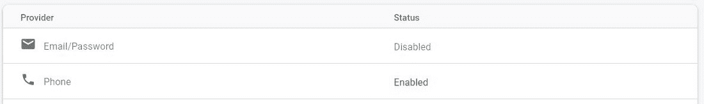
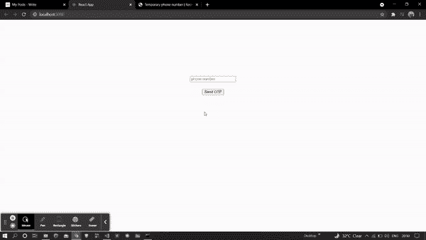

# 如何在 ReactJS 中使用 firebase 认证电话号码？

> 原文:[https://www . geeksforgeeks . org/如何使用 firebase-in-reactjs 认证电话号码/](https://www.geeksforgeeks.org/how-to-authenticate-phone-number-using-firebase-in-reactjs/)

下面的方法介绍了如何在 react 中使用 firebase 通过电话号码进行身份验证。我们已经使用 **firebase** 模块实现了这一点。

**创建反应应用程序并安装模块:**

*   **步骤 1:** 使用以下命令创建一个反应缅甸:

    ```
    npx create-react-app myapp
    ```

*   **步骤 2:** 创建项目文件夹(即 myapp)后，使用以下命令移动到该文件夹:

    ```
    cd myapp
    ```

**项目结构:**我们的项目结构会是这样的。


**步骤 3:** 创建 ReactJS 应用程序后，使用以下命令安装 firebase 模块:

```
npm install firebase@8.3.1 --save
```

**第 4 步:**转到你的 firebase 仪表盘，创建一个新项目并复制你的凭证。

```
const firebaseConfig = {
      apiKey: "your api key",
      authDomain: "your credentials",
      projectId: "your credentials",
      storageBucket: "your credentials",
      messagingSenderId: "your credentials",
      appId: "your credentials"
};
```

**第 5 步:**通过创建一个带有以下代码的 *firebase.js* 文件，将 Firebase 初始化到您的项目中。

## 火库. js

```
import firebase from 'firebase';

const firebaseConfig = {
    // Your credentials
};

firebase.initializeApp(firebaseConfig);
var auth = firebase.auth();
export {auth , firebase};
```

**第六步:**进入你的 firebase 仪表盘，启用如下所示的手机登录方式。



**步骤 7:** 现在使用以下命令安装 npm 包，即 react-firebase-hooks。

**反应-火焰-钩子:**

> https://www.npmjs.com/package/react-firebase-hooks

```
npm i react-firebase-hooks
```

这个包帮助我们倾听用户的当前状态。

**第八步:**用下面的代码创建两个文件，即 login.js 和 main.js。

## log in . js-登入

```
import React, { useState } from 'react';
import { firebase, auth } from './firebase';

const Login = () => {
    // Inputs
    const [mynumber, setnumber] = useState("");
    const [otp, setotp] = useState('');
    const [show, setshow] = useState(false);
    const [final, setfinal] = useState('');

    // Sent OTP
    const signin = () => {

        if (mynumber === "" || mynumber.length < 10) return;

        let verify = new firebase.auth.RecaptchaVerifier('recaptcha-container');
        auth.signInWithPhoneNumber(mynumber, verify).then((result) => {
            setfinal(result);
            alert("code sent")
            setshow(true);
        })
            .catch((err) => {
                alert(err);
                window.location.reload()
            });
    }

    // Validate OTP
    const ValidateOtp = () => {
        if (otp === null || final === null)
            return;
        final.confirm(otp).then((result) => {
            // success
        }).catch((err) => {
            alert("Wrong code");
        })
    }

    return (
        <div style={{ "marginTop": "200px" }}>
            <center>
                <div style={{ display: !show ? "block" : "none" }}>
                    <input value={mynumber} onChange={(e) => { 
                       setnumber(e.target.value) }}
                        placeholder="phone number" />
                    <br /><br />
                    <div id="recaptcha-container"></div>
                    <button onClick={signin}>Send OTP</button>
                </div>
                <div style={{ display: show ? "block" : "none" }}>
                    <input type="text" placeholder={"Enter your OTP"}
                        onChange={(e) => { setotp(e.target.value) }}></input>
                    <br /><br />
                    <button onClick={ValidateOtp}>Verify</button>
                </div>
            </center>
        </div>
    );
}

export default Login;
```

## main.js

```
import React from 'react';
import { auth } from './firebase';

const Mainpage = () => {

    const logout = () => {
        auth.signOut();
    }

    return (
        <div style={{ marginTop: 250 }}>
            <center>
                <h3>Welcome {auth.currentUser.phoneNumber}</h3>
                <button style={{ "marginLeft": "20px" }} 
                  onClick={logout}>Logout</button>
            </center>
        </div>
    );
}

export default Mainpage;
```

**第九步:**最后导入 *App.js* 文件中所有需要的文件，如下图。

## App.js

```
import React from 'react';
import {auth} from './firebase';
import {useAuthState} from 'react-firebase-hooks/auth';
import Login from './login';
import Mainpage from './main';

function App() {
  const [user] = useAuthState(auth);
  return (
    user ? <Mainpage/> : <Login/>
  );
}

export default App;
```

**运行应用程序的步骤:**从项目的根目录使用以下命令运行应用程序:

```
npm start
```

**输出:**现在打开浏览器，转到***http://localhost:3000/***，会看到如下输出:

