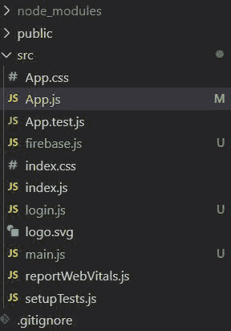
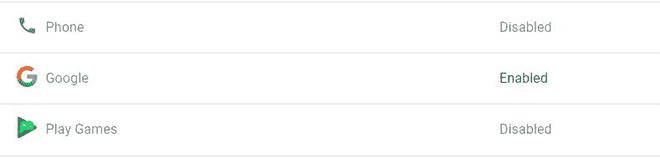
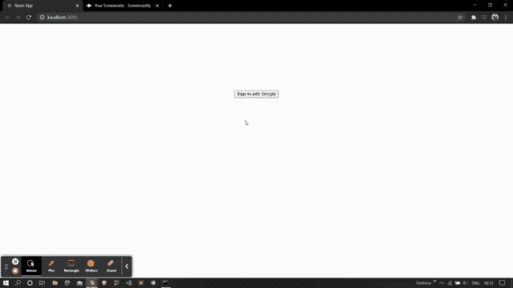

# 如何在 React 中使用 firebase 向谷歌认证？

> 原文:[https://www . geeksforgeeks . org/如何使用 firebase-in-react 向 google 进行身份验证/](https://www.geeksforgeeks.org/how-to-authenticate-with-google-using-firebase-in-react/)

下面的方法涵盖了如何在 react 中使用 firebase 向 Google 进行身份验证。我们已经使用**火焰基地**模块来实现所以。

**创建反应应用程序并安装模块:**

**步骤 1:** 使用以下命令创建一个反应缅甸:

```jsx
npx create-react-app myapp
```

**步骤 2:** 在创建项目文件夹(即 myapp **)后，使用以下命令将**移动到该文件夹:

```jsx
cd myapp
```

**项目结构:**我们的项目结构会是这样的。



**步骤 3:** 创建 ReactJS 应用程序后，使用以下命令安装 **firebase** 模块:

```jsx
npm install firebase@8.3.1 --save
```

**第 4 步:**转到你的 firebase 仪表盘，创建一个新项目并复制你的凭证。

```jsx
const firebaseConfig = {
      apiKey: "your api key",
      authDomain: "your credentials",
      projectId: "your credentials",
      storageBucket: "your credentials",
      messagingSenderId: "your credentials",
      appId: "your credentials"
};
```

**第 5 步:**通过用下面的代码创建 **Firebase.js** 文件，将 Firebase 初始化到您的项目中。

## 火库. js

```jsx
import firebase from 'firebase';

const firebaseConfig = {
    // Your credentials
};

firebase.initializeApp(firebaseConfig);
var auth = firebase.auth();
var provider = new firebase.auth.GoogleAuthProvider(); 
export {auth , provider};
```

**第六步:**进入你的 firebase 仪表盘，启用**谷歌登录**方法，如下图所示。



**步骤 7:** 现在使用以下命令安装 npm 包，即[反应-火焰-钩子](https://www.npmjs.com/package/react-firebase-hooks)。

```jsx
npm i react-firebase-hooks
```

这个包帮助我们倾听用户的当前状态。

**第 8 步:**创建两个文件，即 *login.js* 和 *main.js* ，代码如下。

## log in . js-登入

```jsx
import React from 'react';
import {auth , provider}  from './firebase.js';

const Login = () => {

    // Sign in with google
    const signin = () => {
        auth.signInWithPopup(provider).catch(alert);
    }

    return (
        <div>
            <center>
                <button style={{"marginTop" : "200px"}} 
                onClick={signin}>Sign In with Google</button>
            </center>
        </div>
    );
}

export default Login;
```

## Main.js

```jsx
import React from 'react';
import {auth} from './firebase';

const Mainpage = () => {

    // Signout function
    const logout = () => {
        auth.signOut();
    }

    return (
        <div>
            Welcome

            {
                auth.currentUser.email
            }
            <button style={{"marginLeft" : "20px"}} 
            onClick={logout}>
                Logout
            </button>
        </div>
    );
}

export default Mainpage;
```

**第 8 步:**最后导入 *App.js* 文件中所有需要的文件，如下图所示。

**App.js**

## java 描述语言

```jsx
import React from 'react';
import {auth} from './firebase';
import {useAuthState} from 'react-firebase-hooks/auth';
import Login from './login';
import Mainpage from './main';

function App() {
  const [user] = useAuthState(auth);
  return (
    user ? <Mainpage/> : <Login/>
  );
}

export default App;
```

**运行应用程序的步骤:**从项目的根目录使用以下命令运行应用程序:

```jsx
npm start
```

**输出:**现在打开浏览器，转到***http://localhost:3000/***，会看到如下输出:

