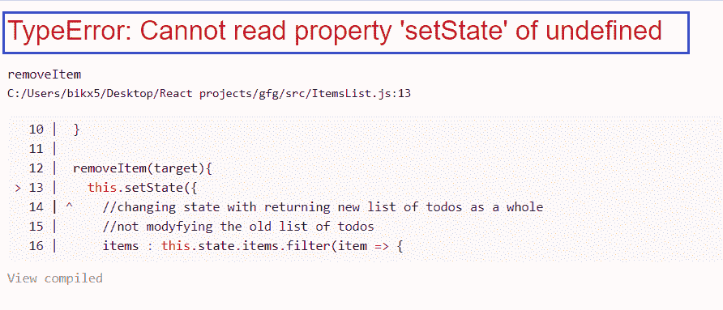
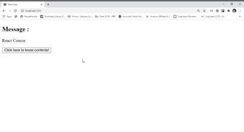
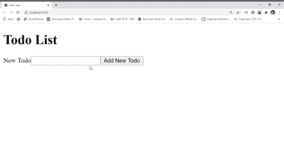

# 如何绑定‘this’关键字来解析 React 中经典的错误消息‘状态未定义’？

> 原文:[https://www . geeksforgeeks . org/如何绑定此关键字-解析-经典-错误-消息-未定义状态-in-react/](https://www.geeksforgeeks.org/how-to-bind-this-keyword-to-resolve-classical-error-message-state-of-undefined-in-react/)

对于学习者来说，JavaScript 中的“this”关键字总是有些难以理解。基本上，函数中的这个关键字是通过查看方法实际上是如何被调用的来确定的。通常在 JavaScript 中，我们使用语法 **obj.method()** 调用方法。在这种情况下，方法函数中“this”关键字的值是对象“obj”。我们如何调用方法是“this”不可预测值的根源。

在 React 中，当我们使用事件处理程序时，我们基本上给出了一个函数对该事件处理程序的引用，当该事件发生时，该函数被调用，这里有一个 catch，它在某个时间点被调用，而不是立即被调用，当它被调用时，它作为自己的调用，现在有任何组件实例对象使用它被调用，这就是为什么方法中的“this”关键字的值是未定义的。为了解决这个问题，我们通常使用 JavaScript bind 方法绑定“this”关键字的值。

**错误信息:**



**例 1:**

**index.js :**

## java 描述语言

```jsx
import React from 'react'
import ReactDOM from 'react-dom'
import App from './App'

ReactDOM.render(<App />, document.querySelector('#root'))
```

**App.js :**

## java 描述语言

```jsx
import React, { Component } from 'react'

class App extends Component {
  static defaultProps = {
    courceContent : [
      'JSX', 'React Props', 'React State',
      'React Lifecycle Methods',
      'React Event Handlers', 'React Router',
      'React Hooks', 'Readux',
      'React Context'
    ]
  }

  constructor(props){
    super(props)

    // Set initial state
    this.state = {msg : 'React Cource', content:''}

    // Binding this keyword of method handleClick
    this.handleClick = this.handleClick.bind(this)
  }

  renderContent(){
    return (
      <ul>
        {this.props.courceContent.map(content => (
          <li>{content}</li>
        ))}
      </ul>
    )
  }

  handleClick(){

    // Changing state
    this.setState({
      msg : 'Cource Content',
      content : this.renderContent()
    })
  }

  render(){

    // Reference of handleClick, called at some
    // point of time on its own gets called like
    // handleClick(), thats why this inside
    // handleClick is undefined
    const button = !this.state.content &&
    <button onClick={this.handleClick}>
       Click here to know contents!
    </button>
    return (
      <div>
        <h2>Message :</h2>

<p>{this.state.msg}</p>

<p>{this.state.content}</p>

        {button}
      </div>
    )
  }
}

export default App
```

**输出:**



**例 2:**

**index.js :**

## java 描述语言

```jsx
import React from 'react'
import ReactDOM from 'react-dom'
import App from './App'

ReactDOM.render(<App />, document.querySelector('#root'))
```

**App.js :**

## java 描述语言

```jsx
import React from 'react'
import TodoList from './TodoList'

const App = () => {
  return <TodoList />
}

export default App
```

**TodoList.js:我是 T1**

## java 描述语言

```jsx
import React, { Component } from 'react'
import TodoForm from './TodoForm'

class TodoList extends Component{
  constructor(props){
    super(props)
    this.state = { todos : [] }
    // Binding this keyword of method createTodo
    this.createTodo = this.createTodo.bind(this)
    // Binding this keyword of method renderTodo
    this.renderTodos = this.renderTodos.bind(this)
  }

  createTodo(todo){
    this.setState({
      todos : [...this.state.todos, todo]
    })
  }

  renderTodos(){
    const todos = this.state.todos.map(todo => (
      <li key={todo}>
        {todo.task}
      </li>
    ))
    return <ul>{todos}</ul>
  }

  render(){
    return(
      <div>
        <h1>Todo List</h1>
        {this.renderTodos()}
        <TodoForm create={this.createTodo}/>
      </div>
    )
  }
}

export default TodoList
```

todoform . js:

## java 描述语言

```jsx
import React, { Component } from 'react'

class TodoForm extends Component{
  constructor(props){
    super(props)

    this.state = { task:'' }

    // Binding this keyword of method handleChange
    this.handleChange = this.handleChange.bind(this)

    // Binding this keyword of method handleSubmit
    this.handleSubmit = this.handleSubmit.bind(this)
  }

  handleChange(event){
    this.setState({
      [event.target.name] : event.target.value
    })
  }

  handleSubmit(event){
    event.preventDefault()
    this.props.create(this.state)
    this.setState({ task : '' })
  }

  render(){
    return(
      <form onSubmit={this.handleSubmit}>
        <div>
          <label htmlFor='task'>New Todo</label>
          <input
            name='task'
            value={this.state.task}
            onChange={this.handleChange}
          />
          <button>Add New Todo</button>
        </div>
      </form>
    )
  }
}

export default TodoForm
```

**输出:**

