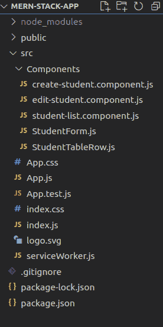
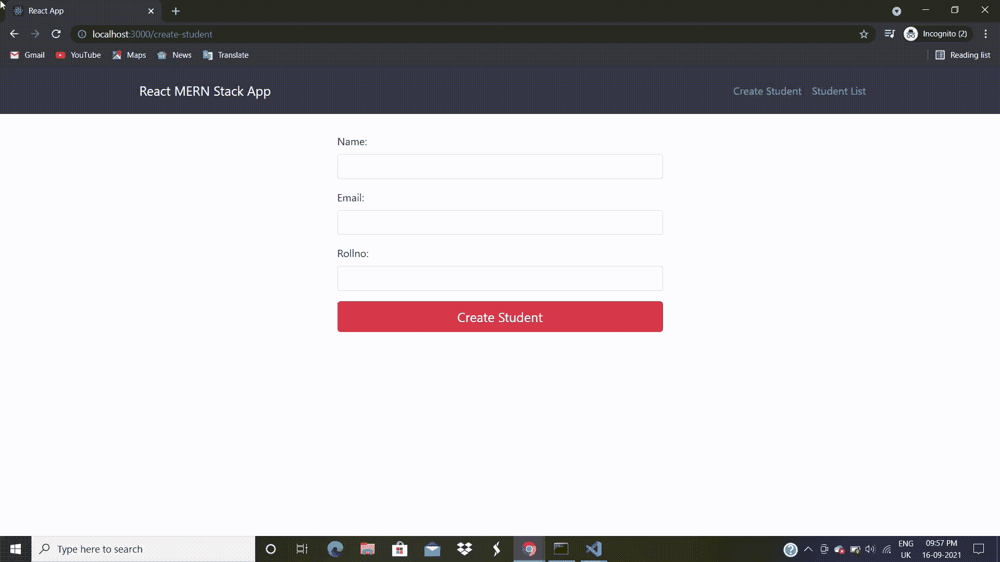
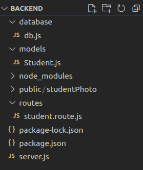
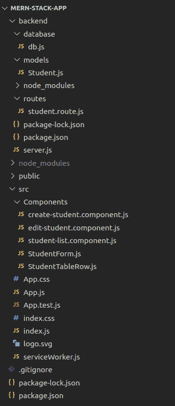
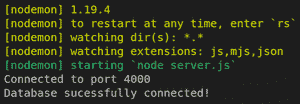
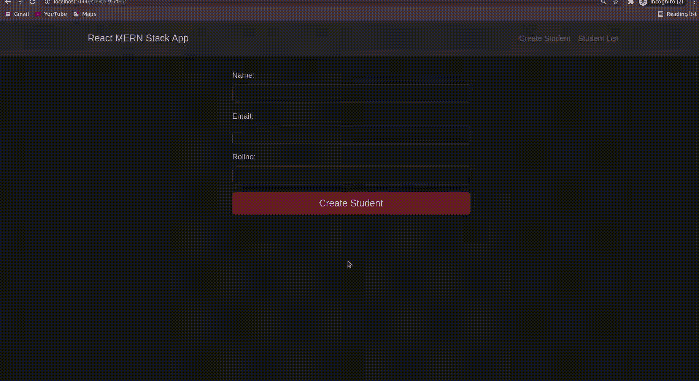

# 如何用 Node.js 和 ReactJS 构建一个基础的 CRUD 应用？

> 原文:[https://www . geeksforgeeks . org/how-build-a-basic-crud-app-with-node-js-and-reactjs/](https://www.geeksforgeeks.org/how-to-build-a-basic-crud-app-with-node-js-and-reactjs/)

在本文中，我们将从头开始创建一个基本的学生应用程序。

应用功能:

*   创建新学生
*   更新现有学生
*   显示学生列表
*   删除学生

本项目中的休息应用编程接口:

<figure class="table">

| **REST API** | **URL** |
| **获取** | http://localhost:4000/学生 |
| **获取** | /学生/更新-学生/id |
| **开机自检** | /学生/创建-学生 |
| **PUT** | /学生/更新-学生/id |
| **删除** | /学生/删除-学生/id |

</figure>

首先，我们将使用 React.js 处理应用程序的前端部分。

**创建反应应用和安装模块**

**第一步:**我们开始用 React 构建前端部分。要创建新的 React App，请在终端中输入以下代码，然后按回车键。

```
npx create-react-app mern-stack-crud
```

**第 2 步:**进入 React 项目文件夹。

```
cd mern-stack-crud
```

**步骤 3:** 要运行反应应用程序，请运行以下命令:

```
npm start
```

该命令通过以下网址打开浏览器的反应应用程序:

**第 4 步:**要构建 React App，我们需要安装一些外部模块。

<figure class="table">

| **NPM** | **细节** |
| **反应-自举** | React-Bootstrap has evolved side by side with React, making it an excellent choice for your UI. |
| **反应-路由器-Dom** | React Router Dom enables you to implement routing in React App. |
| 公理 | It is a commitment-based HTTP Client for network requests. |
| **表格** | Build excellent library of forms in React. |
| **是的** | Yep is a JavaScript pattern builder for form validation. |

</figure>

要安装，请在终端上运行以下代码。

> NPM I react-bootstrap @ next bootstrap @ 5 . 1 . 0 react-router-DOM axios formik 是的

**第 5 步:创建简单的反应组件–**在这一步中，我们将创建一些反应组件来管理学生数据。

前往 ***src*** 文件夹，创建一个文件夹并将其命名为 ***组件*** ，并在该目录中创建以下组件。

*   **学生表单. js**–可重复使用的学生表单
*   **create-student . component . js**–负责创建新学生
*   **编辑-学生.组件. js**-负责更新学生数据
*   **学生-列表.组件. js**-负责显示所有学生
*   ***学生表**T3–负责显示单个学生*

**项目结构:**如下图



前端项目结构

**第 6 步:创建学生表单–**在这一步中，我们将使用 Formik 和 React-Bootstrap 构建一个可重用的学生表单。此表单包含输入学生详细信息的所有必要字段。我们还用 Yy 进行了客户端表单验证。将来，我们将使用该组件来创建和更新学生。转到***src/Components/studentform . js***并编写以下代码。

## 学习型态. js

```
import React from "react";
import * as Yup from "yup";
import { Formik, Form, Field, ErrorMessage } from "formik";
import { FormGroup, FormControl, Button } from "react-bootstrap";

const StudentForm = (props) => {
  const validationSchema = Yup.object().shape({
    name: Yup.string().required("Rquired"),
    email: Yup.string()
      .email("You have enter an invalid email address")
      .required("Rquired"),
    rollno: Yup.number()
      .positive("Invalid roll number")
      .integer("Invalid roll number")
      .required("Rquired"),
  });
  console.log(props);
  return (
    <div className="form-wrapper">
      <Formik {...props} validationSchema={validationSchema}>
        <Form>
          <FormGroup>
            <Field name="name" type="text" 
                className="form-control" />
            <ErrorMessage
              name="name"
              className="d-block invalid-feedback"
              component="span"
            />
          </FormGroup>
          <FormGroup>
            <Field name="email" type="text" 
                className="form-control" />
            <ErrorMessage
              name="email"
              className="d-block invalid-feedback"
              component="span"
            />
          </FormGroup>
          <FormGroup>
            <Field name="rollno" type="number" 
                className="form-control" />
            <ErrorMessage
              name="rollno"
              className="d-block invalid-feedback"
              component="span"
            />
          </FormGroup>
          <Button variant="danger" size="lg" 
            block="block" type="submit">
            {props.children}
          </Button>
        </Form>
      </Formik>
    </div>
  );
};

export default StudentForm;
```

**第 7 步:创建新学生:**在这一步中，我们将创建一个组件来添加新学生。我们已经创建了一个 ***学生表单*** 组件来输入学生详细信息。现在，是时候使用这个组件了。转到***src/Components/create-student . component . js***并编写以下代码。

## create-student.component.js

```
// CreateStudent Component for add new student

// Import Modules
import React, { useState, useEffect } from "react";
import axios from 'axios';
import StudentForm from "./StudentForm";

// CreateStudent Component
const CreateStudent = () => {
  const [formValues, setFormValues] = 
    useState({ name: '', email: '', rollno: '' })
  // onSubmit handler
  const onSubmit = studentObject => {
    axios.post(
'http://localhost:4000/students/create-student', 
    studentObject)
      .then(res => {
        if (res.status === 200)
          alert('Student successfully created')
        else
          Promise.reject()
      })
      .catch(err => alert('Something went wrong'))
  }

  // Return student form
  return(
    <StudentForm initialValues={formValues} 
      onSubmit={onSubmit} 
      enableReinitialize>
      Create Student
    </StudentForm>
  )
}

// Export CreateStudent Component
export default CreateStudent
```

**第 8 步:更新学生的详细信息:**在本部分中，我们将创建一个组件来更新详细信息。我们有可重用的 ***StudentForm*** 组件，让我们再用一次。我们将获取学生详细信息以重新初始化表格。转到***src/Components/edit-student . component . js***并编写以下代码。

## edit-student.component.js

```
// EditStudent Component for update student data

// Import Modules
import React, { useState, useEffect } from "react";
import axios from "axios";
import StudentForm from "./StudentForm";

// EditStudent Component
const EditStudent = (props) => {
  const [formValues, setFormValues] = useState({
    name: "",
    email: "",
    rollno: "",
  });

  //onSubmit handler
  const onSubmit = (studentObject) => {
    axios
      .put(
        "http://localhost:4000/students/update-student/" +
          props.match.params.id,
        studentObject
      )
      .then((res) => {
        if (res.status === 200) {
          alert("Student successfully updated");
          props.history.push("/student-list");
        } else Promise.reject();
      })
      .catch((err) => alert("Something went wrong"));
  };

  // Load data from server and reinitialize student form
  useEffect(() => {
    axios
      .get(
        "http://localhost:4000/students/update-student/" 
        + props.match.params.id
      )
      .then((res) => {
        const { name, email, rollno } = res.data;
        setFormValues({ name, email, rollno });
      })
      .catch((err) => console.log(err));
  }, []);

  // Return student form
  return (
    <StudentForm
      initialValues={formValues}
      onSubmit={onSubmit}
      enableReinitialize
    >
      Update Student
    </StudentForm>
  );
};

// Export EditStudent Component
export default EditStudent;
```

**第九步:显示学生列表:**在这一步中，我们将构建一个组件，在表格中显示学生详细信息。我们将获取学生的数据，并对其进行迭代，为每个学生创建表行。转到***src/Components/student-list . component . js***并编写以下代码。

## 学生列表.组件. js

```
import React, { useState, useEffect } from "react";
import axios from "axios";
import { Table } from "react-bootstrap";
import StudentTableRow from "./StudentTableRow";

const StudentList = () => {
  const [students, setStudents] = useState([]);

  useEffect(() => {
    axios
      .get("http://localhost:4000/students/")
      .then(({ data }) => {
        setStudents(data);
      })
      .catch((error) => {
        console.log(error);
      });
  }, []);

  const DataTable = () => {
    return students.map((res, i) => {
      return <StudentTableRow obj={res} key={i} />;
    });
  };

  return (
    <div className="table-wrapper">
      <Table striped bordered hover>
        <thead>
          <tr>
            <th>Name</th>
            <th>Email</th>
            <th>Roll No</th>
            <th>Action</th>
          </tr>
        </thead>
        <tbody>{DataTable()}</tbody>
      </Table>
    </div>
  );
};

export default StudentList;
```

**第十步:显示单个学生:**在这一步，我们将返回负责显示学生数据的表行。转到***src/Components/studenttablerow . js***并编写以下代码。

## 学生表格行. js

```
import React from "react";
import { Button } from "react-bootstrap";
import { Link } from "react-router-dom";
import axios from "axios";

const StudentTableRow = (props) => {
  const { _id, name, email, rollno } = props.obj;

  const deleteStudent = () => {
    axios
      .delete(
"http://localhost:4000/students/delete-student/" + _id)
      .then((res) => {
        if (res.status === 200) {
          alert("Student successfully deleted");
          window.location.reload();
        } else Promise.reject();
      })
      .catch((err) => alert("Something went wrong"));
  };

  return (
    <tr>
      <td>{name}</td>
      <td>{email}</td>
      <td>{rollno}</td>
      <td>
        <Link className="edit-link" 
          to={"/edit-student/" + _id}>
          Edit
        </Link>
        <Button onClick={deleteStudent} 
          size="sm" variant="danger">
          Delete
        </Button>
      </td>
    </tr>
  );
};

export default StudentTableRow;
```

**第 11 步:编辑 App.js:** 最后，在我们的 MERN Stack CRUD 应用中加入制作路由的菜单。转到 ***src/App.js*** 并编写以下代码。

## App.js

```
// Import React
import React from "react";

// Import Bootstrap
import { Nav, Navbar, Container, Row, Col } 
        from "react-bootstrap";
import "bootstrap/dist/css/bootstrap.css";

// Import Custom CSS
import "./App.css";

// Import from react-router-dom
import { BrowserRouter as Router, Switch,
    Route, Link } from "react-router-dom";

// Import other React Component
import CreateStudent from 
    "./Components/create-student.component";
import EditStudent from 
    "./Components/edit-student.component";
import StudentList from 
    "./Components/student-list.component";

// App Component
const App = () => {
  return (
    <Router>
      <div className="App">
        <header className="App-header">
          <Navbar bg="dark" variant="dark">
            <Container>
              <Navbar.Brand>
                <Link to={"/create-student"} 
                  className="nav-link">
                  React MERN Stack App
                </Link>
              </Navbar.Brand>

              <Nav className="justify-content-end">
                <Nav>
                  <Link to={"/create-student"} 
                    className="nav-link">
                    Create Student
                  </Link>
                </Nav>

                <Nav>
                  <Link to={"/student-list"} 
                    className="nav-link">
                    Student List
                  </Link>
                </Nav>
              </Nav>
            </Container>
          </Navbar>
        </header>

        <Container>
          <Row>
            <Col md={12}>
              <div className="wrapper">
                <Switch>
                  <Route exact path="/" 
                    component={CreateStudent} />
                  <Route path="/create-student" 
                    component={CreateStudent} />
                  <Route path="/edit-student/:id" 
                    component={EditStudent} />
                  <Route path="/student-list" 
                    component={StudentList} />
                </Switch>
              </div>
            </Col>
          </Row>
        </Container>
      </div>
    </Router>
  );
};

export default App;
```

**第 12 步:添加样式–**转到 ***src/App.css*** 并编写以下代码。

## App.css

```
.wrapper {
  padding-top: 30px;
}

body h3 {
  margin-bottom: 25px;
}

.navbar-brand a {
  color: #ffffff;
}

.form-wrapper,
.table-wrapper {
  max-width: 500px;
  margin: 0 auto;
}

.table-wrapper {
  max-width: 700px;
}

.edit-link {
  padding: 7px 10px;
  font-size: 0.875rem;
  line-height: normal;
  border-radius: 0.2rem;
  color: #fff;
  background-color: #28a745;
  border-color: #28a745;
  margin-right: 10px;
  position: relative;
  top: 1px;
}

.edit-link:hover {
  text-decoration: none;
  color: #ffffff;
}

/* Chrome, Safari, Edge, Opera */
input::-webkit-outer-spin-button,
input::-webkit-inner-spin-button {
  -webkit-appearance: none;
  margin: 0;
}

/* Firefox */
input[type=number] {
  -moz-appearance: textfield;
}
```

现在，我们已经成功地为我们的 ***mern-stack-app*** 创建了前端。让我们构建后端部分。在此之前，跳到下一节，看看前端部分在没有后端的情况下是如何工作的。

**运行应用程序的步骤:**打开终端，键入以下命令。

```
npm start
```

**输出:**



现在我们将处理应用程序的后端部分。我们将在我们的 ***mern-stack-crud*** 中创建一个文件夹来管理服务器服务，如数据库、模型、模式、路由和 API，将此文件夹命名为 ***后端*** 。

**第一步:**运行命令为服务器创建 ***后端*** 文件夹并进入其中。

```
mkdir backend && cd backend
```

**第二步:创建 package . JSON–**接下来，我们需要创建一个单独的 ***package.json*** 文件来管理我们的***mern-stack-crud***app 的服务器。

```
npm init -y
```

转到 ***后端/package.json*** 文件会如下图所示。替换 ***测试*** 属性像:

```
"test": "echo \"Error: no test specified\" && exit 1" 
"start": "nodemon server.js"
```

**步骤 3:安装节点依赖项–**安装以下节点依赖项。

<figure class="table">

| **NPM** | **细节** |
| **表示** | Node. js framework helps to create powerful REST APIs. |
| **Text parser** | Extract the whole body part of the request stream and expose it on req.body |
| 颜色 | This is a Node.js package, which helps to enable access control-allow-origin CORS header. |
| **[mongoose]** | This is a NoSQL database for creating robust web applications. |

</figure>

要安装上述依赖项，请在终端上运行以下代码。

```
npm install express body-parser cors mongoose
```

您可以安装 *nodemon* 作为开发依赖项，以自动化服务器重启过程。

```
npm i -D nodemon
```

**后端项目结构**



后端项目结构

**第 4 步:设置 MongoDB 数据库–**在这一步中，我们将为我们的应用程序设置一个 MongoDB 数据库。在开始之前，请确保您的系统上安装了最新版本的 MongoDB。在 ***后端*** 文件夹内创建文件夹，并将其命名为 ***数据库*** 。在 ***数据库*** 文件夹内创建一个名为 ***db.js*** 的文件。转到 ***后端/数据库/db.js*** 并编写以下代码。

## db.js(数据库)

```
module.exports = {
  db: 'mongodb://localhost:27017/reactdb'
};
```

我们已经声明了 MongoDB 数据库，并将其命名为 ***reactdb** 。*

**第 5 步:定义 mongose Schema–**现在，创建 MongoDB schema，用于与 MongoDB 数据库进行交互。在 ***后端*** 文件夹中创建一个名为 ***模型*** 的文件夹来保存模式相关文件，并在其中创建一个文件 ***Student.js*** 来定义 MongoDB 模式。转到 ***后端/模型/Student.js*** 并编写以下代码。

## 学生. js

```
const mongoose = require('mongoose');
const Schema = mongoose.Schema;

let studentSchema = new Schema({
  name: {
    type: String
  },
  email: {
    type: String
  },
  rollno: {
    type: Number
  }
}, {
    collection: 'students'
  })

module.exports = mongoose.model('Student', studentSchema)
```

我们在学生模式中声明了名称、电子邮件和 rollno 字段以及它们各自的数据类型。

**第六步:使用 ExpressJS 创建路线–**在这一步中，我们将使用 Express 和 Node.js 为 Create、READ、UPDATE 和 DELETE 设置一些路线(REST APIs)。这些路线将帮助我们管理我们的 ***mern-stack-crud*** 应用程序中的数据。创建一个文件夹，并将其命名为后端文件夹中的路由。这里我们会保留所有路线相关的文件。另外，创建一个文件并将其命名为***student . routes . js***在 ***路由*** 文件夹中，在这个文件中我们将定义我们的路由。

```
mkdir routes && cd routes && touch student.route.js
```

然后，转到 ***后端/routes/student . route . js***文件，编写以下代码。

## student.route.js

```
let mongoose = require("mongoose"),
  express = require("express"),
  router = express.Router();

// Student Model
let studentSchema = require("../models/Student");

// CREATE Student
router.post("/create-student", (req, res, next) => {
  studentSchema.create(req.body, (error, data) => {
    if (error) {
      return next(error);
    } else {
      console.log(data);
      res.json(data);
    }
  });
});

// READ Students
router.get("/", (req, res) => {
  studentSchema.find((error, data) => {
    if (error) {
      return next(error);
    } else {
      res.json(data);
    }
  });
});

// UPDATE student
router
  .route("/update-student/:id")
  // Get Single Student
  .get((req, res) => {
    studentSchema.findById(
        req.params.id, (error, data) => {
      if (error) {
        return next(error);
      } else {
        res.json(data);
      }
    });
  })

  // Update Student Data
  .put((req, res, next) => {
    studentSchema.findByIdAndUpdate(
      req.params.id,
      {
        $set: req.body,
      },
      (error, data) => {
        if (error) {
          return next(error);
          console.log(error);
        } else {
          res.json(data);
          console.log("Student updated successfully !");
        }
      }
    );
  });

// Delete Student
router.delete("/delete-student/:id", 
(req, res, next) => {
  studentSchema.findByIdAndRemove(
      req.params.id, (error, data) => {
    if (error) {
      return next(error);
    } else {
      res.status(200).json({
        msg: data,
      });
    }
  });
});

module.exports = router;
```

**第七步:配置 server . js–**我们几乎已经为我们的 ***mern-stack-crud*** 应用程序创建了一切。现在，在 ***后端*** 文件夹的根目录下创建 ***server.js*** 文件。转到 ***后端/server.js*** 并编写以下代码。

## server.js

```
let express = require('express');
let mongoose = require('mongoose');
let cors = require('cors');
let bodyParser = require('body-parser');
let dbConfig = require('./database/db');

// Express Route
const studentRoute = require('../backend/routes/student.route')

// Configure mongoDB Database
mongoose.set('useNewUrlParser', true);
mongoose.set('useFindAndModify', false);
mongoose.set('useCreateIndex', true);
mongoose.set('useUnifiedTopology', true);

// Connecting MongoDB Database
mongoose.Promise = global.Promise;
mongoose.connect(dbConfig.db).then(() => {
  console.log('Database successfully connected!')
},
  error => {
    console.log('Could not connect to database : ' + error)
  }
)

const app = express();
app.use(bodyParser.json());
app.use(bodyParser.urlencoded({
  extended: true
}));
app.use(cors());
app.use('/students', studentRoute)

// PORT
const port = process.env.PORT || 4000;
const server = app.listen(port, () => {
  console.log('Connected to port ' + port)
})

// 404 Error
app.use((req, res, next) => {
  res.status(404).send('Error 404!')
});

app.use(function (err, req, res, next) {
  console.error(err.message);
  if (!err.statusCode) err.statusCode = 500;
  res.status(err.statusCode).send(err.message);
});
```

现在，我们已经成功地为我们的 ***mern-stack-app*** 创建了后端。

**我们最终的项目目录结构:**



项目目录结构

现在，启动 MongoDB 数据库服务器来运行该服务器。

**运行应用的步骤:**打开一个终端，停留在 ***后端*** 文件夹，运行以下命令启动 Nodemon 服务器。

```
npm start
```

如果一切正常，您将在终端屏幕上看到以下输出。



mern-stack-crud 服务器运行

**最终输出:**



mern 堆栈 crud 应用程序