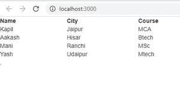

# 如何用数组中的 ReactJS 构建一个 HTML 表？

> 原文:[https://www . geeksforgeeks . org/如何使用数组重新构造 html 表/](https://www.geeksforgeeks.org/how-to-build-an-html-table-using-reactjs-from-arrays/)

如果我们有一个数组，并且想用 ReactJS 为它建立一个 HTML 表，我们可以使用 map 函数。map()方法遍历数组的每个元素，并将它转换成一个表行。首先，我们将创建一个表格标签，然后首先，我们将遍历表格的标题/列名，并使用Label it into a table title. Then, we will traverse the table data and use theTag them into each row as a table body.

**创建反应应用程序:**

*   **步骤 1:** 使用以下命令创建一个反应应用程序:

    ```
    npx create-react-app foldername
    ```

*   **步骤 2:** 创建项目文件夹(即文件夹名)后，使用以下命令移动到该文件夹:

    ```
    cd foldername
    ```

**项目结构:**如下图。


**示例:**现在在 **App.js** 文件中写下以下代码。在这里，App 是我们编写代码的默认组件。

## App.js

```
import React, { Component } from 'react';

class App extends Component {
    render() {
        var heading = ['Name', 'City', 'Course'];
        var body =
            [['Kapil', 'Jaipur', 'MCA'],
            ['Aakash', 'Hisar', 'Btech'],
            ['Mani', 'Ranchi', 'MSc'],
            ['Yash', 'Udaipur', 'Mtech']
            ];
        return (
            <div >
                <Table heading={heading} body={body} />,
            </div>
        );
    }
}

class Table extends Component {
    render() {
        var heading = this.props.heading;
        var body = this.props.body;
        return (
            <table style={{ width: 500 }}>
                <thead>
                    <tr>
                        {heading.map(head => <th>{head}</th>)}
                    </tr>
                </thead>
                <tbody>
                    {body.map(row => <TableRow row={row} />)}
                </tbody>
            </table>
        );
    }
}

class TableRow extends Component {
    render() {
        var row = this.props.row;
        return (
            <tr>
                {row.map(val => <td>{val}</td>)}
            </tr>
        )
    }
}

export default App;
```

**运行应用程序的步骤:**从项目的根目录使用以下命令运行应用程序:

```
npm start
```

**输出:**现在打开浏览器，转到***http://localhost:3000/***，会看到如下输出:



从输出中可以看出，标题使用Tag, the rest of the lines useMark. The map function iterates through each row and returns a row, which is then added to the table.