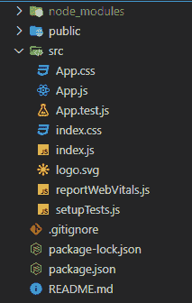
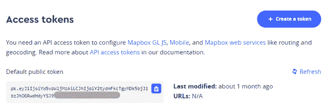
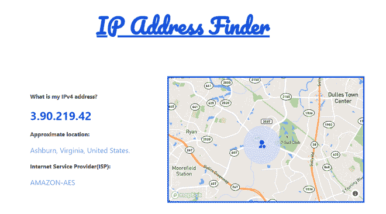

# 如何在 ReactJS 中构建 IP 地址查找器应用？

> 原文:[https://www . geesforgeks . org/如何构建 ip 地址查找器-app-in-reactjs/](https://www.geeksforgeeks.org/how-to-build-an-ip-address-finder-app-in-reactjs/)

在本文中，我们将构建一个 IP 地址查找应用程序，让您在地图上找到您的客户的大致位置。IP 地址是标识互联网或本地网络上设备的唯一地址。IP 代表“互联网协议”，这是一套管理通过互联网或本地网络发送的数据格式的规则。通过这篇文章，我们将学习如何获取用户的 IP 地址以及在地图上显示他/她的大致位置。

**先决条件:**本项目的先决条件是:

*   [反应](http://www.geeksforgeeks.org/react-js-introduction-working/)
*   [功能组件](https://www.geeksforgeeks.org/reactjs-functional-components/)
*   [反作用钩](https://www.geeksforgeeks.org/introduction-to-react-hooks/)
*   公理&API
*   [Javascript 为 6](https://www.geeksforgeeks.org/introduction-to-es6/)

**创建反应应用程序和模块安装:**

**步骤 1:** 在终端中键入以下命令，创建一个 react 应用程序:

```
npx create-react-app ip-finder
```

**步骤 2:** 现在，通过运行以下命令进入项目文件夹，即 ip-finder:

```
cd ip-finder
```

**步骤 3:** 使用以下命令安装本项目所需的一些 npm 包:

```
npm install axios 
npm install react-map-gl
npm install react-icons
```

**项目结构:**会是这样的:



**示例:**让我们抓取这个项目所需的 Mapbox API 键。遵循以下简单步骤:

*   去网站:https://www.mapbox.com/，创建一个免费账户。
*   转到您的帐户仪表板，在页面底部，您会发现一个名为“访问令牌”的部分。



*   复制默认的公共访问令牌，并将其保存在某个地方以供以后使用。

**文件名:App.js** 在这个文件中，我们将使用名为 https://ipapi.co/*的免费开源 API 获取用户的 IP 地址(免费计划:1000 个请求/天)。* App.js 分为两部分，一部分用于显示用户的 IP 地址、位置& ISP(互联网服务提供商)，另一部分用于在动态地图上显示用户的大概位置。现在，在 **App.js** 组件中写下以下代码。

## java 描述语言

```
import { useEffect, useState } from 'react';
import Axios from 'axios';
import Map from './Map';
import './App.css';

function App() {

  // Setting up the initial state variables
  const [ipDetails, setIpDetails] = useState([]);
  const [lat, setLat] = useState(22.5726);
  const [lon, setLon] = useState(88.3832);

  // Fetching the API once when the
  // component is mounted
  useEffect(() => {
    Axios.get('https://ipapi.co/json/').then((res) => {
      setIpDetails(res.data);
      setLat(res.data.latitude);
      setLon(res.data.longitude);
    });
  }, [])

  return (
    <>
      <h1 className="heading">IP Address Finder</h1>
      <div className="App">
        <div className="left">
          <h4>What is my IPv4 address?</h4>
          <h1 id="ip">{ipDetails.ip}</h1>
          <h4>Approximate location: </h4>

<p>{ipDetails.city}, {ipDetails.region},
          {ipDetails.country_name}.</p>

          <h4>Internet Service Provider(ISP):</h4>

<p>{ipDetails.org}</p>

        </div>
        <Map lat={lat} lon={lon} />
      </div>
    </>
  );
}

export default App;
```

在 App.js 组件中，我们已经导入了渲染地图的自定义 Map.js 组件。现在创建该组件。在 **src** 文件夹下创建一个名为 **Map.js** 的文件。

在 **Map.js** 组件中，我们将使用 *react-map-gl* 包导入地图。此外，我们将使用标记来指出用户的大致位置。有关 *react-map-gl* 的更多信息，请访问他们的官方文档。

**文件名:Map.js** 现在在 **Map.js** 组件中写下以下代码。

## java 描述语言

```
import React, { useEffect, useState } from 'react';
import ReactMapGL, { Marker } from 'react-map-gl';
import { RiUserLocationFill } from 'react-icons/ri';

const API_KEY = '<YOUR_API_KEY>';

const Map = ({ lat, lon }) => {

  // Setting up the initial viewport of the map
  const [viewport, setViewport] = useState({
    latitude: lat,
    longitude: lon,
    zoom: 14,
    bearing: 0,
    pitch: 0,
    width: '100%',
    height: '100%',
  });

  // Viewport re-renders whenever latitude
  // and longitude changes
  useEffect(() => {
    const a = { ...viewport };
    a.latitude = lat;
    a.longitude = lon;
    setViewport(a);
  }, [lat, lon]);

  return (
    <div className="map">
      <ReactMapGL
        mapboxApiAccessToken={API_KEY}
        {...viewport}
        onViewportChange={(viewport) => setViewport(viewport)}
        mapStyle="mapbox://styles/mapbox/streets-v11">
        <Marker latitude={lat} longitude={lon}>
          <div className="mark">
            <RiUserLocationFill size="25px" color="blue" />
          </div>
        </Marker>
      </ReactMapGL>
    </div>
  );
};

export default Map;
```

**注意:**用自己的 Mapbox 公共访问令牌替换< YOUR_API_KEY >。

**文件名： 应用程序.css**

## 半铸钢ˌ钢性铸铁(Cast Semi-Steel)

```
@import url('https://fonts.googleapis.com/css2?family=Pacifico&display=swap');
.App{
  height: 70vh;
  display: flex;
  justify-content: center;
  align-items: center;
}
.left{
  box-sizing: border-box;
  padding-left: 80px;
  width: 40%;
}
.map{
  width: 550px;
  height: 350px;
  border: 4px solid #1453dc;
}
.mark{
  padding: 40px;
  border-radius: 50%;
  background-color: #d2d8fabe
}
.heading{
  font-size: 60px;
  text-align: center;
  text-decoration: underline;
  font-family: 'Pacifico', cursive;
  color: #1453dc;
}
p{
  font-size: 20px;
  color: #1453dcaf;
}
#ip{
  color: #1453dc;
}
```

**运行应用程序的步骤:**从项目的根目录使用以下命令运行应用程序。

```
npm start
```

**输出:**现在打开浏览器，转到 **http://localhost:3000/** ，会看到如下输出:



App 演示