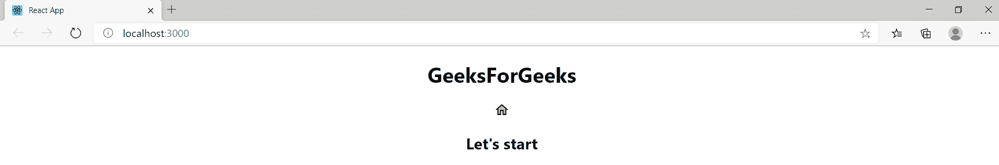
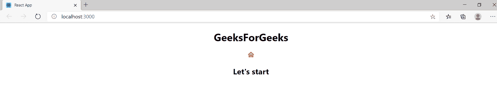

# 如何在 ReactJS 中使用 Material-UI 改变图标的颜色？

> 原文:[https://www . geeksforgeeks . org/如何使用材料更改图标颜色-ui-in-reactjs/](https://www.geeksforgeeks.org/how-to-change-the-color-of-icons-using-material-ui-in-reactjs/)

材质-用户界面图标是一个基于[反应](https://www.geeksforgeeks.org/reactjs/)的模块。材料用户界面库为用户提供了最高效、有效和用户友好的界面。React 提供的不仅仅是 **1000** 材质-界面图标。它是最受欢迎和最受欢迎的框架之一。为了在反应中使用材质界面，我们需要安装材质界面和材质界面图标。此外，对于自定义样式，您可以随时参考材质用户界面中的 SVG 图标组件的应用编程接口。

**先决条件:**

*   基础知识 [ReactJS](https://www.geeksforgeeks.org/reactjs/)
*   [已创建 ReactJS 应用程序](https://www.geeksforgeeks.org/reactjs-setting-development-environment/)

下面按顺序描述了为图标添加颜色的所有步骤。

**安装:**

*   **第一步**:在进一步移动之前，首先我们要安装 Material-UI 模块，通过在你的项目目录中运行下面的命令，借助你的 src 文件夹中的终端，或者你也可以在你的项目文件夹中的 Visual Studio Code 的终端中运行这个命令。

```jsx
npm install @material-ui/core 

```

*   **步骤 2:** 安装完 Material-UI 模块后，现在通过在项目目录中运行以下命令，在 src 文件夹中的终端的帮助下安装 Material-UI 图标，或者您也可以在项目文件夹中的 Visual Studio Code 的终端中运行该命令。

```jsx
npm install @material-ui/icons

```

*   **第三步**:安装完模块之后，现在打开你的 App.js 文件，它在你的项目目录里面，在 src 文件夹下面，并且删除它里面的代码。
*   **第四步**:现在安装完成后，我们可以使用图标组件的颜色道具来改变图标的颜色。我们也可以使用相同的风格道具。
*   **第五步**:现在导入 React、材质-UI 核心颜色、材质-UI 图标模块
*   **第六步**:在你的 app.js 文件中，添加这个代码片段导入 React、Material-UI 核心颜色、Material-UI 图标模块。

```jsx
import React from 'react';
import green from "@material-ui/core/colors/green";
import MailIcon from "@material-ui/icons/Mail";

```

下面是一个示例程序来说明颜色道具的使用:

**例 1** :将图标颜色改为绿色。

*   **app.js:**

## java 描述语言

```jsx
import React from 'react';

// Importing the color of your choice from Material-UI 
import green from "@material-ui/core/colors/green";

// Importing Home icon from Material-UI . You can refer to the 
// API of this SVG icon component in Material-UI
import HomeIcon from "@material-ui/icons/HomeTwoTone";

export default function App() {
  return (
    <div classname="App">
      <h1><center>GeeksForGeeks</center></h1>
      {/* We provide inline css to make the color of the home 
          icon as green. We use style prop for the same. */}
      <center><HomeIcon style={{ color: "green" }} /></center>
      <h2><center>Let's start</center></h2>
    </div>
  );
}
```

*   **输出**



**例 2** :将图标颜色改为红色。

*   **app.js:**

## java 描述语言

```jsx
import React from 'react';

// Importing the color of your choice from Material-UI 
import red from "@material-ui/core/colors/red";

// Importing Home icon from Material-UI . You can refer to 
// the API of this SVG icon component in Material-UI
import HomeIcon from "@material-ui/icons/HomeTwoTone";

export default function App() {
  return (
    <div classname="App">
      <h1><center>GeeksForGeeks</center></h1>
      {/* We provide inline css to make the color of the
          home icon as green. We use style prop for the same. */}
      <center><HomeIcon style={{ color: "red" }} /></center>
      <h2><center>Let's start</center></h2>
    </div>
  );
}
```

*   **输出**



因此，使用上述步骤，我们可以使用材质用户界面来导入和更改反应图标的颜色。