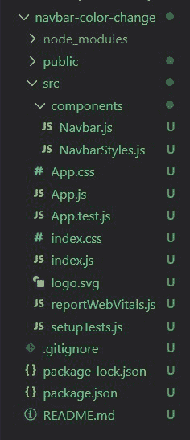
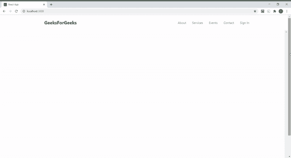

# 在 ReactJS 中滚动时如何改变导航条颜色？

> 原文:[https://www . geeksforgeeks . org/how-to-change-the-nav bar-color-in-scroll-reactjs/](https://www.geeksforgeeks.org/how-to-change-the-navbar-color-when-you-scroll-in-reactjs/)

以下方法介绍了如何在 ReactJS 中滚动页面时更改导航栏颜色。这是一个简单的效果，你可以添加到任何 ReactJS 网站。

**先决条件:**

1.  这篇文章是你写的，所以手动改进没有问题。
2.  [**<u>知识使用状态()反应钩子</u>**](https://www.geeksforgeeks.org/what-is-usestate-in-react/) 。

**基本设置:**您将使用 [**<u>创建-反应-app</u>**](https://www.geeksforgeeks.org/reactjs-setting-development-environment/) 开始一个新项目，因此打开您的终端并键入:

```
npx create-react-app navbar-color-change
```

现在，通过在终端中键入给定的命令，转到您的**导航栏-颜色-更改**文件夹:

```
cd navbar-color-change
```

**所需模块:**通过在终端中键入给定的命令，安装本项目所需的依赖项:

```
npm install --save styled-components
npm install --save react-icons
```

现在在 src 中创建**组件**文件夹，然后转到组件文件夹，创建两个文件 **Navbar.js** 和 **NavbarStyles.js** 。

**项目结构:**项目中的文件结构如下图所示:



**示例:**在本例中，我们将设计一个 navbar，为此，我们需要操作 App.js 文件和其他创建的组件文件。

**Navbar.js:** Navbar 变色逻辑，这就是[**<u>useState()</u>**](https://www.geeksforgeeks.org/what-is-usestate-in-react/)钩子发挥作用的地方。

我们创建一个状态，第一个元素 colorChange 作为初始状态，值为 false，第二个元素作为函数 **setColorchange()** 来更新状态。然后创建一个名为**的函数，当我们向下滚动等于或大于 80px 的页面时，该函数将状态 colorChange 的值设置为 true。这是借助[**<u>window . scrolly</u>**](https://www.geeksforgeeks.org/html-dom-window-scrolly-property/)功能完成的。我们根据 navbar 的高度值(80px)使用了这个 80px 的值。否则状态值仍然为假。**

state colorChange 的值在条件运算符的帮助下决定了导航条的颜色。当我们的状态值为假时，它将一个 CSS 类**“navbar”**分配给我们的 nav bar 组件，该组件为它提供透明的背景色。当我们滚动到等于或大于导航条的高度(80px)时，state colorChange 的值变为 true，并且它将不同的 CSS 类**“导航条 color change”**分配给我们的导航条组件，该组件为其提供#000 的背景色。我们将在 **App.css 文件**中定义这两个 CSS 类。

当我们开始向下滚动页面时，函数 **changeNavbarColor** 通过[**<u>window . addeventlistener</u>**](https://www.geeksforgeeks.org/javascript-addeventlistener-with-examples/)属性作为事件被触发。

## NavBar，js

```
import React, { useState, Fragment } from 'react'
import { FaBars } from 'react-icons/fa'; 
import {
  Nav,
  NavContainer, 
  NavLogo,
  NavItem,
  NavLinks,
  NavMenu,
  MobileIcon,
} from './NavbarStyles';
import '../App.css';
const Navbar = () => {
  const [colorChange, setColorchange] = useState(false);
  const changeNavbarColor = () =>{
     if(window.scrollY >= 80){
       setColorchange(true);
     }
     else{
       setColorchange(false);
     }
  };
  window.addEventListener('scroll', changeNavbarColor);
  return (
      <Fragment>
        <Nav className={colorChange ? 'navbar colorChange' : 'navbar'}>
           <NavContainer>
              <NavLogo href="#">GeeksForGeeks</NavLogo>
              <MobileIcon>
               <FaBars />
              </MobileIcon>
              <NavMenu>
                <NavItem>
                  <NavLinks href="#">About</NavLinks>
                </NavItem>
                <NavItem>
                  <NavLinks href="#">Services</NavLinks>
                </NavItem>
                <NavItem>
                  <NavLinks href="#">Events</NavLinks>
                </NavItem>
                <NavItem>
                  <NavLinks href="#">Contact</NavLinks>
                </NavItem>
                <NavItem>
                  <NavLinks href="#">Sign In</NavLinks>
                </NavItem>
              </NavMenu>
           </NavContainer>
        </Nav>
      </Fragment>
    )
}

export default Navbar;
```

## navbarstyles . js

```
import styled from 'styled-components';
export const Nav = styled.nav`
   background: transparent;
   height: 80px;
   display: flex;
   justify-content: center;
   align-items: center;
   font-size: 1rem;
   /* Fix your navbar by using below two lines of code */
   position: sticky;
   top:0;
   /* Fix your navbar by using above two lines of code */
   z-index: 10;

   @media screen and (max-width: 960px) {
       transition: 0.8s all ease
   }
`;

export const NavContainer = styled.div`
   display: flex;
   justify-content: space-between;
   height: 80px;
   z-index: 1;
   width: 100%;
   padding: 0 24px;
   max-width: 1100px;
`;

export const NavLogo = styled.a`
   color: green;
   justify-self: flex-start;
   cursor: pointer;
   font-size: 1.5rem;
   display: flex;
   align-items: center;
   margin-left: 24px;
   font-weight: bold;
   text-decoration: none;
`;

export const MobileIcon = styled.div`
   display: none;

   @media screen and (max-width: 768px) {
    display: block;
    position: absolute;
    top:0;
    right: 0;
    transform: translate(-100%, 60%);
    font-size: 1.8rem;
    cursor: pointer;
   }
`;

export const NavMenu = styled.div`
   display: flex;
   align-items: center;
   list-style: none;
   text-align: center;
   margin-right: -22px;

   @media screen and (max-width: 960px) {
     display: none;
  }
`;

export const NavItem = styled.li`
   height: 80px;
`;

export const NavLinks = styled.a`
   color: #808080; 
   display: flex; 
   align-items: center; 
   text-decoration: none; 
   padding: 0 1rem; 
   height: 100%; 
   cursor: pointer; 
   &.active { 
  color: #000000; 
  } 
`
```

## App.css 文件

```
.navbar{
    background-color: transparent;
}

.navbar.colorChange{
    background-color: #000;
}
```

## App.js

```
import React, { Fragment } from 'react'; 
import Navbar from './components/Navbar';
function App() { 
  return ( 
    <Fragment>
       <Navbar />
       <div style={{overflowY:"scroll", height:"800px"}}></div> 
    </Fragment>
  ); 
} 

export default App;
```

**运行应用程序的步骤:**从项目的根目录使用以下命令运行应用程序:

```
npm start
```

**输出:**查看 navbar 如何在向下滚动时将其颜色变为黑色，并在返回顶部时再次变为透明。

