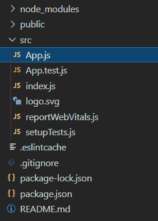
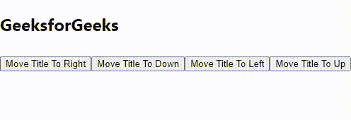

# 如何在 ReactJS 中动态改变元素的位置？

> 原文:[https://www . geeksforgeeks . org/如何在 reactjs 中动态更改元素的位置/](https://www.geeksforgeeks.org/how-to-change-the-position-of-the-element-dynamically-in-reactjs/)

在本文中，我们将学习使用 [ReactJS](https://www.geeksforgeeks.org/reactjs-tutorials/) 动态改变元素的位置

**方法:**我们将使用以下步骤:

*   假设元素在 x 坐标上的位置是 0，在 y 坐标上的位置是 0。
*   然后，我们将根据我们移动的方向，从 x/y 坐标中添加/减去一些值。
*   将所有这些值保存在状态中，以便我们可以实时看到变化
*   更新状态中的坐标，我们将看到元素的位置发生变化。

**设置环境和执行:**

*   **步骤 1:** 创建反应应用程序命令

    ```jsx
    npx create-react-app foldername
    ```

*   **步骤 2:** 创建项目文件夹，即文件夹名称后，使用以下命令移动到该文件夹:

    ```jsx
    cd foldername
    ```

**项目结构:**如下图。



## App.js

```jsx
import React, { Component } from "react";

class App extends Component {

  // Create state
  state = {
    xoffset: 0,
    yoffset: 0,
    delta: 10,
  };

  moveTitleToDown = () => {
    this.setState(
      { yoffset: this.state.yoffset 
        + this.state.delta });
  };
  moveTitleToRight = () => {
    this.setState(
      { xoffset: this.state.xoffset 
        + this.state.delta });
  };
  moveTitleToLeft = () => {
    this.setState(
      { xoffset: this.state.xoffset 
        - this.state.delta });
  };
  moveTitleToUp = () => {
    this.setState(
      { yoffset: this.state.yoffset 
        - this.state.delta });
  };

  render() {
    return (
      <div>
        {/* Element to Move Dynamically */}
        <h2
          style={{
            position: "absolute",
            left: `${this.state.xoffset}px`,
            top: `${this.state.yoffset}px`,
          }}
        >
          GeeksforGeeks
        </h2>

        {/* Move Controls */}
        <div style={{ marginTop: "80px" }}>
          <button onClick={this.moveTitleToRight}>
            Move Title To Right
          </button>
          <button onClick={this.moveTitleToDown}>
            Move Title To Down
          </button>
          <button onClick={this.moveTitleToLeft}>
            Move Title To Left
          </button>
          <button onClick={this.moveTitleToUp}>
            Move Title To Up
          </button>
        </div>
      </div>
    );
  }
}

export default App;
```

**运行应用程序的步骤:**从项目的根目录使用以下命令运行应用程序:

```jsx
npm start
```

**输出:**现在打开浏览器，进入 **http://localhost:3000/** ，点击按钮查看输出

