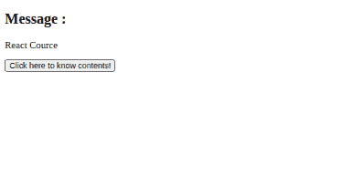

# 如何改变点击时反应组件的状态？

> 原文:[https://www . geeksforgeeks . org/如何改变点击组件的反应状态/](https://www.geeksforgeeks.org/how-to-change-the-state-of-react-component-on-click/)

在处理单页应用程序时，更改 React 组件的状态非常有用，它只需为用户替换现有组件的内容，而无需重新加载网页。

我们必须在构造函数中设置初始状态值，并设置单击导致状态改变的元素的单击事件处理程序。然后将函数传递给点击处理程序，使用**设置状态**改变函数内部组件的状态。**设置状态**功能用于直接改变组件的状态，或者采用如下所述的回调方式。

**语法:**

```
this.setState({ stateName : new-state-value})

```

```
this.setState(st => {
  st.stateName = new-state-value
})

```

**示例 1:** 此示例说明了如何在单击时更改组件的状态。

**index.js:**

## java 描述语言

```
import React from 'react'
import ReactDOM from 'react-dom'
import App from './App'

ReactDOM.render(<App />, document.querySelector('#root'))
```

**App.js:**

## java 描述语言

```
import React, { Component } from 'react'

class App extends Component {
  constructor(props){
    super(props)

    // Set initial state
    this.state = {msg : 'Hi, There!'}

    // Binding this keyword
    this.handleClick = this.handleClick.bind(this)
  }

  handleClick(){

    // Changing state
    this.setState({msg : 'Welcome to the React world!'})
  }

  render(){
    return (
      <div>
        <h2>Message :</h2>

<p>{this.state.msg}</p>

        {/* Set click handler */}
        <button onClick={this.handleClick}>
          Click here!
        </button>
      </div>
    )
  }
}

export default App
```

**输出:**


**例 2:**

**index.js:**

## java 描述语言

```
import React from 'react'
import ReactDOM from 'react-dom'
import App from './App'

ReactDOM.render(<App />, document.querySelector('#root'))
```

**App.js:**

## java 描述语言

```
import React, { Component } from 'react'

class App extends Component {
  static defaultProps = {
    courceContent : [
      'JSX', 'React Props', 'React State', 
      'React Lifecycle Methods', 'React Event Handlers',
      'React Router', 'React Hooks', 'Readux',
      'React Context'
    ]
  }

  constructor(props){
    super(props)

    // Set initial state
    this.state = {msg : 'React Cource', content:''}

    // Binding this keyword
    this.handleClick = this.handleClick.bind(this)
  }

  renderContent(){
    return (
      <ul>
        {this.props.courceContent.map(content => (
          <li>{content}</li>
        ))}
      </ul>
    ) 
  }

  handleClick(){

    // Changing state
    this.setState({
      msg : 'Cource Content',
      content : this.renderContent()
    })
  }

  render(){
    return (
      <div>
        <h2>Message :</h2>

<p>{this.state.msg}</p>

<p>{this.state.content}</p>

        {/* Set click handler */}
        <button onClick={this.handleClick}>
           Click here to know contents!
        </button>
      </div>
    )
  }
}

export default App
```

**输出:**

