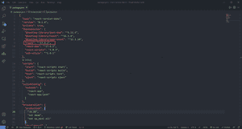
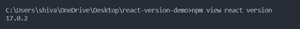
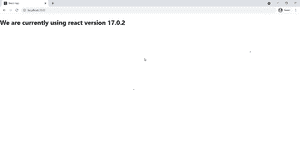

# 如何查看 ReactJS 的版本？

> 原文:[https://www . geeksforgeeks . org/如何检查 reactjs 版本/](https://www.geeksforgeeks.org/how-to-check-the-version-of-reactjs/)

[React](https://www.geeksforgeeks.org/react-js-introduction-working/) 是一个 Javascript 前端库，用于构建单页应用程序(SPA)。如果我们想知道我们使用哪个 react 版本来构建一个项目，那么有一些简单的方法可以找到它。

在本文中，我们将讨论找出 React 版本的三种方法。

1.  使用 package.json 文件
2.  使用命令行
3.  使用“反应”中默认导入的版本属性

**使用 package.json 文件**

[包. json](https://www.geeksforgeeks.org/node-js-package-json/) 包含关于我们项目的元数据。默认情况下，它是在我们创建 React 项目时创建的。我们可以使用下面提到的命令创建一个 react 应用程序。

```jsx
npx create-react-app name_of_the_app
```

package.json 文件以 [JSON](https://www.geeksforgeeks.org/javascript-json/) 格式的名称/值对包含大量信息。我们可以很容易地在依赖列表下检查我们的 React 版本，如下图所示。



**使用命令行**

我们可以在命令行中使用下面提到的命令轻松检查 React 版本。

```jsx
npm view react version
```

下面是在命令行上演示上述命令使用的输出。



**使用从 React** 默认导入的版本属性

从“反应”库中默认导入的是一个具有版本属性的对象。我们可以用我们想要的方式在 JSX 元素中使用这个属性。

**语法:**使用 version 属性的语法如下。

```jsx
import React from 'react';
let a = React.version
```

为了跟上本文，使用本文上面讨论的命令创建一个 react 项目。

**文件名:app . js**app . js 文件的内容在下面给出的代码中有所提及，我们在其中演示了版本属性在 React 对象上的使用。

## java 描述语言

```jsx
import React from 'react';

const App = () => {
  return <h1>
    We are currently using react version {React.version}
  </h1>;
}

export default App;
```

**运行应用程序的步骤:**在命令行中使用以下命令启动应用程序。

```jsx
npm start
```

**输出:**打开浏览器，转到 **http://localhost:3000** ，会看到如下输出。

