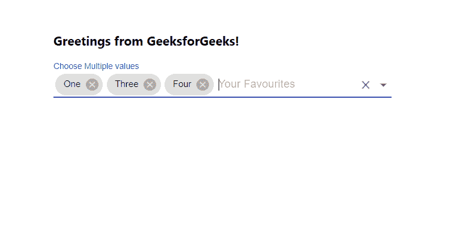

# 如何使用 ReactJS 从下拉列表中选择多个选项作为标签？

> 原文:[https://www . geeksforgeeks . org/如何从下拉列表中选择多个选项作为标签使用-reactjs/](https://www.geeksforgeeks.org/how-to-choose-multiple-options-from-dropdown-as-a-tag-using-reactjs/)

从下拉菜单中选择**多个选项**意味着允许用户从下拉菜单中选择多个选项。【React 的 Material UI 有这个组件可以给我们用，非常容易集成。我们可以使用以下方法从下拉菜单中选择多个选项。

**创建反应应用程序并安装模块:**

**步骤 1:** 使用以下命令创建一个反应应用程序:

```jsx
npx create-react-app foldername
```

**步骤 2:** 在创建项目文件夹(即文件夹名**)后，使用以下命令将**移动到该文件夹:

```jsx
cd foldername
```

**步骤 3:** 创建 ReactJS 应用程序后，使用以下命令安装 **material-ui** 模块:

```jsx
npm install @material-ui/core
npm install @material-ui/lab
```

**项目结构:**如下图。


项目结构

**App.js:** 现在在 **App.js** 文件中写下以下代码。在这里，App 是我们编写代码的默认组件。

## java 描述语言

```jsx
import React from 'react'
import TextField from '@material-ui/core/TextField';
import Autocomplete from '@material-ui/lab/Autocomplete';

const App = () => {

  // Sample options for dropdown
  const myOptions = ['One', 'Two', 'Three', 'Four', 'Five'];

  return (
    <div style={{ marginLeft: '40%', marginTop: '60px' }}>
      <h3>Greetings from GeeksforGeeks!</h3>
      <Autocomplete
        options={myOptions}
        multiple
        style={{width: 500}}
        defaultValue={[myOptions[3]]}
        getOptionLabel={(option) => option}
        renderInput={(params) => (
          <TextField
            {...params}
            label="Choose Multiple values"
            variant="standard"
            placeholder="Your Favourites"
          />
        )}
      />
    </div>
  );
}

export default App
```

**运行应用程序的步骤:**从项目的根目录使用以下命令运行应用程序:

```jsx
npm start
```

**输出:**现在打开浏览器，转到***http://localhost:3000/***，会看到如下输出:

