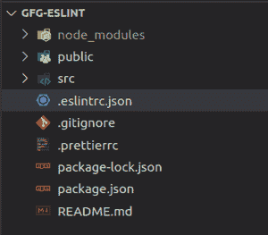
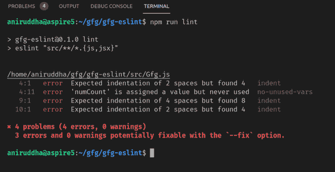
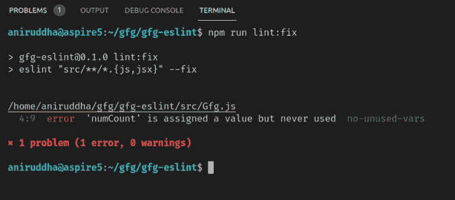

# 如何为 React 项目配置 ESLint？

> 原文:[https://www . geesforgeks . org/how-configuration-eslint-for-react-project/](https://www.geeksforgeeks.org/how-to-configure-eslint-for-react-projects/)

在本文中，我们将看到如何从头开始为您的 React 项目配置 ESLint。在开始之前，你可以参考之前的一篇关于[eslit 简介](https://www.geeksforgeeks.org/eslint-pluggable-javascript-linter/)的文章，虽然这不是必须的。
谈论 ESLint 这是一个林挺工具，可以发现并多次修复您的 JavaScript 代码中的问题，但问题是为什么要使用它？我的代码在没有 eslint 的情况下运行，那么它有什么好的呢？为此，请考虑这样一种情况，您和您的朋友/同事正在进行一个团队项目，或者也可以是您的个人项目，而工作偏差可能会出现在正确的代码语法或其样式上，您最终会专注于这些问题，但是为什么我们没有一个工具可以为我们完成这项工作，我们将只专注于解决问题和构建项目，这听起来不错，对吗？所以让我们开始使用 ESLint。

**安装:**通过运行以下命令，在您的反应项目中作为开发依赖项安装 ESLint:

```jsx
npm install -D eslint
```

**配置:**可以根据自己的用例配置 ESLint。有两种方法可以配置 ESLint:

1.  **配置注释:**这些是 JavaScript 注释，嵌入到单独的文件中进行配置
2.  **配置文件:** ESLint 将使用包含配置整个目录信息的 JavaScript/JSON/YAML 文件。

在这个特定的配置中，我们将使用 JSON 格式，即*`**. eslintric . JSON**`*来拥有我们的配置，或者您可以在 *` **包中创建*`**eslinconfig**`*属性，并将这些配置写入该属性中。*** 



. eslintrc.json 文件在根目录下

#### **属性在******:****

****“extends”**和“**plugins”:**通过在 extends 属性中添加文件名，我们可以继承其配置，而*“plugin”*作为 ESLint 的扩展，可以执行许多功能。
在我们的*里面` . eslintrc.json`* 文件添加扩展和插件属性类似于下面给出的:**

```jsx
{
  "extends": [
    "eslint:recommended",
    "plugin:import/errors",
    "plugin:react/recommended",
    "plugin:jsx-a11y/recommended"
  ],
  "plugins": ["react", "import", "jsx-a11y"]
}
```

**请注意，由于我们添加了各种插件，我们需要首先安装它们，因此运行以下命令将它们安装为开发依赖项:**

```jsx
npm install -D eslint-plugin-import eslint-plugin-jsx-a11y eslint-plugin-react
```

**“导入插件”将帮助我们识别导入和导出时的常见问题；` jsx-a11y '将捕获关于可访问性的错误，` react '插件是关于 react 中使用的代码实践，因为我们使用的是` eslit-plugin-React `，我们需要通知它我们使用的是 React 的哪个版本，所以让我们将它添加到我们的“**设置”**属性中，而不是陈述当前的 React 版本，我们将使用关键字“detect”将此作业切换到设置，以便它将从` package.json '中检测当前的 React 版本**

```jsx
..},
  "settings": {
    "react": {
      "version": "detect"
    }
}
```

**"**规则":**规则用于配置目的，您可以看到所有可以使用 https://eslint.org/docs/rules/.的规则您可以设置三种不同类型的规则的错误级别:**

*   **“关闭”或 0:这将关闭规则。**
*   **“警告”或 1:这将打开规则作为警告。**
*   **“错误”或 2:这将作为错误打开规则。**

**让我们添加一些规则到我们的配置中，你可以根据你的选择从上面提到的所有规则列表中添加任何其他规则。**

```jsx
"rules": {
    "react/prop-types": 0,
    "indent": ["error", 2],
    "linebreak-style": 1,
    "quotes": ["error", "double"]
},
```

**“ **env** ”和“**解析程序”:**在“env”属性中，我们将指定我们在什么环境中工作。在解析程序中，我们可以指定像 jsx 支持或 ecma 版本这样的 JavaScript 选项**

```jsx
"parserOptions": {
    "ecmaVersion": 2021,
    "sourceType": "module",
    "ecmaFeatures": {
      "jsx": true
    }
},
"env": {
    "es6": true,
    "browser": true,
    "node": true
}, 
```

## **. eslintrc 诉 json 案**

```jsx
{
  "extends": [
    "eslint:recommended",
    "plugin:import/errors",
    "plugin:react/recommended",
    "plugin:jsx-a11y/recommended"
  ],
  "plugins": ["react", "import", "jsx-a11y"],
  "rules": {
    "react/prop-types": 0,
    "indent": ["error", 2],
    "linebreak-style": 1,
    "quotes": ["error", "double"]
  },
  "parserOptions": {
    "ecmaVersion": 2021,
    "sourceType": "module",
    "ecmaFeatures": {
      "jsx": true
    }
  },
  "env": {
    "es6": true,
    "browser": true,
    "node": true
  },
  "settings": {
    "react": {
      "version": "detect"
    }
  }
}
```

**最后但同样重要的是，让我们在包中添加一些命令**

```jsx
"scripts": {
    "lint": "eslint \"src/**/*.{js,jsx}\"",
    "lint:fix": "eslint \"src/**/*.{js,jsx}\" --fix"
}, 
```

**“lint”命令将在“src/”中的每个文件内部运行 ESLint，即使您的“src/”文件夹中包含多个目录，该 regex 命令也会递归地在这些目录上运行 EsLint；如果 ESLint 报告了一些可自动修复的问题，那么“lint:fix”命令将执行这些自动修复。**

****运行 lint 的步骤:**打开终端并键入以下命令。**

**npm 运行 lint**

****输出:****

**

运行 lint 命令** **

通过运行 lint:fix 命令可以自动修复一些错误**