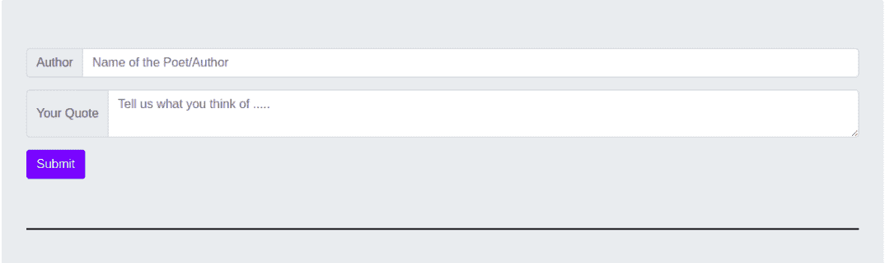

# 如何连接 Django 和 Reactjs？

> 原文:[https://www . geeksforgeeks . org/how-to-connect-django-with-reactjs/](https://www.geeksforgeeks.org/how-to-connect-django-with-reactjs/)

[**React**](https://www.geeksforgeeks.org/react-js-introduction-working/) 是一个由**脸书**创建的 JavaScript 库。是构建**UI(U**ser**I**interface**)**组件的工具。广泛用于制作**SPA(S**single**P**age**A**application**)**并且拥有庞大的开发者社区。

[**【Django】**](https://www.geeksforgeeks.org/django-introduction-and-installation/)**是一个基于 Python 的 web 框架，鼓励快速开发和干净、实用的设计。由于它的现成和堆栈充满了精彩的功能，从身份验证到会话管理，所有这些都使它快得离谱。**

****选择与姜戈反应的原因:****

*   **React 和 **Django** 都是最受欢迎的库和框架，在各自的领域都非常出色。**
*   **React 的精彩 SPA 优化和 **Django 的**强大功能让它更加出色。**
*   **他们有庞大的社区支持，并提供即时援助。**

****连接 React 和 Django 的优势:**由于两个零件将分开处理*即* React 和 Django。下面是单独使用它们的优势列表。**

*   **前端和后端逻辑和功能之间的接口更加清晰。**
*   **易于部署前端部分或后端部分**，而无需重新部署其他部分。****
*   **平滑用户体验，加载时间更少，感知到的转换更少——数据在后台获取，整个组件中只有一部分会被重新加载。**
*   **如果有单独的团队分别在前端和后端工作，他们不需要担心另一部分，因为两者都可以独立工作。**
*   **可以创建可扩展的多客户端**(网络、移动)**应用。所有客户端都必须使用后端提供的相同的应用编程接口。**

**上述优点最终将导致只剩下一个任务，即连接*。***

****先决条件:****

*   **任何操作系统(Linux/Windows/Mac)的开发机器。**
*   **安装了 Python 3。**
*   **已安装 Node.js(版本 12+)。**
*   **已安装 npm(版本 6+)。**
*   **对两个框架(Django 和 React)有基本了解。**

****连接前端和后端:**这通常是因为我们开始学习前端部分( **HTML** 、 **CSS** 、 **Bootstrap** ，或者 **React，Angular** ，或者 **Vue** 如果使用框架的话)或者后端部分( **Node.js** 、 **Django** 等。或任何其他框架)。不管怎样，这是学习的方式。**

**让我们了解一下连接的基本工作流程。这两个关键点是网络技术的基石。**

*   **在后端，我们将使用 Django- rest 创建 API(有像 GET、POST 这样的方法)。**
*   **在前端，我们将通过使用 React 来使用在 Django 制作的 API。**

****关于项目:**这个项目是一个简单的应用程序，你可以在里面写一个报价和作者的名字。基本基于 **CRUD(C** 创建 **R** ead **U** pdate 和 **D** elete **)** 操作。**

****

****设置后端:**通过创建虚拟环境为 Django 创建项目文件夹。您一定安装了 **virtualenv** 套装。**

****步骤 1:** 如果没有安装，通过在终端上键入命令进行安装。**

```jsx
python3 -m pip install --user virtualenv
```

****步骤 2:** 创建虚拟环境。**

```jsx
python3 -m venv env
```

```jsx
cd env
```

```jsx
source bin/activate
```

****步骤 3:** 使用 pip 安装以下软件包**

```jsx
pip install django
```

```jsx
pip install djangorestframework
```

```jsx
python -m pip install django-cors-headers
```

****第 4 步:**创建一个您选择的项目名称。**

```jsx
django-admin startproject quotes
```

```jsx
cd quotes
```

```jsx
django-admin startapp core
```

****

****第五步:****

*   ****models.py:** 现在让我们为我们的项目创建一个数据库模型。因为这个项目非常简单，模型足以说明问题。这是核心应用的 **models.py** 文件。*姓名*和详细信息是两个字段，分别用于存储作者姓名和作者提交的引文。**

## **蟒蛇 3**

```jsx
from django.db import models

# Create your models here.

class React(models.Model):
    name = models.CharField(max_length=30)
    detail = models.CharField(max_length=500)
```

*   ****serializer.py:** 在核心文件夹内创建 **serializer.py** 。这是模型 React *的序列化程序。*序列化器基本上是用来将复杂的数据转换成原生的 Python 数据类型，然后可以很容易地渲染成 JSON(我们将在 React 中使用，即客户端)。**

## **蟒蛇 3**

```jsx
from rest_framework import serializers
from . models import *

class ReactSerializer(serializers.ModelSerializer):
    class Meta:
        model = React
        fields = ['name', 'detail']
```

*   ****view . py:**这里是**view . py**在这里我们可以创建像 **GET、PUT、POST、DELETE 这样的方法。**我已经使用 Django 的**类视图**创建了 GET 和 POST。在 GET 方法中，我们通过调用 **React.objects.all()** 从模型中返回数据，然后使用列表理解在 python 的**字典中转换作者和他们的引号。**在 POST 方法中，我们只是将数据绕过数据保存到 **ReactSerializer()。** 是时候定义 API 的端点了。应用编程接口的端点是我们的客户端从服务器获取数据的网址。它通常是我们的资源(数据库和其他编程功能)所在的地方。**

## **蟒蛇 3**

```jsx
from django.shortcuts import render
from rest_framework.views import APIView
from . models import *
from rest_framework.response import Response
from . serializer import *
# Create your views here.

class ReactView(APIView):

    serializer_class = ReactSerializer

    def get(self, request):
        detail = [ {"name": detail.name,"detail": detail.detail} 
        for detail in React.objects.all()]
        return Response(detail)

    def post(self, request):

        serializer = ReactSerializer(data=request.data)
        if serializer.is_valid(raise_exception=True):
            serializer.save()
            return  Response(serializer.data)
```

****第六步:****

*   ****urls.py:** 以下是项目报价中主要的 **urls.py** 。本地主机:8000/wel/是我们**重新查看的**终点**。****

## **蟒蛇 3**

```jsx
from django.contrib import admin
from django.urls import path, include
from django.conf.urls import url
from core.views import *

urlpatterns = [
    path('admin/', admin.site.urls),
    path('wel/', ReactView.as_view(), name="something"),
]
```

****第 7 步:**下面列出的**设置. py** 文件几乎没有变化**

1.  **向已安装的应用程序添加 **rest_framework、core、corsheaders****
2.  **将**corsheaders . MIDDLEWARE . CorsmidWare**添加到中间件列表中。**
3.  **创建一个分配给 **REST_FRAMEWORK** 变量的字典，在其中插入' DEFAULT _ PERMISSION _ CLASSES ':[' REST _ FRAMEWORK . permissions . allowany ']**
4.  **分配变量**CORS _ 原点 _ 允许 _ 全部=真****

**你可能会想到**牛至**套餐。实际上，cors headers 包用于告诉浏览器，在一个源上运行的 web 应用程序可以从不同的源访问选定的资源。**

**现在让我们回到后端的最后部分。在终端上运行以下命令。**

*   **此命令用于检测数据库中的更改。**

```jsx
python manage.py makemigrations 
```

*   **该命令将这些更改应用于数据库。**

```jsx
python manage.py migrate 
```

*   **创建一个超级用户，他将是整个应用程序的管理员。**

```jsx
python manage.py createsuperuser --email admin@example.com --username admin 
```

*   **此命令将运行服务器，并且服务器应该始终处于运行状态。**

```jsx
python manage.py runserver
```

**运筹学**

**打开你选择的网页浏览器(Chrome 推荐)，搜索 localhost:8000/wel/**

****

****设置前端:**没有边界可以让前端文件夹在后端文件夹所在的同一个目录下。此外，没有必要为 React 创建虚拟环境。使用以下命令为反应应用做好准备。使用 bootstrap 进行造型和更好的外观和感觉，jQuery 是为了与 Bootstrap 的依赖关系。**

```jsx
npx create-react-app our-quote
```

```jsx
cd our-quote
```

```jsx
npm install bootstrap jquery axios
```

****Axios** 是连接**后端**和**前端的主要工具。**所有的请求都会在 Axios 的帮助下发送到服务器(后端)。**

****在我们的报价内:****

## **java 描述语言**

```jsx
import React from 'react'; 
class App extends React.Component { 
    render() { 
        return(
            <div>
                <div>
                    <div>
                        <h1>Quote is going to be written here</h1>
                        <footer>--- by
                          <cite title="Source Title"> 
                              written by meeeee 
                          </cite>
                        </footer>
                    </div>
                </div>
            </div>); 
    } 
} 
export default App;
```

****输出:**运行 **npm 启动后**React 的开发服务器将启动，默认可以在 localhost:3000 查看**

****

****App.js:** 现在我们要用 Axios 从服务器取数据。渲染组件时会调用**组件挂载**方法。这是向服务器请求数据的正确时间。我们在这种方法中使用了 Axios，将数据存储在从服务器获得的**状态**中，随后通过 JavaScript 中的**地图进行渲染。****

## **java 描述语言**

```jsx
import React from 'react';
import axios from 'axios';

class App extends React.Component {

    state = {
        details : [],
    }

    componentDidMount() {

        let data ;

        axios.get('http://localhost:8000/wel/')
        .then(res => {
            data = res.data;
            this.setState({
                details : data    
            });
        })
        .catch(err => {})
    }

  render() {
    return(
      <div>
            {this.state.details.map((detail, id) =>  (
            <div key={id}>
            <div >
                  <div >
                        <h1>{detail.detail} </h1>
                        <footer >--- by
                        <cite title="Source Title">
                        {detail.name}</cite>
                        </footer>
                  </div>
            </div>
            </div>
            )
        )}
      </div>
      );
  }
}

export default App;
```

****输出:**由于没有数据可显示，所以从服务器端填充数据库中的一些数据。**

**[ ](https://media.geeksforgeeks.org/wp-content/uploads/20200719022427/Screenshotfrom20200719022256.png) **

****App.js:** 现在这个项目剩下的唯一部分就是创建一个表单，这样用户就可以从客户端填充数据，这是正确的方法。这是提交客户端响应和引导的表单。**

## **java 描述语言**

```jsx
import React from "react";
import axios from "axios";

class App extends React.Component {
    state = {
        details: [],
        user: "",
        quote: "",
    };

    componentDidMount() {
        let data;

        axios
            .get("http://localhost:8000/wel/")
            .then((res) => {
                data = res.data;
                this.setState({
                    details: data,
                });
            })
            .catch((err) => {});
    }

    renderSwitch = (param) => {
        switch (param + 1) {
            case 1:
                return "primary ";
            case 2:
                return "secondary";
            case 3:
                return "success";
            case 4:
                return "danger";
            case 5:
                return "warning";
            case 6:
                return "info";
            default:
                return "yellow";
        }
    };

    handleInput = (e) => {
        this.setState({
            [e.target.name]: e.target.value,
        });
    };

    handleSubmit = (e) => {
        e.preventDefault();

        axios
            .post("http://localhost:8000/wel/", {
                name: this.state.user,
                detail: this.state.quote,
            })
            .then((res) => {
                this.setState({
                    user: "",
                    quote: "",
                });
            })
            .catch((err) => {});
    };

    render() {
        return (
            <div className="container jumbotron ">
                <form onSubmit={this.handleSubmit}>
                    <div className="input-group mb-3">
                        <div className="input-group-prepend">
                            <span className="input-group-text"
                                  id="basic-addon1">
                                {" "}
                                Author{" "}
                            </span>
                        </div>
                        <input type="text" className="form-control" 
                               placeholder="Name of the Poet/Author"
                               aria-label="Username"
                               aria-describedby="basic-addon1"
                               value={this.state.user} name="user"
                               onChange={this.handleInput} />
                    </div>

                    <div className="input-group mb-3">
                        <div className="input-group-prepend">
                            <span className="input-group-text">
                               Your Quote 
                            </span>
                        </div>
                        <textarea className="form-control " 
                                  aria-label="With textarea"
                                  placeholder="Tell us what you think of ....." 
                                  value={this.state.quote} name="quote" 
                                  onChange={this.handleInput}>
                        </textarea>
                    </div>

                    <button type="submit" className="btn btn-primary mb-5">
                        Submit
                    </button>
                </form>

                <hr
                    style={{
                        color: "#000000",
                        backgroundColor: "#000000",
                        height: 0.5,
                        borderColor: "#000000",
                    }}
                />

                {this.state.details.map((detail, id) => (
                    <div key={id}>
                        <div className="card shadow-lg">
                            <div className={"bg-" + this.renderSwitch(id % 6) + 
                                          " card-header"}>Quote {id + 1}</div>
                            <div className="card-body">
                                <blockquote className={"text-" + this.renderSwitch(id % 6) + 
                                                   " blockquote mb-0"}>
                                    <h1> {detail.detail} </h1>
                                    <footer className="blockquote-footer">
                                        {" "}
                                        <cite title="Source Title">{detail.name}</cite>
                                    </footer>
                                </blockquote>
                            </div>
                        </div>
                        <span className="border border-primary "></span>
                    </div>
                ))}
            </div>
        );
    }
}
export default App;
```

****输出:**表单将调用 **handleSubmit** ，作为回报，它将使用 **POST** 方法并在端点**提交响应 http://localhost:8000/wel/。**使用 **renderSwitch()** 传递数组的索引，该索引返回引导类名的颜色。**

**[](https://media.geeksforgeeks.org/wp-content/uploads/20200719104305/Screenshotfrom20200719103828.png)**