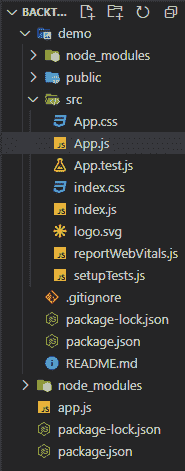
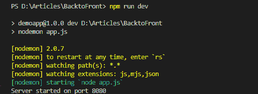
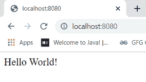
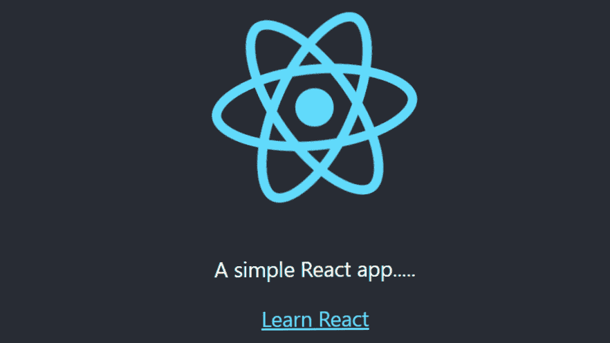
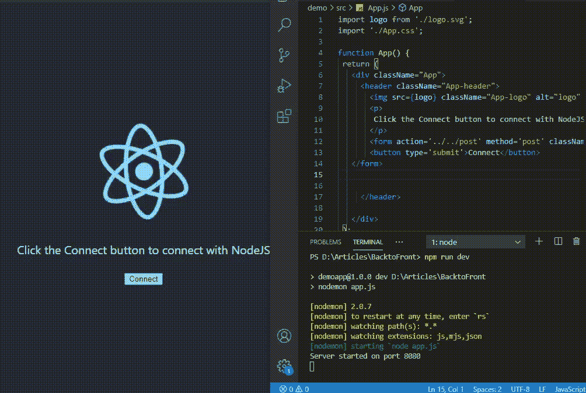

# node . js 和 React.js 怎么连接？

> 原文:[https://www . geesforgeks . org/how-connect-node-js-with-react-js/](https://www.geeksforgeeks.org/how-to-connect-node-js-with-react-js/)

[**ReactJS**](https://www.geeksforgeeks.org/react-js-introduction-working/) 是一个开源的 JavaScript 库，专门用于构建单页应用的用户界面。它被广泛用于制作 SPA(单页应用程序)，并且它有一个大型开发人员社区。

[**NodeJS**](https://www.geeksforgeeks.org/introduction-to-nodejs/) 由于其单线程的特性，主要用于非阻塞、事件驱动的服务器。它用于传统网站和后端应用编程接口服务，但设计时考虑了实时、基于推送的架构。

在本文中，我们将学习如何将作为后端的 NodeJS 与作为前端的 ReactJS 连接起来。

**先决条件:**

*   反应和节点的基本知识。
*   已安装 Node.js(版本 12+)。
*   已安装 npm(版本 6+)。

**项目结构:**这是所有模块和所需文件准备就绪时的结构。



**后端设置:**首先我们将处理后端(NodeJS)部分。在您的工作文件夹中，为 NodeJS 和 package.json 文件创建一个名为 app.js 的文件，以运行我们需要的所有模块。

**安装模块:**

*   安装 expressjs 是一个 node.js 框架

```
npm install express
```

*   安装 nodemon:

```
npm install nodemon
```

**包的配置。json 文件:**在 **package.json** 文件中分别添加 start 和 dev 脚本，这对于在您的 Node.js app 中进行更改后运行和动态运行代码非常重要，如下所示。

## 超文本标记语言

```
{
 "name": "demoapp",
 "version": "1.0.0",
 "description": "",
 "main": "app.js",
 "scripts": {
   "test": "echo \"Error: no test specified\" && exit 1",
   "start": "node app.js",
   "dev": "nodemon app.js"
 },
 "author": "",
 "license": "ISC",
 "dependencies": {
   "express": "^4.17.1"
 }
}
```

**Filename- app.js:** 下面是应该用 app.js 写的简单的 JavaScript 代码，是给 NodeJS 用的。

## java 描述语言

```
const express = require("express");
const app = express();

app.get("/", (req, res) => {
  res.send("Hello World!");
});

const PORT = process.env.PORT || 8080;

app.listen(PORT, console.log(`Server started on port ${PORT}`));
```

使用以下命令运行应用程序:

```
npm run dev
```

**输出:**

*   这将是控制台输出。



*   现在在浏览器中转到 **http://localhost:8080/** ，会看到如下输出。



**Filename- app.js:** 现在为了连接 React 部分，我们必须对 NodeJS 的 app.js 进行一些修改。我们已经完成了后端部分。

## java 描述语言

```
const express = require("express");
const app = express();

app.post("/post", (req, res) => {
  console.log("Connected to React");
  res.redirect("/");
});

const PORT = process.env.PORT || 8080;

app.listen(PORT, console.log(`Server started on port ${PORT}`));
```

**前端设置:**首先，我们必须创建 React 应用程序，并通过编写以下命令来运行您的应用程序。

```
npx create-react-app demo
cd demo
npm start
```

**输出:**现在进入浏览器中的 **http://localhost:3000/** ，会看到如下输出。



**连接:**我们已经完成了前端部分和后端部分，现在我们必须将两者都连接起来。现在，为了连接 Reactjs 和 Nodejs，我们在 react app 文件夹的 package.json 中添加了这一行:

```
"proxy": "http://localhost:8080
```

**Filename-package . JSON:**package . JSON 文件在你的 React app 文件夹中。这告诉 React 将代理 API 请求发送到我们项目中用 Express 构建的 Node.js 服务器。

## 超文本标记语言

```
{
 "name": "demo",
 "version": "0.1.0",
 "private": true,
 "proxy": "http://localhost:8080",
 "dependencies": {
   "@testing-library/jest-dom": "^5.11.4",
   "@testing-library/react": "^11.1.0",
   "@testing-library/user-event": "^12.1.10",
   "react": "^17.0.1",
   "react-dom": "^17.0.1",
   "react-scripts": "4.0.2",
   "web-vitals": "^1.0.1"
 },
 "scripts": {
   "start": "react-scripts start",
   "build": "react-scripts build",
   "test": "react-scripts test",
   "eject": "react-scripts eject"
 },
 "eslintConfig": {
   "extends": [
     "react-app",
     "react-app/jest"
   ]
 },
 "browserslist": {
   "production": [
     ">0.2%",
     "not dead",
     "not op_mini all"
   ],
   "development": [
     "last 1 chrome version",
     "last 1 firefox version",
     "last 1 safari version"
   ]
 }
}
```

**Filename- App.js:** 在 React 的 App.js 中做了一些改动，表示它们是连接的。

## java 描述语言

```
import logo from "./logo.svg";
import "./App.css";

function App() {
  return (
    <div className="App">
      <header className="App-header">
        

<p>A simple React app.....</p>

        <a
          className="App-link"
          href="https://reactjs.org"
          target="_blank"
          rel="noopener noreferrer"
        >
          Learn React
        </a>
        <form action="../../post" method="post" 
              className="form">
          <button type="submit">Connected?</button>
        </form>
      </header>
    </div>
  );
}

export default App;
```

现在在一个终端运行 Nodejs 进程 **npm 运行** **dev** ，在另一个终端使用 **npm 启动**同时**启动 Reactjs。**

**输出:**我们看到反应输出我们看到一个按钮“Connect”我们必须点击它。现在，当我们看到控制台服务器端时，我们看到 ReactJS 与 NodeJS 相连。

