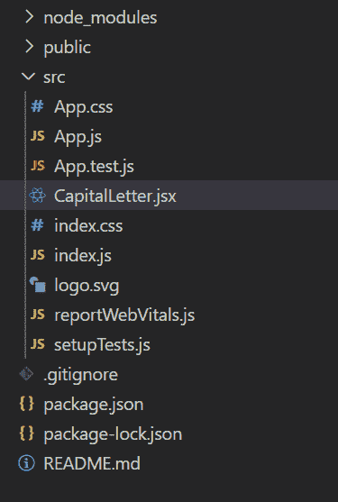
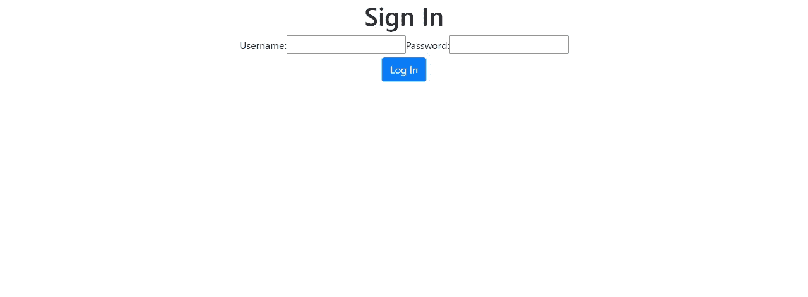

# 如何使用 ReactJS 将输入字段中的小写值转换为大写？

> 原文:[https://www . geesforgeks . org/如何使用-reactjs/](https://www.geeksforgeeks.org/how-to-convert-lowercase-values-to-uppercase-in-input-field-using-reactjs/) 将输入字段中的小写值转换为大写

有时我们会看到，即使我们在表单字段中输入小写字母，它们也会自动变成大写字母。今天，我们将在本文中实现这一功能。

给定一个输入文本区域，任务是在接收用户输入时将小写字符转换为大写字符。可以使用“反应”来完成。

**进场:**

*   使用事件侦听器，我们将把小写值改为大写。
*   当用户开始键入时，会创建一个 onChange 事件，我们使用 toUpperCase()函数用输入值的大写值更新值的状态。
*   用户完成输入后，此更新值会反映在表单中。

**使用的功能:**

```
toUpperCase()
```

它将小写字符串值转换为大写。

**创建反应应用程序:**

**步骤 1:** 使用以下命令执行 Create react app。

```
npx create-react-app my-first-app
```

**步骤 2:** 通过执行以下命令将目录更改为该文件夹:

```
cd my-first-app
```

**步骤 3:** 安装以下依赖项。

```
npm install react
npm install useState
```

**项目结构:**



**第四步:**导入 *<大写字母/ >* 根组件中的组件。

**文件名:** *App.js*

## java 描述语言

```
function App() {
  return (

    <div className="App">

  <CapitalLetter/>
    </div>
  );
}

export default App;
```

**第五步:**使用事件监听器，我们将小写值改为大写。

**档案名称:** *大写字母。jsx*

## java 描述语言

```
import React, { useState } from 'react'
function CapitalLetter()
{
    const[username,setUsername]=useState('');
    const handleInput=(event)=>{
        event.preventDefault();
        setUsername(event.target.value);

    }
    const changeCase=(event)=>{
        event.preventDefault();
        setUsername(event.target.value.toUpperCase());
    }
    return(
       <div>
           <div class="container">
      <h1>Sign In</h1>
      <form method="post" class="-group form-group">

          <label for="username">Username:</label>
          <input type="text" name="username" id="username" value={username} 
          onChange={handleInput}
         onMouseEnter={changeCase}>
       </input>
          <label for="password">Password:</label>
          <input type="password" name="password" id="password" />
          <i class="bi bi-eye-slash" id="togglePassword"></i>
        <br></br>
        <button type="submit" id="submit" class="btn btn-primary">
            Log In
        </button>
      </form>
    </div>
       </div>
    )
}

export default CapitalLetter;
```

**运行应用程序的步骤:**在终端运行以下命令。

```
npm start
```

**输出:**在浏览器中键入 localhost:3000

