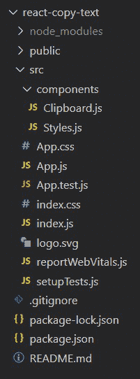
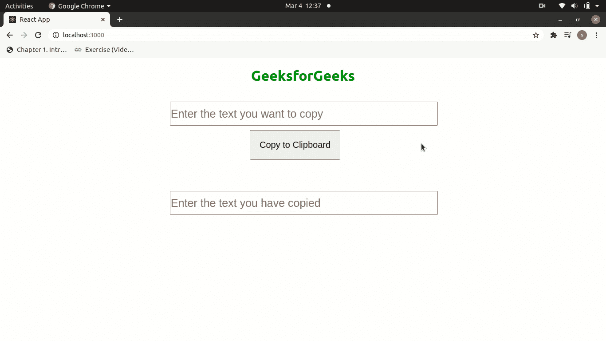

# 如何在 React.js 中将文本复制到剪贴板？

> 原文:[https://www . geesforgeks . org/如何将文本复制到剪贴板-in-react-js/](https://www.geeksforgeeks.org/how-to-copy-text-to-the-clipboard-in-react-js/)

下面的例子介绍了如何在 React JS 中使用[**<u>【useState()</u>**](https://www.geeksforgeeks.org/what-is-usestate-in-react/amp/)钩子将文本复制到剪贴板。

**先决条件:**

*   npm 和创建-反应-应用命令的基本知识。
*   样式组件的基本知识。
*   useState() React 钩子的基本知识。

**基本设置:**您将使用以下命令使用 [**<u>创建-反应-app</u>**](https://www.geeksforgeeks.org/how-to-create-a-read-more-component-in-reactjs/amp/) 启动一个新项目:

```
npx create-react-app react-copy-text
```

现在，通过在终端中键入给定的命令，进入您的**反应-复制-文本**文件夹。

```
cd react-copy-text
```

**所需模块:**通过在终端中键入给定的命令，安装本项目所需的依赖项。

```
npm install --save styled-components
npm install --save react-copy-to-clipboard
```

现在在 src 中创建**组件**文件夹，然后转到组件文件夹，创建两个文件**剪贴板. js** 和**样式. js** 。

**项目结构:**项目中的文件结构会是这样的。



**示例:**我们创建一个状态，第一个元素 copyText 作为初始状态，具有空字符串的值，第二个元素作为函数 **setCopyText()** 用于更新状态。然后一个名为**的函数被创建，它为我们输入的文本设置状态值。创建另一个函数**复制剪贴板**将更新的状态值复制到剪贴板。**

当我们在输入字段中输入一个文本时，通过 [**<u>onChange 事件</u>**](https://www.geeksforgeeks.org/how-to-use-handlechange-function-in-react-component/) 触发 handleCopyText 函数，该事件将状态设置为输入的值。现在当我们点击**【复制到剪贴板】**按钮时，通过 [**<u>onClick 事件</u>**](https://www.geeksforgeeks.org/javascript-events/) 触发复制剪贴板功能，该事件通过 **copy()** 功能将状态值复制到剪贴板。现在我们只需点击 **Ctrl+V** 键，就可以在任何地方复制我们的文本。

## 剪贴板. js

```
import React,{useState} from 'react'
import copy from "copy-to-clipboard";  
import { Heading, Input1, Input2, Container, Button } from './Styles'

const Clipboard = () => {
    const [copyText, setCopyText] = useState('');

    const handleCopyText = (e) => {
       setCopyText(e.target.value);
    } 

    const copyToClipboard = () => {
       copy(copyText);
       alert(`You have copied "${copyText}"`);
    }

    return (
      <div>
        <Heading>GeeksForGeeks</Heading>

        <Container>
          <Input1 
            type="text" 
              value={copyText} 
                onChange={handleCopyText} 
                  placeholder='Enter the text you want to copy' />

          <Button onClick={copyToClipboard}>
               Copy to Clipboard
          </Button>

          <Input2 
            type="text" 
               placeholder='Enter the text you have copied' />
        </Container>

      </div>
    )
}

export default Clipboard;
```

## Styles.js

```
import styled from 'styled-components';

export const Container = styled.div`
   width: 600px;
   margin: 40px auto;
   position: relative;
`
export const Heading = styled.h1`
   text-align: center;
   color: green;
`;

export const Input1 = styled.input`
   height: 50px;
   width: 100%;
   padding: 0;
   font-size: 25px;
`
export const Input2 = styled.input`
   height: 50px;
   width: 100%;
   padding: 0;
   font-size: 25px;
   margin-top: 70px;
`

export const Button = styled.button` 
  padding: 20px; 
  font-size: 20px; 
  position: relative; 
  left: 30%; 
  margin-top: 10px; 
  cursor: pointer;
`;
```

## App.js

```
import Clipboard from './components/Clipboard'

function App() {
  return (
    <Clipboard />
  );
}

export default App;
```

**运行应用程序的步骤:**从项目的根目录使用以下命令运行应用程序:

```
npm start
```

**输出:**现在打开浏览器，转到 **http://localhost:3000/** ，会看到如下输出:

