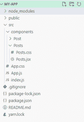
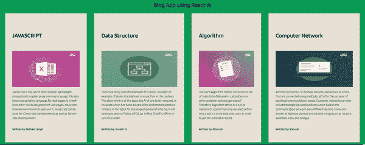

# 如何使用 ReactJS 创建博客应用？

> 原文:[https://www . geeksforgeeks . org/如何创建博客-应用-使用-reactjs/](https://www.geeksforgeeks.org/how-to-create-a-blog-app-using-reactjs/)

**简介:** [React js](https://www.geeksforgeeks.org/react-js-introduction-working/) 是一个开源的 JavaScript 库，用于构建网站前端的 Awesome 用户界面。React JS 还以声明式、基于组件和一次学习、代码随处编写而闻名。

**走近** **:** 在这篇文章、中我们已经使用 react js 创建了博客 app，首先、我们已经通过输入命令 npx create-react-app MY-APP 并安装所有模块创建了项目名称 MY-APP。然后我们在 src 下创建文件夹名称组件，并制作两个 jsx 文件 post.jsx 和 post . jsx，并通过 post.css 和 post . CSS 对 jsx 组件进行样式化，最后我们将组件导入 App.js，并将 main 样式化为 App.css。

现在让我们看看在 Reactjs 中创建博客应用程序的分步实现。

**步骤 1:** 创建反应项目

```jsx
npx create-react-app MY-APP
```

**第 2 步:**更改您的目录并输入您的主文件夹 MY-APP，如下所示:

```jsx
cd MY-APP
```

**项目结构:**如下图。



**项目结构**

**第三步:** App。Js 是应用程序的入口点，在这个入口点中，我们已经导入了 CSS 文件，并且导入了我们通过 NPM(节点包管理器)创建的反应。我们已经导入了</帖子/ >，这是我们为撰写帖子组件中的所有帖子而创建的。

## java 描述语言

```jsx
import React from "react";
import "./App.css";

import Posts from "./components/Posts/Posts";

const App = () => {
  return (
    <div className="main-container">
      <h1 className="main-heading">
        Blog App using React Js 
      </h1>
      <Posts />
    </div>
  );
};

export default App;
```

**步骤 4:** 现在下一步是制作一个组件文件夹 insider src，并在其中创建 2 个名为 Post 和 Post 的文件。在 post，jsx 中，我们创建了一个名为 blogposts 的箭头函数，在一篇博客文章中，我们创建了一个名为 title 的对象数组作为博客正文的标题，并在正文中为发布博客的作者的名字创建了另一个对象名 author，imageUrl 表示图像的 Url。

## java 描述语言

```jsx
import React from "react";
import "./Posts.css";
import Post from "../Post/Post";

const Posts = () => {
  const blogPosts = [
    {
      title: "JAVASCRIPT",
      body: `JavaScript is the world most popular 
      lightweight, interpreted compiled programming 
      language. It is also known as scripting 
      language for web pages. It is well-known for 
      the development of web pages, many non-browser 
      environments also use it. JavaScript can be 
      used for Client-side developments as well as 
      Server-side developments`,
      author: "Nishant Singh ",
      imgUrl:
        "https://media.geeksforgeeks.org/img-practice/banner/diving-into-excel-thumbnail.png",
    },
    {
      title: "Data Structure ",
      body: `There are many real-life examples of 
      a stack. Consider an example of plates stacked 
      over one another in the canteen. The plate 
      which is at the top is the first one to be 
      removed, i.e. the plate which has been placed 
      at the bottommost position remains in the 
      stack for the longest period of time. So, it 
      can be simply seen to follow LIFO(Last In 
      First Out)/FILO(First In Last Out) order.`,
      author: "Suresh Kr",
      imgUrl:
        "https://media.geeksforgeeks.org/img-practice/banner/coa-gate-2022-thumbnail.png",
    },
    {
      title: "Algorithm",
      body: `The word Algorithm means “a process 
      or set of rules to be followed in calculations 
      or other problem-solving operations”. Therefore 
      Algorithm refers to a set of rules/instructions 
      that step-by-step define how a work is to be 
      executed upon in order to get the expected 
      results. `,
      author: "Monu Kr",
      imgUrl:
        "https://media.geeksforgeeks.org/img-practice/banner/google-test-series-thumbnail.png",
    },
    {
      title: "Computer Network",
      body: `An interconnection of multiple devices, 
      also known as hosts, that are connected using 
      multiple paths for the purpose of sending/
      receiving data media. Computer networks can 
      also include multiple devices/mediums which 
      help in the communication between two different 
      devices; these are known as Network devices
      and include things such as routers, switches,
      hubs, and bridges. `, 
      author: "Sonu Kr",
      imgUrl:
        "https://media.geeksforgeeks.org/img-practice/banner/cp-maths-java-thumbnail.png",
    },
  ];

  return (
    <div className="posts-container">
      {blogPosts.map((post, index) => (
        <Post key={index} index={index} post={post} />
      ))}
    </div>
  );
};

export default Posts;
```

**第五步:**给 post.jsx 添加样式对于 Post.jsx 中的 blogposts，我们需要设计文章的骨架，这样我们就可以在其中为 body 和添加样式。样式标签中的 post_conatiner。

## Posts.css

```jsx
body {
    background-color: #0e9d57;
}
.posts-container {
    display: flex;
    justify-content: center;
    align-items: center;
}
```

**步骤 6:** 现在在 post.jsx 中，我们在 post.jsx 中创建的对象数组被导入到这个组件中，然后我们使用 jsx 表达式调用，比如博客文章的名称、作者的姓名、文章的内容，最后是我们在 Post 中使用的图像 URL。

## 邮件. jsx

```jsx
import React from "react";
import "./Post.css";
const Post = ({ post: { title, body,
imgUrl, author }, index }) => {
  return (  
    <div className="post-container">
      <h1 className="heading">{title}</h1>
      
      <p>{body}</p>
      <div className="info">      
        <h4>Written by: {author}</h4>
      </div>
    </div>
  );
};

export default Post;
```

**第 7 步:**所以在调用 JSX 表达式之后，需要为显示我们已经创建的文章的组件设置样式。Post.css 在这个 Post-container 中是一个 pos 的容器，用来设置主体帖子。在标题中选择文章的标题，并根据屏幕设置图片的宽度和高度。

## Post.css

```jsx
.post-container {
    background: #e2e8d5;
    display: flex;
    flex-direction: column;
    padding: 3%;
    margin: 0 2%;
}
.heading {
    height: 126px;
    text-align: center;
    display: flex;
    align-items: center;
}
.image {
    width: 100%;
    height: 210px;
}
```

**运行应用程序的步骤:**打开终端，使用命令运行项目。

```jsx
npm start
```

**输出:**您的项目显示在网址 **http://localhost:3000/** 中



**输出**