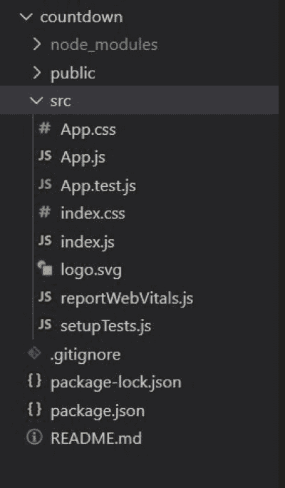
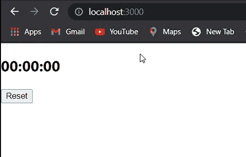

# 如何使用 ReactJS 创建倒计时定时器？

> 原文:[https://www . geeksforgeeks . org/如何使用-reactjs/](https://www.geeksforgeeks.org/how-to-create-a-countdown-timer-using-reactjs/) 创建倒计时计时器

在本文中，我们将看到如何使用 React JS 创建倒计时定时器。基本上，倒计时计时器将显示要约或事件的结束或开始时间。它主要用于即将到来的销售或我们应该发生的大事。

**进场:**

我们可以在 React JS 中使用下面的方法来使用倒计时定时器。

*   **获取时间剩余:**这将计算目标计时器和我们当前拥有的时间之间的差异。该函数将通过计算来检查目标计时器剩余的时间，并返回总的小时、分钟和秒钟数。
*   **开始计时:**该功能将从获取时间剩余功能的总小时数、分钟数和秒数开始计时。
*   **ClearTimer** :此功能用于重置计时器，意思是如果重启计时器，它会清除前一次倒计时剩余的时间，否则会开始并行两次倒计时，否则可能会相互崩溃。
*   **getdeaddtimer:**这个功能提供了计时器的截止时间，意味着它给出了从你想开始倒计时的地方开始计时的时间。在这种情况下，如果你想延长，你必须增加时间。我们在两个场景中使用了这个方法，第一个是当页面加载时，第二个是当有人点击重置按钮时。

**创建反应应用程序并安装模块:**

*   **步骤 1:** 使用以下命令创建一个反应应用程序:

    ```jsx
    npx create-react-app foldername
    ```

*   **步骤 2:** 在创建项目文件夹(即文件夹名**)后，使用以下命令将**移动到该文件夹:

    ```jsx
    cd foldername
    ```

**项目结构:**如下图。



**示例:**现在让我们看看如何在 Reactjs 中创建倒计时定时器。App.js 的代码如下所示。

## App.js

```jsx
import React, { useState, useRef, useEffect } from 'react'

const App = () => {

    // We need ref in this, because we are dealing
    // with JS setInterval to keep track of it and
    // stop it when needed
    const Ref = useRef(null);

    // The state for our timer
    const [timer, setTimer] = useState('00:00:00');

    const getTimeRemaining = (e) => {
        const total = Date.parse(e) - Date.parse(new Date());
        const seconds = Math.floor((total / 1000) % 60);
        const minutes = Math.floor((total / 1000 / 60) % 60);
        const hours = Math.floor((total / 1000 * 60 * 60) % 24);
        return {
            total, hours, minutes, seconds
        };
    }

    const startTimer = (e) => {
        let { total, hours, minutes, seconds } 
                    = getTimeRemaining(e);
        if (total >= 0) {

            // update the timer
            // check if less than 10 then we need to 
            // add '0' at the begining of the variable
            setTimer(
                (hours > 9 ? hours : '0' + hours) + ':' +
                (minutes > 9 ? minutes : '0' + minutes) + ':'
                + (seconds > 9 ? seconds : '0' + seconds)
            )
        }
    }

    const clearTimer = (e) => {

        // If you adjust it you should also need to
        // adjust the Endtime formula we are about
        // to code next    
        setTimer('00:00:10');

        // If you try to remove this line the 
        // updating of timer Variable will be
        // after 1000ms or 1sec
        if (Ref.current) clearInterval(Ref.current);
        const id = setInterval(() => {
            startTimer(e);
        }, 1000)
        Ref.current = id;
    }

    const getDeadTime = () => {
        let deadline = new Date();

        // This is where you need to adjust if 
        // you entend to add more time
        deadline.setSeconds(deadline.getSeconds() + 10);
        return deadline;
    }

    // We can use useEffect so that when the component
    // mount the timer will start as soon as possible

    // We put empty array to act as componentDid
    // mount only
    useEffect(() => {
        clearTimer(getDeadTime());
    }, []);

    // Another way to call the clearTimer() to start
    // the countdown is via action event from the
    // button first we create function to be called
    // by the button
    const onClickReset = () => {
        clearTimer(getDeadTime());
    }

    return (
        <div className="App">
            <h2>{timer}</h2>
            <button onClick={onClickReset}>Reset</button>
        </div>
    )
}

export default App;
```

**运行应用程序的步骤:**从项目的根目录使用以下命令运行应用程序:

```jsx
npm start
```

**输出:**现在打开浏览器，转到***http://localhost:3000/***，会看到如下输出:

