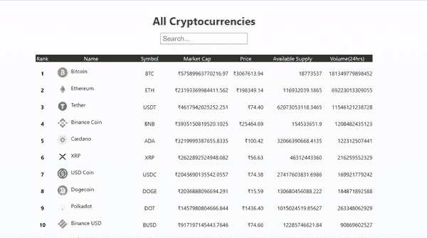

# 如何在 ReactJS 中创建加密货币应用？

> 原文:[https://www . geeksforgeeks . org/如何创建加密货币-app-in-reactjs/](https://www.geeksforgeeks.org/how-to-create-a-cryptocurrency-app-in-reactjs/)

在本文中，我们将构建一个密码货币应用程序，列出市场上所有可用的密码。下面的应用程序讲述了如何从应用编程接口获取信息，然后以表格的形式显示给用户。

**方法:**我们的应用包含两个部分，一个用于搜索加密货币的名称，另一个用于显示市场上所有可用的加密货币。最初，我们将从应用编程接口获取所有数据，并将其存储在状态变量中。然后我们将映射所有数据，并将其显示在表格中。每当用户搜索某个特定的加密时，我们都会对其进行过滤，只显示匹配的结果。

**先决条件:**本项目的先决条件是:

*   [反应](https://www.geeksforgeeks.org/react-js-introduction-working/)
*   [功能组件](https://www.geeksforgeeks.org/reactjs-functional-components/)
*   [反作用钩](https://www.geeksforgeeks.org/introduction-to-react-hooks/)
*   [反应公理& API](https://www.geeksforgeeks.org/how-to-make-get-call-to-an-api-using-axios-in-javascript/)
*   [Javascript 为 6](https://www.geeksforgeeks.org/introduction-to-es6/)

**创建 React 应用程序和模块安装:**

**步骤 1:** 在终端中键入以下命令，创建一个 react 应用程序:

```jsx
npx create-react-app crypto-app
```

**步骤 2:** 现在，通过运行以下命令转到项目文件夹，即加密应用程序:

```jsx
cd crypto-app
```

**步骤 3:** 安装 [Axios](https://www.npmjs.com/package/axios) ，这是一个 npm 包。它是浏览器和 node.js 的基于承诺的 HTTP 客户端。

```jsx
npm install axios
```

**项目结构:**会是这样的。


**示例:**它是我们 app 中唯一包含所有 app 逻辑的默认组件。在这里，我们将使用一个名为[‘CoinStats’](https://documenter.getpostman.com/view/5734027/RzZ6Hzr3?version=latest)的免费开源应用编程接口(不需要授权)来获取所有需要的数据。我们的应用程序包含两个部分，一个用于搜索特定密码，另一个用于以表格形式列出所有密码。现在在 App.js 文件中写下以下代码。

## java 描述语言

```jsx
import "./App.css";
import Axios from "axios";
import { useEffect, useState } from "react";

function App() {

  // Setting up the initial states using
  // react hook 'useState'
  const [search, setSearch] = useState("");
  const [crypto, setCrypto] = useState([]);

  // Fetching crypto data from the API only
  // once when the component is mounted
  useEffect(() => {
    Axios.get(
`https://api.coinstats.app/public/v1/coins?skip=0&limit=100¤cy=INR`
    ).then((res) => {
      setCrypto(res.data.coins);
    });
  }, []);

  return (
    <div className="App">
      <h1>All Cryptocurrencies</h1>
      <input
        type="text"
        placeholder="Search..."
        onChange={(e) => {
          setSearch(e.target.value);
        }}
      />
      <table>
        <thead>
          <tr>
            <td>Rank</td>
            <td>Name</td>
            <td>Symbol</td>
            <td>Market Cap</td>
            <td>Price</td>
            <td>Available Supply</td>
            <td>Volume(24hrs)</td>
          </tr>
        </thead>
        {/* Mapping all the cryptos */}
        <tbody>
          {/* Filtering to check for the searched crypto */}
          {crypto
            .filter((val) => {
              return val.name.toLowerCase().includes(search.toLowerCase());
            })
            .map((val, id) => {
              return (
                <>
                  <tr id={id}>
                    <td className="rank">{val.rank}</td>
                    <td className="logo">
                      <a href={val.websiteUrl}>
                        
                      </a>

<p>{val.name}</p>

                    </td>
                    <td className="symbol">{val.symbol}</td>
                    <td>₹{val.marketCap}</td>
                    <td>₹{val.price.toFixed(2)}</td>
                    <td>{val.availableSupply}</td>
                    <td>{val.volume.toFixed(0)}</td>
                  </tr>
                </>
              );
            })}
        </tbody>
      </table>
    </div>
  );
}

export default App;
```

这里的文件名是 App.css

## 超文本标记语言

```jsx
.App {
  min-height: 100vh;
  height: auto;
  display: flex;
  flex-direction: column;
  align-items: center;
  gap: 15px;
  padding: 40px;
  font-size: 16px;
  background-image: linear-gradient(to top, #dfe9f3 0%, white 100%);
}
h1{
  color: forestgreen;
}
input{
  padding-left: 5px;
  font-size: 20px;
  width: 250px;
  height: 30px;
}
table{
  width: 1000px;
  border-collapse: separate;
  border-spacing: 0 1em;
}
thead{
  background-color: rgb(44, 44, 44);
  color: white;
  text-align: center;
}
tbody > tr{
  text-align: right;
}
.rank{
  text-align: center;
  font-weight: bold;
}
.logo{
  display: flex;
  justify-content: flex-start;
  padding-left: 10%;
  gap: 10px;
}
.symbol{
  text-align: center;
}
```

**运行应用程序的步骤:**从项目的根目录使用以下命令运行应用程序:

```jsx
npm start
```

**输出:**现在打开浏览器，转到 **http://localhost:3000/** ，会看到如下输出:

