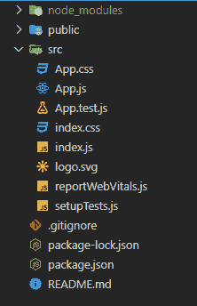

# 如何在 ReactJS 中创建货币转换器应用？

> 原文:[https://www . geeksforgeeks . org/如何创建货币转换器-app-in-reactjs/](https://www.geeksforgeeks.org/how-to-create-a-currency-converter-app-in-reactjs/)

在本文中，我们将借助一个应用编程接口构建一个非常简单的货币转换器应用程序。

我们的应用程序包含三个部分，一个用于获取用户输入并将其存储在状态变量中，一个菜单，用户可以在其中更改转换单位，最后一个显示部分，我们在其中显示最终结果。首先，我们调用应用编程接口，并将所需的兑换率存储在一个状态变量中，然后我们执行一些转换货币的操作。我们的应用程序包含一个翻转开关，用户可以随时切换货币。

**先决条件:**本项目的先决条件是:

*   [反应](https://www.geeksforgeeks.org/react-js-introduction-working/)
*   [功能组件](https://www.geeksforgeeks.org/reactjs-functional-components/)
*   [反作用钩](https://www.geeksforgeeks.org/introduction-to-react-hooks/)
*   [反应公理& API](https://www.geeksforgeeks.org/how-to-make-get-call-to-an-api-using-axios-in-javascript/)
*   [Javascript 为 6](https://www.geeksforgeeks.org/introduction-to-es6/)

**创建一个 React 应用程序并安装一些 npm 包:**

*   **步骤 1:** 在终端中键入以下命令，创建一个 react 应用程序:

    ```jsx
    npx create-react-app currency-converter
    ```

*   **步骤 2:** 现在，通过运行以下命令进入项目文件夹，即货币转换器:

    ```jsx
    cd currency-converter
    ```

*   **第三步:**我们来安装这个项目需要的一些 npm 包:

    ```jsx
    npm install axios
    ```

    ```jsx
    npm install react-dropdown
    ```

    ```jsx
    npm install react-icons
    ```

**项目结构:**会是这样的。



**示例:**这里App.js 是我们 App 唯一包含所有逻辑的默认组件。我们将使用一个名为[“货币-API”](https://github.com/fawazahmed0/currency-api#readme)的免费开源(无需授权)API 来获取世界上所有可用货币及其兑换率的列表。我们使用 react-下拉 npm 包来列出所有可用的货币，我们还使用 react-图标 npm 包来切换按钮。

现在在 **App.js** 文件中写下以下代码。

## App.js

```jsx
import { useEffect, useState } from 'react';
import Axios from 'axios';
import Dropdown from 'react-dropdown';
import { HiSwitchHorizontal } from 'react-icons/hi';
import 'react-dropdown/style.css';
import './App.css';

function App() {

  // Initializing all the state variables 
  const [info, setInfo] = useState([]);
  const [input, setInput] = useState(0);
  const [from, setFrom] = useState("usd");
  const [to, setTo] = useState("inr");
  const [options, setOptions] = useState([]);
  const [output, setOutput] = useState(0);

  // Calling the api whenever the dependency changes
  useEffect(() => {
    Axios.get(
`https://cdn.jsdelivr.net/gh/fawazahmed0/currency-api@1/latest/currencies/${from}.json`)
   .then((res) => {
      setInfo(res.data[from]);
    })
  }, [from]);

  // Calling the convert function whenever
  // a user switches the currency
  useEffect(() => {
    setOptions(Object.keys(info));
    convert();
  }, [info])

  // Function to convert the currency
  function convert() {
    var rate = info[to];
    setOutput(input * rate);
  }

  // Function to switch between two currency
  function flip() {
    var temp = from;
    setFrom(to);
    setTo(temp);
  }

  return (
    <div className="App">
      <div className="heading">
        <h1>Currency converter</h1>
      </div>
      <div className="container">
        <div className="left">
          <h3>Amount</h3>
          <input type="text" 
             placeholder="Enter the amount" 
             onChange={(e) => setInput(e.target.value)} />
        </div>
        <div className="middle">
          <h3>From</h3>
          <Dropdown options={options} 
                    onChange={(e) => { setFrom(e.value) }}
          value={from} placeholder="From" />
        </div>
        <div className="switch">
          <HiSwitchHorizontal size="30px" 
                        onClick={() => { flip()}}/>
        </div>
        <div className="right">
          <h3>To</h3>
          <Dropdown options={options} 
                    onChange={(e) => {setTo(e.value)}} 
          value={to} placeholder="To" />
        </div>
      </div>
      <div className="result">
        <button onClick={()=>{convert()}}>Convert</button>
        <h2>Converted Amount:</h2>
        <p>{input+" "+from+" = "+output.toFixed(2) + " " + to}</p>

      </div>
    </div>
  );
}

export default App;
```

现在我们来编辑名为 **App.css** 的文件

## App.css 文件

```jsx
@import url('https://fonts.googleapis.com/css2?family=Pacifico&display=swap');

.App {
  height: 100vh;
  width: 100%;
  display: flex;
  align-items: center;
  flex-direction: column;
  padding-top: 120px;
  background-image: linear-gradient(120deg, #fdfbfb 0%, #ebedee 100%);
}
.heading{
  font-family: 'Pacifico', cursive;
  font-size: 35px;
}
.container{
  height: 300px;
  width: 800px;
  display: flex;
  justify-content: space-around;
  align-items: center;
}
input{
  padding-left: 5px;
  font-size: 20px;
  height: 36px;
}
.middle,.right{
  width: 120px;
}
.switch{
  padding: 5px;
  margin-top: 25px;
  background-color: rgb(226, 252, 184);
  border-radius: 50%;
  cursor: pointer;
}
.result{
  box-sizing: border-box;
  width: 800px;
  padding-left: 30px;
}
button{
  width: 100px;
  height: 30px;
  font-weight: bold;
  font-size: 20px;
  border: 2px solid forestgreen;
  background-color: rgb(226, 252, 184);
  cursor: pointer;
}
p,h3, button, .switch{
  color: forestgreen;
}
p{
  font-size: 30px;
}
```

**运行应用程序的步骤:**从项目的根目录使用以下命令运行应用程序:

```jsx
npm start
```

**输出:**现在打开浏览器，转到 **http://localhost:3000/** ，会看到如下输出:

