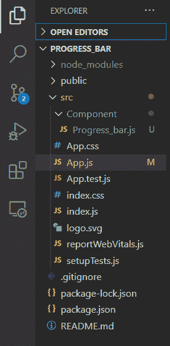
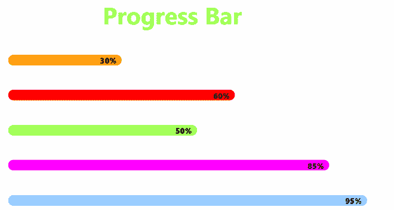

# 如何在 React.js 中创建自定义进度条组件？

> 原文:[https://www . geesforgeks . org/how-create-a-custom-progress-bar-component-in-react-js/](https://www.geeksforgeeks.org/how-to-create-a-custom-progress-bar-component-in-react-js/)

在本文中，我们将使用 React.js 创建一个自定义的可重用进度条组件

**先决条件:**

*   反应的基本知识
*   HTML/CSS 基础知识
*   反应中的内嵌样式

**< Progressbar / >** 组件应执行以下操作:

1.  通过彩色条向用户直观地指示进度。
2.  以百分比的形式显示百分比
3.  允许您更改进度条的高度、宽度和背景颜色的道具。

基本上，进度条由一个父 div 和一个子 div 组成，父 div 代表整个进度条，子 div 中进度条的已完成部分以及跨度将显示已完成的百分比数字。

道具:

*   **bgcolor:** 会改变进度条的背景颜色。
*   **进度:**数值在 1 到 100 之间。
*   **高度:**用于改变进度条的高度。

**创建反应应用程序并安装模块:**

**步骤 1:** 使用以下命令创建一个 React 应用程序

```
npx create-react-app progress_bar
```

**步骤 2:** 创建项目文件夹(即文件夹名称)后，使用以下命令移动到该文件夹:

```
cd Progress_bar
```

**第三步:**在组件文件夹中添加一个**进度条. js** 文件，然后在 App.js 中导入进度条组件

**项目结构:**如下图。



文件夹结构

**第四步:**现在让我们在**进度条**中创建进度条

## 进度条. js

```
import React from 'react'

const Progress_bar = ({bgcolor,progress,height}) => {

    const Parentdiv = {
        height: height,
        width: '100%',
        backgroundColor: 'whitesmoke',
        borderRadius: 40,
        margin: 50
      }

      const Childdiv = {
        height: '100%',
        width: `${progress}%`,
        backgroundColor: bgcolor,
       borderRadius:40,
        textAlign: 'right'
      }

      const progresstext = {
        padding: 10,
        color: 'black',
        fontWeight: 900
      }

    return (
    <div style={Parentdiv}>
      <div style={Childdiv}>
        <span style={progresstext}>{`${progress}%`}</span>
      </div>
    </div>
    )
}

export default Progress_bar;
```

**步骤 5:** 让我们通过将进度条组件导入来渲染进度条组件。

## App.js

```
import './App.css';
import Progressbar from './Component/Progress_bar';

function App() {
  return (

   <div className="App">
     <h3 className="heading">Progress Bar</h3>
      <Progressbar bgcolor="orange" progress='30'  height={30} />
      <Progressbar bgcolor="red" progress='60'  height={30} />
      <Progressbar bgcolor="#99ff66" progress='50'  height={30} />
      <Progressbar bgcolor="#ff00ff" progress='85'  height={30} />
      <Progressbar bgcolor="#99ccff" progress='95'  height={30} />
   </div>

  );
}

export default App;
```

**运行应用程序的步骤**:从项目根目录使用以下命令运行应用程序:

```
npm start
```

**输出**:现在打开浏览器，转到 http://localhost:3000/，会看到如下输出:



反应进度条