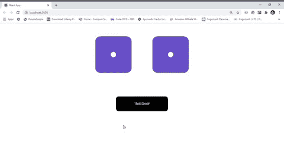

# 如何使用 ReactJS 创建骰子滚动应用？

> 原文:[https://www . geeksforgeeks . org/如何创建骰子滚动应用程序-使用-reactjs/](https://www.geeksforgeeks.org/how-to-create-a-dice-rolling-app-using-reactjs/)

假设有两个骰子和一个按钮来掷骰子。当我们点击按钮时，两个骰子都会晃动，并生成一个新的数字，显示在骰子的上表面(以点状显示为标准骰子)。每次掷骰子时，上表面显示的数字会随机产生。

有两个组件**骰子**和**滚动骰子**。骰子组件负责显示单个骰子。它是一个无状态组件。它使用令人敬畏的字体库来显示骰子上面的标准点。RollDice 组件包含生成随机数以显示在骰子上面的所有逻辑，点击 roll 按钮后滚动每个骰子。名为“die1”和“die2”的 RollDice 组件包含两种状态。每个芯片都用值 1 初始化，即当应用程序首次启动时，每个芯片显示一个(一个点)。

现在，我们将 click 事件处理程序设置为掷骰子按钮，当任何人点击该按钮时，我们使用 setState 将 die1 和 die2 的状态都更改为某个随机数，从 1 到 6(我们使用一个数字作为单词，因为 font-awesome 库处理单词数以显示确切的点数)。我们还确保骰子滚动时用户不能再次点击按钮。为此，我们使用初始设置为假的“滚动”状态，当骰子滚动时，将滚动设置为真，并启动一秒钟的计时器。一秒钟后，再次将滚动状态设置为“假”。当滚动状态设置为真时，禁用该按钮。

这是应用程序的大致概述。让我们实现它来更好地理解它。

**示例:**

*   **index.js:**

    ## java 描述语言

    ```jsx
    import React from 'react'
    import ReactDOM from 'react-dom'
    import App from './App'

    ReactDOM.render(<App />, document.querySelector('#root'))
    ```

*   **App.js:** App 组件仅渲染单个 RollDice 组件

    ## java 描述语言

    ```jsx
    import React from 'react';
    import RollDice from './RollDice'

    function App() {
      return (
        <div>
          <RollDice />
        </div>
      );
    }

    export default App;
    ```

*   **RollDice.js :** 它包含了逻辑背后的一切。设置事件处理程序，根据用户的交互更新所有状态渲染芯片组件。该文件必须由您创建。

    ## java 描述语言

    ```jsx
    import React,{ Component } from 'react'
    import './RollDice.css'
    import Die from './Die'

    class RollDice extends Component{

      // Face numbers passes as default props
      static defaultProps = {
        sides : ['one', 'two', 'three', 
                 'four', 'five', 'six']
      }
      constructor(props){
        super(props)

        // States
        this.state = {
          die1 : 'one',
          die2 : 'one',
          rolling: false
        }
        this.roll = this.roll.bind(this)
      }
      roll(){
        const {sides} = this.props
        this.setState({

          // Changing state upon click
          die1 : sides[Math.floor(Math.random() * sides.length)],
          die2 : sides[Math.floor(Math.random() * sides.length)],
          rolling:true
        })

        // Start timer of one sec when rolling start
        setTimeout(() => {

          // Set rolling to false again when time over
          this.setState({rolling:false})
        },1000)
      }

      render(){
        const handleBtn = this.state.rolling ? 
                          'RollDice-rolling' : ''
        const {die1, die2, rolling} = this.state
        return(
          <div className='RollDice'>
            <div className='RollDice-container'>
              <Die face={die1} rolling={rolling}/>
              <Die face={die2} rolling={rolling}/>
            </div>
            <button className={handleBtn}
                    disabled={this.state.rolling} 
                    onClick={this.roll}>
              {this.state.rolling ? 'Rolling' : 'Roll Dice!'}
            </button>
          </div>
        )
      }
    }

    export default RollDice
    ```

*   **Die.js:** 负责按照父 RollDice 组件的通知，仅显示带有正确点号面的单芯片组件。该文件必须由您创建。

    ## java 描述语言

    ```jsx
    import React, {Component} from 'react'
    import './Die.css'

    class Die extends Component{
      render(){
        const {face, rolling} = this.props

        // Using font awesome icon to show 
        // the exactnumber of dots
        return <i className={`Die fas fa-dice-${face}
                  ${rolling && 'Die-shaking'}`}/>
      }
    }

    export default Die
    ```

*   **RollDice.css :** 样式化 RollDice 组件内容

    ## 半铸钢ˌ钢性铸铁(Cast Semi-Steel)

    ```jsx
    .RollDice{
      display: flex;
      flex-flow: column nowrap;
      min-height: 100vh;
    }

    /* Shows each dice in one row */
    .RollDice-container{
      display: flex;
      justify-content: center;
      align-content: center;
    }
    /* Stylling rolldice button */
    .RollDice button{
      width:15em;
      padding:1.5em;
      border: 0px;
      border-radius: 10px;
      color:white;
      background-color:black;
      margin-top: 3em;
      align-self: center;
    }

    /* Setting hover effect on button */
    .RollDice button:hover{
      cursor: pointer;
    }

    .RollDice-rolling{
      border: 0px;
      border-radius: 10px;
      background-color:darkslateblue !important;
      opacity:0.7
    }
    ```

*   **Die.css:** 对每个模具组件进行造型，并为其设置动画效果。

    ## 半铸钢ˌ钢性铸铁(Cast Semi-Steel)

    ```jsx
    /* Styling each Die */
    .Die{
      font-size:10em;
      padding:0.25em;
      color:slateblue;
    }

    /* Applying Animation */
    .Die-shaking{
      animation-name:wobble;
      animation-duration: 1s;
    }

    /* Setting Animation effect to the 
       dice using css keyframe */
    @keyframes wobble {
      from {
        transform: translate3d(0, 0, 0);
      }
      15% {
        transform: translate3d(-25%, 0, 0) 
                   rotate3d(0, 0, 1, -5deg);
      }
      30% {
        transform: translate3d(20%, 0, 0) 
                   rotate3d(0, 0, 1, 3deg);
      }
      45% {
        transform: translate3d(-15%, 0, 0)
                   rotate3d(0, 0, 1, -3deg);
      }
      60% {
        transform: translate3d(10%, 0, 0) 
                   rotate3d(0, 0, 1, 2deg);
      }
      75% {
        transform: translate3d(-5%, 0, 0) 
                   rotate3d(0, 0, 1, -1deg);
      }
      to {
        transform: translate3d(0, 0, 0);
      }
    }
    ```

**输出:**

