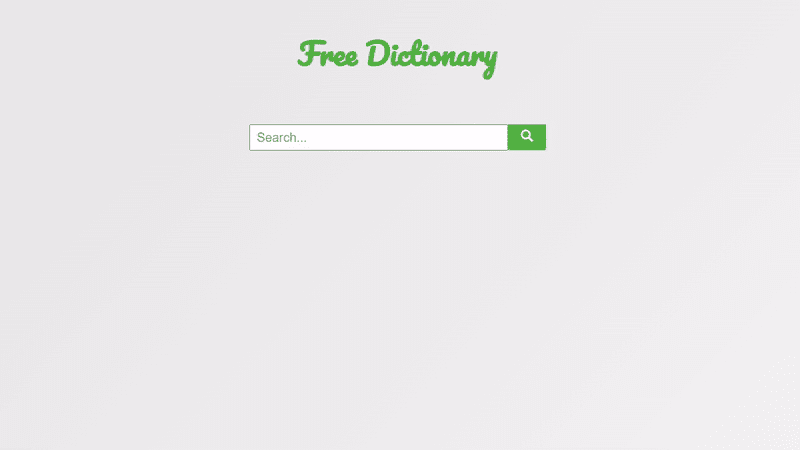

# 如何在 ReactJS 中创建词典应用？

> 原文:[https://www . geeksforgeeks . org/如何创建词典-app-in-reactjs/](https://www.geeksforgeeks.org/how-to-create-a-dictionary-app-in-reactjs/)

在本文中，我们将借助一个应用编程接口构建一个非常简单的字典应用程序。对于初学者来说，这是一个完美的项目，因为它将教你如何从应用编程接口获取信息并显示它，以及 React 实际上是如何工作的一些基础知识。此外，我们将学习如何使用反应图标。我们开始吧。

**方法:**我们的应用包含两个部分，一个用于获取用户输入，另一个用于显示数据。每当用户搜索一个单词时，我们将该输入存储在一个状态中，并根据搜索到的关键字参数触发一个 API 调用。之后，当进行 API 调用时，我们只需将该 API 响应存储在另一个状态变量中，然后我们最终相应地显示信息。

**先决条件:**本项目的先决条件是:

*   [反应](https://www.geeksforgeeks.org/reactjs-tutorials/)
*   [功能组件](https://www.geeksforgeeks.org/reactjs-functional-components/)
*   [反作用钩](https://www.geeksforgeeks.org/introduction-to-react-hooks/)
*   [反应公理& API](https://www.geeksforgeeks.org/how-to-make-get-call-to-an-api-using-axios-in-javascript/)
*   [javascript 为 6](https://www.geeksforgeeks.org/introduction-to-es6/)

**创建一个 React 应用程序并安装一些 npm 包:**

**步骤 1:** 在终端中键入以下命令，创建一个 react 应用程序:

```
npx create-react-app dictionary-app
```

**步骤 2:** 现在，通过运行以下命令进入项目文件夹，即字典-应用程序:

```
cd dictionary-app
```

**第三步:**我们来安装这个项目需要的一些 npm 包:

```
npm install axios
```

```
npm install react-icons --save
```

**项目结构:**应该是这样的:


**示例:**它是我们 app 中唯一包含所有逻辑的组件。我们将使用一个名为[“免费字典应用编程接口”](https://dictionaryapi.dev/)的免费开源应用编程接口(不需要授权)来获取所有需要的数据。我们的应用程序包含两个部分，即一个用于获取用户输入的部分和一个搜索按钮，另一个用于显示数据。除了显示我们收到的信息，我们还将有一个扬声器按钮，让用户听语音。

现在在 App.js 文件中写下以下代码。在这里，应用程序是我们编写代码的默认组件。这里的文件名是 App.js 和 App.css

## java 描述语言

```
import { React, useState } from "react";
import Axios from "axios";
import "./App.css";
import { FaSearch } from "react-icons/fa";
import { FcSpeaker } from "react-icons/fc";

function App() {
  // Setting up the initial states using react hook 'useState'

  const [data, setData] = useState("");
  const [searchWord, setSearchWord] = useState("");

  // Function to fetch information on button
  // click, and set the data accordingly
  function getMeaning() {
    Axios.get(
      `https://api.dictionaryapi.dev/api/v2/entries/en_US/${searchWord}`
    ).then((response) => {
      setData(response.data[0]);
    });
  }

  // Function to play and listen the
  // phonetics of the searched word
  function playAudio() {
    let audio = new Audio(data.phonetics[0].audio);
    audio.play();
  }

  return (
    <div className="App">
      <h1>Free Dictionary</h1>
      <div className="searchBox">

        // Taking user input
        <input
          type="text"
          placeholder="Search..."
          onChange={(e) => {
            setSearchWord(e.target.value);
          }}
        />
        <button
          onClick={() => {
            getMeaning();
          }}
        >
          <FaSearch size="20px" />
        </button>
      </div>
      {data && (
        <div className="showResults">
          <h2>
            {data.word}{" "}
            <button
              onClick={() => {
                playAudio();
              }}
            >
              <FcSpeaker size="26px" />
            </button>
          </h2>
          <h4>Parts of speech:</h4>

<p>{data.meanings[0].partOfSpeech}</p>

          <h4>Definition:</h4>

<p>{data.meanings[0].definitions[0].definition}</p>

          <h4>Example:</h4>

<p>{data.meanings[0].definitions[0].example}</p>

        </div>
      )}
    </div>
  );
}

export default App;
```

## 超文本标记语言

```
@import url(
'https://fonts.googleapis.com/css2?family=Pacifico&display=swap');
@import url(
'https://fonts.googleapis.com/css2?family=Poppins:ital,wght@0,200;0,400;0,600;0,800;1,300&display=swap');

.App {
  height: 100vh;
  width: 100vw;
  display: flex;
  flex-direction: column;
  align-items: center;
  background-color: #f6f6f6;
  background-image: linear-gradient(315deg, #f6f6f6 0%, #e9e9e9 74%);
  font-family:'Poppins', sans-serif;
}

h1 {
  text-align: center;
  font-size: 3em;
  font-family: 'Pacifico', cursive;
  color: #4DB33D;
  padding: 1.5em;
}

h2{
  font-size: 30px;
  text-decoration: underline;
  padding-bottom: 20px;
}

h4{
  color: #4DB33D;
}

input{
  width: 400px;
  height: 38px;
  font-size: 20px;
  padding-left: 10px;
}

.searchBox > button{
  background-color: #4DB33D;
  height: 38px;
  width: 60px;
  border: none;
  color: white;
  box-shadow: 0px 3px 2px #439e34;
  cursor: pointer;
  padding: 0;
}

.showResults{
  width: 500px;
  padding: 20px;
}

.showResults > h2 > button{
  background: none;
  border: none;
  cursor: pointer;
}
```

**运行应用程序的步骤:**从项目的根目录使用以下命令运行应用程序:

```
npm start
```

**输出:**现在打开浏览器，转到***http://localhost:3000/***，会看到如下输出:

