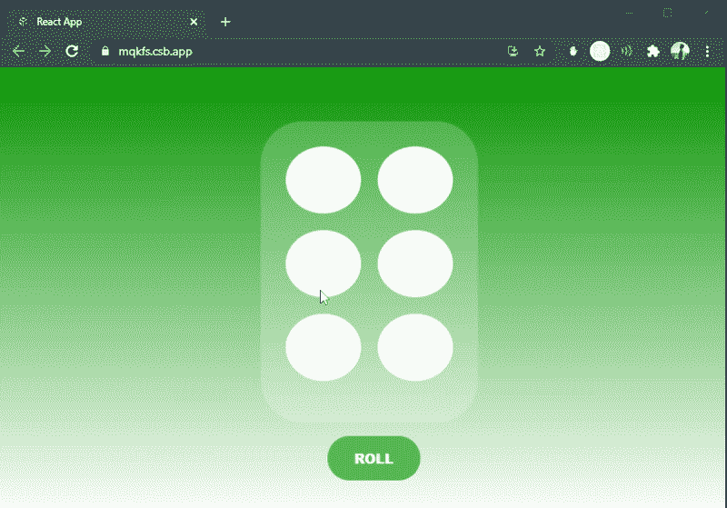

# 如何使用 React 和 framer-motion 创建滚压模具？

> 原文:[https://www . geeksforgeeks . org/如何使用反应和成帧器运动来创建模具/](https://www.geeksforgeeks.org/how-to-create-a-die-using-react-and-framer-motion/)

我们可以使用 react with plain CSS 和 framer-motion 库来创建一个骰子，并使用以下方法制作其动画:

**先决条件:**

1.  JavaScript 知识(ES6)
2.  HTML/CSS 的知识。
3.  ReactJS 的基本知识。

**创建反应应用程序并安装模块:**

**步骤 1:** 使用以下命令创建一个反应应用程序:

```jsx
npx create-react-app rolling-die
```

**第 2 步:**创建项目文件夹后，即擀面杖**，**使用以下命令移动到项目文件夹:

```jsx
cd rolling-die
```

**步骤 3:** 创建 ReactJS 应用程序后，使用以下命令安装**成帧器-运动**模块:

```jsx
$ npm install framer-motion
```

**App.js:** 现在在 **App.js** 文件中写下以下代码。在这里，App 是我们编写代码的默认组件。

**示例:**

## App.js

```jsx
import React, { useState, useEffect } from "react";
import { motion } from "framer-motion";
import "./App.css";

// Animation properties for the container
// which is the face of the die
const container = {
  hidden: { opacity: 1, scale: 0 },
  visible: {
    scale: [0, 1],
    opacity: 1,
    transition: {
      staggerChildren: 0.5,
      delayChildren: 0.5,
    },
  },
};

// Animation properties for the disc(s) that
// denote(s) the number player gets after rolling the die
const discsOnTheDie = {
  hidden: { y: 20, opacity: 0 },
  visible: {
    y: 0,
    opacity: [0.2, 1],
  },
};

// Utility function to get the random number
// from 1 t0 6 just like a physical die
const rollTheDie = () => {
  return Math.floor(Math.random() * 7 + 1);
};

const App = () => {
  // Managing state of randomSize aka number on the die
  // using useState hook
  const [randomSize, setRandomSize] = useState(rollTheDie());
  const discNumbers = new Array(randomSize);

  // Assigning 0 to randomSize to the array
  for (var i = 0; i < discNumbers.length; i++) {
    discNumbers[i] = i;
  }

  useEffect(() => {
    // This will fire on every change of randomSize
    setRandomSize(rollTheDie());
  }, [randomSize]);

  return (
    <div>
      <motion.ul
        className="square-container"
        variants={container}
        initial="hidden"
        animate="visible"
      >
        {/* Mapping javascript array discNumbers  */}
        {discNumbers.map((index) => (
          <motion.li key={index} className="disc" 
                     variants={discsOnTheDie} />
        ))}
      </motion.ul>
      <button
        onClick={() => {
          setRandomSize();
        }}
      >
        {" "}
        ROLL{" "}
      </button>
    </div>
  );
};

export default App;
```

## App.css

```jsx
body {
  overflow: hidden;
  width: 100vw;
  height: 100vh;
  display: flex;
  justify-content: center;
  align-items: center;
  background: linear-gradient(180deg, green, white);
}

.square-container {
  display: grid;
  width: 200px;
  height: 300px;
  border-radius: 50px;
  padding: 30px;
  gap: 20px;
  list-style: none;
  grid-template-rows: repeat(3, 1fr);
  grid-template-columns: repeat(2, 1fr);
  background: rgba(255, 255, 255, 0.2);
}

.disc {
  background: white;
  border-radius: 100%;
  justify-content: center;
  align-items: center;
}

button {
  text-decoration: none;
  display: inline-block;
  margin-left: 80px;
  border: none;
  color: white;
  padding: 15px 32px;
  text-align: center;
  font-size: 16px;
  font-weight: 900;
  border-radius: 50px;
  background-color: #4caf50;
}
```

**运行应用程序的步骤:**从项目的根目录使用以下命令运行应用程序。

```jsx
npm start
```

**输出:**现在打开浏览器，转到***http://localhost:3000/***，会看到如下输出:

