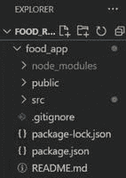
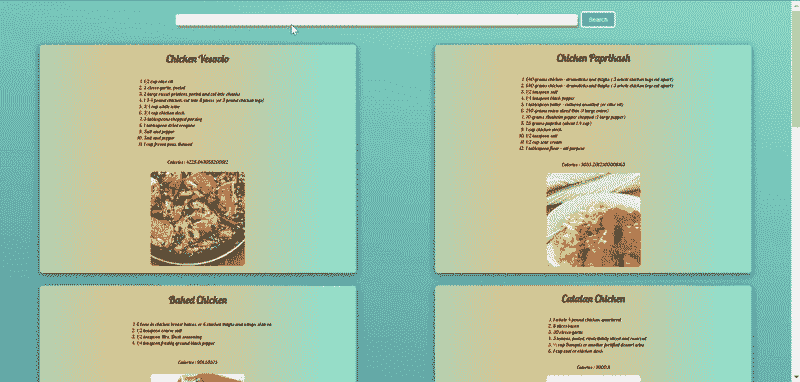

# 如何使用 ReactJS 创建美食食谱应用？

> 原文:[https://www . geesforgeks . org/how-to-create-a-food-recipe-app-using-reactjs/](https://www.geeksforgeeks.org/how-to-create-a-food-recipe-app-using-reactjs/)

我们将使用 React.js 制作一个食物食谱应用程序

#### 先决条件:

*   [反作用钩](https://www.geeksforgeeks.org/introduction-to-react-hooks/)
*   [反应成分](https://www.geeksforgeeks.org/reactjs-functional-components/)
*   [JavaScript 为 6](https://www.geeksforgeeks.org/introduction-to-es6/)
*   API
*   CSS

**方法:**在这个应用程序中，我们应该有一个组件来展示我们的食物食谱。我们需要使用食物配方应用编程接口获取所有需要的食物配方。我们将获取应用编程接口数据，使用反应钩子(useEffect，useState)将这些数据存储在组件结构中。

**获取食谱 API KEY:** 首先我们从 **API** 获取数据，得到所有的食谱。为此，我们将使用名为**毛豆**的平台。([https://developer.edamam.com/](https://developer.edamam.com/))

*   首先我们需要注册，然后转到 navbar 中的 API 部分。
*   在**开发者**部分点击**立即开始**。
*   然后进入**仪表盘**部分(右上角)>点击左侧**应用** >
*   有一个**配方搜索 API** 选项>点击**查看**在那个部分
*   从那里复制您的**应用程序标识**和**应用程序密钥**并将其存储在某个地方。

**创建 react 应用并安装所有需要的包:**

**步骤 1:** 使用以下命令创建一个反应应用程序:

```
npx create-react-app foldername
```

**步骤 2:** 创建项目文件夹(即文件夹名**)后，使用以下命令移动到该文件夹中:**

```
cd foldername
```

**项目结构:**如下图。



**第三步:**现在在 src/App.js 文件**里面，**在< YOUR_App_ID >和< YOUR_APP_KEY >的地方提供旅游自己的 app id 和 APP 密钥，这是你从**毛豆**那里得到的。

## App.js

```
import React, { useEffect, useState } from 'react'
import './App.css';
import Recipe from './Recipe';

const App = () => {
  const APP_ID = <YOUR_APP_ID>;
  const APP_KEY = <YOUR_APP_KEY>;
  const [recipes, setRecipes] = useState([]);
  const [search, setSearch] = useState("");
  const [query, setQuery] = useState("chicken");
  useEffect(() => {
    getRecipes();
  }, [query])
  const getRecipes = async () => {
    const response = await fetch
          (`https://api.edamam.com/search?q=${query}&app_id=${APP_ID}&app_key=${APP_KEY}`);
    const data = await response.json();
    setRecipes(data.hits);
    // console.log(data);

  };
  const updateSearch = e => {
    setSearch(e.target.value);
  };
  const getSearch = e => {
    e.preventDefault();
    setQuery(search);
    setSearch("");
  }

  return (
    <div className="App">
      <form className="search-form" onSubmit={getSearch}  >
        <input className="search-bar" type="text" value={search}
             onChange={updateSearch} />
        <button className="search-button" type="submit" >
             Search
        </button>
      </form>
      <div className="recipes">
        {recipes.map(recipe => (
          <Recipe
            key={recipe.recipe.label}
            title={recipe.recipe.label}
            calories={recipe.recipe.calories}
            image={recipe.recipe.image}
            ingredients={recipe.recipe.ingredients}
          />

        ))}
      </div>

    </div>
  );
}

export default App;
```

**第四步:**在 App.js. Edit src/Recipe.js 文件中导入的名为“Recipe.js”(你想怎么命名都可以)的 src 文件夹中制作一个组件文件。该文件包含配方卡的整个结构。

## 食谱. js

```
import React from "react";
import style from './recipe.module.css';

const Recipe = ({title,calories,image,ingredients}) =>{
    return(
        <div className={style.recipe}>
            <h1>{title}</h1>
            <ol>
                {ingredients.map(ingredient=>(
                    <li>{ingredient.text}</li>
                ))}
            </ol>

<p>Calories : {calories}</p>

            

        </div>
    );

}
export default Recipe;
```

**第五步:**现在在 src/App.css 里面添加样式。

## 半铸钢ˌ钢性铸铁(Cast Semi-Steel)

```
.App{
  min-height: 100vh;
 background-image: linear-gradient(15deg, #13547a 0%, #80d0c7 100%);
}
.search-form{
  min-height: 10vh;
  display: flex;
  justify-content: center;
  align-items: center;
}
.search-bar{
  width: 50%;
  border:none;
  padding: 10px;
  border-radius: 5px;
  box-shadow: 5px 10px #979b91;
}
.search-button{
  background: #4da1ab;
  border: 5px solid white;
  border-radius: 8px;
  padding: 10px 20px;
  color: white;
  font-size: larger;
  margin: 0 0 0 10px;
}
.search-button:hover {
  background-color:#fa709a ;
}
.recipes{
  display: flex;
  justify-content: space-around;
  flex-wrap: wrap;
}
```

**第六步:**在 src 文件夹中新建一个名为“recipe.module.css”的文件。该文件用于向 src/Recipe.js 文件添加样式。

## recipe.module.css

```
@import url('https://fonts.googleapis.com/css2?family=Lobster&display=swap');
.recipe{
    border-radius: 10px;
    box-shadow: 0px 5px 20px rgb(63, 60, 60);
    margin: 20px;
    display: flex;
    flex-direction: column;
    justify-content: space-around;
    background-image: linear-gradient(to right, 
        #e4afcb 0%, #b8cbb8 0%, #b8cbb8 0%, 
        #e2c58b 30%, #c2ce9c 64%, #7edbdc 100%);
    align-items: center;
    min-width: 40%;
    font-family: 'Lobster', cursive;   
}

.image{
    border-radius: 10px;
    margin:0px 0px 20px 0px;
}
```

**运行应用程序的步骤:**从项目的根目录使用以下命令运行应用程序:

```
npm start
```

**输出:**现在打开浏览器，转到***http://localhost:3000/***，会看到如下输出:



食物食谱应用