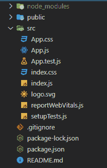

# 如何在 ReactJS 中创建电影预告片应用？

> 原文:[https://www . geesforgeks . org/how-to-create-a-movie-预告片-app-in-reactjs/](https://www.geeksforgeeks.org/how-to-create-a-movie-trailer-app-in-reactjs/)

在本文中，我们将制作一个简单的应用程序来搜索任何电影/网络系列预告片。我们将使用“电影预告片”npm 包来找到这样的 URL，并使用另一个名为“react-player”的 npm 包来显示内容。

**先决条件:**本项目的先决条件是:

*   [反应过来。](https://www.geeksforgeeks.org/react-js-introduction-working/)
*   [反应钩。](https://www.geeksforgeeks.org/introduction-to-react-hooks/)
*   [JavaScript 为 6\.](https://www.geeksforgeeks.org/introduction-to-es6/)
*   [反应公理& API](https://www.geeksforgeeks.org/how-to-make-get-call-to-an-api-using-axios-in-javascript/)
*   [功能组件](https://www.geeksforgeeks.org/reactjs-functional-components/)

**方法:**我们的应用包含两个部分，一部分用于获取用户输入，另一部分用于显示视频。每当用户搜索视频时，我们将把它存储在一个状态变量中，每当用户点击搜索按钮时，我们将调用一个函数，获取所需的视频网址并将其存储在另一个状态变量中。现在我们有了所需的网址，我们将简单地使用“ReactPlayer”组件来呈现该视频。

**创建 React app 并安装模块:**

*   **步骤 1:** 在终端中键入以下命令，创建一个 react 应用程序:

```jsx
npx create-react-app movie-app
```

*   **步骤 2:** 现在，通过运行以下命令进入项目文件夹，即电影应用程序:

```jsx
cd movie-app
```

*   **第三步:**我们来安装这个项目需要的一些 npm 包:

[**电影预告片:**](https://www.npmjs.com/package/movie-trailer) 为任何电影/系列获取 Youtube 预告片。

```jsx
npm install --save movie-trailer
```

[**react-player:**](https://www.npmjs.com/package/react-player) 一个用于播放各种 URL 的 react 组件，包括文件路径、YouTube 等。

```jsx
npm install react-player
```

**项目结构:**应该是这样的:



**示例代码:**

**编辑 src/App.js 文件:**这个文件包含我们的 App 逻辑:

## java 描述语言

```jsx
import './App.css';
import { useState } from 'react';
import ReactPlayer from 'react-player';
import movieTrailer from 'movie-trailer';

function App() {

  //Setting up the initial states using
  // react hook 'useState"
  const [video, setVideo] = useState("inception");
  const [videoURL, setVideoURL] = 
    useState("https://youtu.be/sa9l-dTv9Gk");

  //A function to fetch the required URL
  // and storing it inside the
  // videoURL state variable
  function handleSearch() {
    movieTrailer(video).then((res) => {
      setVideoURL(res);
    });
  }

  return (
    <div className="App">
      <div className="search-box">
        <label>
            Search for any movies/shows:{ " " }
        </label>
        <input type="text" onChange=
            {(e) => { setVideo(e.target.value) }} />

        <button onClick={()=>{handleSearch()}}>
            Search
        </button>
      </div>

      // Using 'ReactPlayer' component to
      // display the video
      <ReactPlayer url={videoURL} controls={true}/>
    </div>
  );
}

export default App;
```

**编辑 src/App.css 文件:**该文件包含该应用所需的所有样式:

## 半铸钢ˌ钢性铸铁(Cast Semi-Steel)

```jsx
.App {
    display: flex;
    flex-direction: column;
    justify-content: center;
    align-items: center;
    text-align: center;
    height: 100vh;
    width: 100%;
    font-size: 22px;
}

.search-box {
    height: 10vh;
}

.search-box>input,
button {
    box-sizing: border-box;
    height: 25px;
    font-size: 20px;
}
```

**运行应用程序的步骤:**在终端中键入以下命令:

```jsx
npm start
```

**输出:**现在在浏览器中打开 [http://localhost:3000/](http://localhost:3000/) 查看我们的工作 app。

