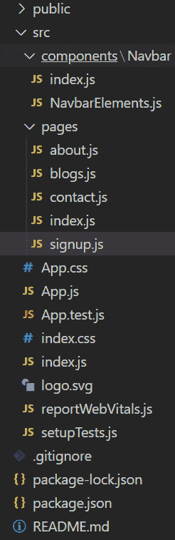
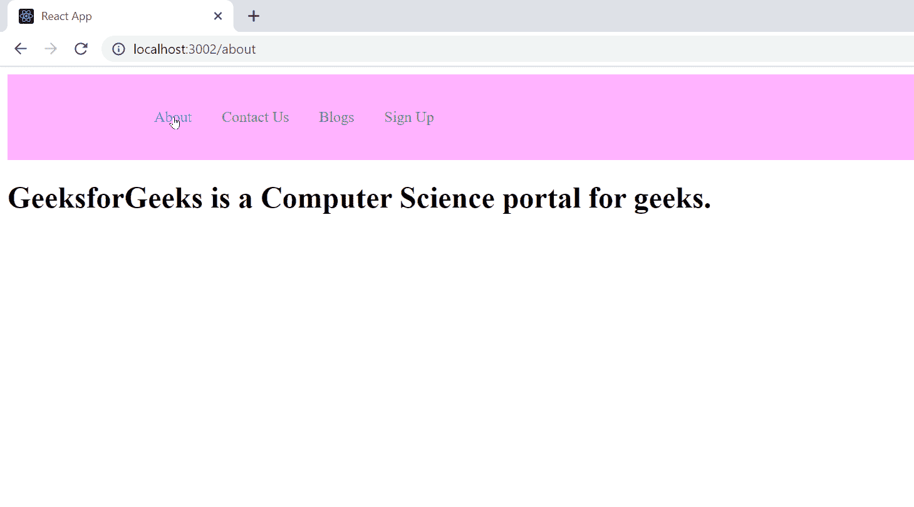

# 如何使用 React.js 创建多页网站？

> 原文:[https://www . geesforgeks . org/如何创建多页网站-使用-反应-js/](https://www.geeksforgeeks.org/how-to-create-a-multi-page-website-using-react-js/)

在本文中，我们将看到如何使用 React Js 创建一个简单的多页面网站。

**先决条件:**

1.  [npm](https://www.geeksforgeeks.org/node-js-npm-node-package-manager/)
2.  [创建-反应-应用](https://www.geeksforgeeks.org/reactjs-tutorials/)
3.  [react-router-dom](https://www.geeksforgeeks.org/reactjs-router/)
4.  [样式组件](https://www.geeksforgeeks.org/react-styled-components-module/)

**方法:**我们将创建一个简单的网站，它将有不同的页面和一个导航栏。我们将创建多个页面主页、关于页面、博客页面、注册页面和联系人页面，然后我们将看到如何在这些页面之间导航。我们将使用以下软件包和组件:

*   **react-router-DOM:**react-router-DOM 是一个 reactJS 包，它可以让你在网页中实现动态路由。
*   **浏览器浏览器:**它使用 HTML5 历史 API 来保持 UI 与 URL 同步。
*   **路由:**其职责是当路径与当前 URL 匹配时，渲染 UI。
*   **开关:**它渲染与位置匹配的第一个子路由或重定向。
*   **style-components:**style-component Module 允许我们在 React 中以非常模块化和可重用的方式在 JavaScript 中编写 CSS。

下面是逐步实现:

**第一步:**我们将使用 [**<u>创建-反应-app</u>**](https://www.geeksforgeeks.org/reactjs-setting-development-environment/) 启动一个新项目，因此打开您的终端并键入:

```jsx
npx create-react-app react-website
```

**第 2 步:**现在，通过在终端中键入给定的命令进入您的文件夹:

```jsx
cd react-website
```

**步骤 3:** 通过在终端中键入给定的命令，安装本项目所需的依赖项。

```jsx
npm install react-router-dom 
npm install --save styled-components
```

**第 4 步:**现在在 src 中创建组件文件夹，然后转到组件文件夹，并创建一个新的文件夹名称 Navbar。在 Navbar 文件夹中创建两个文件索引，js 和 NavbarElements.js .在 src 名称页面中再创建一个文件夹，在页面中创建文件名 about.js，blogs.js，index.js，registration . js，contact.js

**项目结构:**项目结构如下图所示:



**步骤 5:** 现在我们将创建 navbar 并为其设置样式。

## index.js

```jsx
import React from "react";
import { Nav, NavLink, NavMenu } 
    from "./NavbarElements";

const Navbar = () => {
  return (
    <>
      <Nav>
        <NavMenu>
          <NavLink to="/about" activeStyle>
            About
          </NavLink>
          <NavLink to="/contact" activeStyle>
            Contact Us
          </NavLink>
          <NavLink to="/blogs" activeStyle>
            Blogs
          </NavLink>
          <NavLink to="/sign-up" activeStyle>
            Sign Up
          </NavLink>
        </NavMenu>
      </Nav>
    </>
  );
};

export default Navbar;
```

## navbarelements . js

```jsx
import { FaBars } from "react-icons/fa";
import { NavLink as Link } from "react-router-dom";
import styled from "styled-components";

export const Nav = styled.nav`
  background: #ffb3ff;
  height: 85px;
  display: flex;
  justify-content: space-between;
  padding: 0.2rem calc((100vw - 1000px) / 2);
  z-index: 12;
`;

export const NavLink = styled(Link)`
  color: #808080;
  display: flex;
  align-items: center;
  text-decoration: none;
  padding: 0 1rem;
  height: 100%;
  cursor: pointer;
  &.active {
    color: #4d4dff;
  }
`;

export const Bars = styled(FaBars)`
  display: none;
  color: #808080;
  @media screen and (max-width: 768px) {
    display: block;
    position: absolute;
    top: 0;
    right: 0;
    transform: translate(-100%, 75%);
    font-size: 1.8rem;
    cursor: pointer;
  }
`;

export const NavMenu = styled.div`
  display: flex;
  align-items: center;
  margin-right: -24px;
  /* Second Nav */
  /* margin-right: 24px; */
  /* Third Nav */
  /* width: 100vw;
white-space: nowrap; */
  @media screen and (max-width: 768px) {
    display: none;
  }
`;
```

**第六步:**现在我们将在 src/pages 中编辑项目中的各个页面。

## about.js

```jsx
import React from "react";

const About = () => {
  return (
    <div>
      <h1>
        GeeksforGeeks is a Computer 
        Science portal for geeks.
      </h1>
    </div>
  );
};

export default About;
```

## blogs.js

```jsx
import React from 'react';

const Blogs = () => {
  return (
    <h1>You can write your blogs!</h1>
  );
};

export default Blogs;
```

## index.js

```jsx
import React from 'react';

const Home = () => {
  return (
    <div>
      <h1>Welcome to GeeksforGeeks</h1>
    </div>
  );
};

export default Home;
```

## 注册. js

```jsx
import React from 'react';

const SignUp = () => {
  return (
    <div>
      <h1>Sign Up Successfull</h1>
    </div>
  );
};

export default SignUp;
```

## contact.js

```jsx
import React from 'react';

const Contact = () => {
  return (
    <div>
      <h1>Mail us on feedback@geeksforgeeks.org</h1>
    </div>
  );
};

export default Contact;
```

## index.js

```jsx
import React from 'react';
import ReactDOM from 'react-dom';
import App from './App';

ReactDOM.render(
<React.StrictMode>
    <App />
</React.StrictMode>,
document.getElementById('root')
);
```

## App.js

```jsx
import React from 'react';
import './App.css';
import Navbar from './components/Navbar';
import { BrowserRouter as Router, Routes, Route}
    from 'react-router-dom';
import Home from './pages';
import About from './pages/about';
import Blogs from './pages/blogs';
import SignUp from './pages/signup';
import Contact from './pages/contact';

function App() {
return (
    <Router>
    <Navbar />
    <Routes>
        <Route exact path='/' exact element={<Home />} />
        <Route path='/about' element={<About/>} />
        <Route path='/contact' element={<Contact/>} />
        <Route path='/blogs' element={<Blogs/>} />
        <Route path='/sign-up' element={<SignUp/>} />
    </Routes>
    </Router>
);
}

export default App;
```

**运行应用程序的步骤:**现在要运行上述代码，请打开终端并键入以下命令。

```jsx
npm start
```

**输出:**

