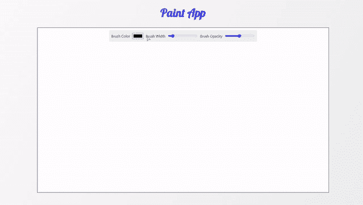

# 如何在 ReactJS 中创建绘画应用？

> 原文:[https://www . geeksforgeeks . org/how-to-create-a-paint-app-in-reactjs/](https://www.geeksforgeeks.org/how-to-create-a-paint-app-in-reactjs/)

在本文中，我们将构建一个简单的绘画应用程序，让您像在 MS-Paint 中一样进行绘画。通过本文，我们将学习如何在 React.js 中实现和使用 canvas

我们的应用程序包含两个部分，一个用于绘图，另一个是菜单，用户可以在其中自定义画笔颜色、宽度和不透明度。

**先决条件:**本项目的先决条件是:

*   [反应](https://www.geeksforgeeks.org/react-js-introduction-working/)
*   [功能组件](https://www.geeksforgeeks.org/reactjs-functional-components/)
*   [反作用钩](https://www.geeksforgeeks.org/introduction-to-react-hooks/)
*   [HTML 画布](https://www.geeksforgeeks.org/html-canvas-basics/)
*   [JavaScript 为 6](https://www.geeksforgeeks.org/introduction-to-es6/)

**创建反应应用程序:**

*   **步骤 1:** 在终端中键入以下命令，创建一个 react 应用程序:

```jsx
npx create-react-app paint-app
```

*   **步骤 2:** 现在，通过运行以下命令进入项目文件夹，即 paint-app:

```jsx
cd paint-app
```

**项目结构:**会是这样的:


**文件名:App.js** 在这个文件中，我们将实现画布并使用它。这里我们创建三个函数:startDrawing()、endDrawing()和 draw()。主要思想是，每当鼠标按钮按下时，我们执行 startDrawing 函数，这样光标就知道 x 和 y 坐标(起始坐标)，我们将 isDrawing 状态切换为 true。现在，只要用户移动鼠标，我们就执行绘制功能，在当前的 x 和 y 坐标上绘制一个笔划。如果用户向上提起鼠标按钮，我们将执行结束绘制功能，该功能将关闭笔划路径，同时将 isDrawing 状态切换为 false。现在在 **App.js** 组件中写下以下代码。

## java 描述语言

```jsx
import { useEffect, useRef, useState } from "react";
import Menu from "./components/Menu";
import "./App.css";

function App() {
  const canvasRef = useRef(null);
  const ctxRef = useRef(null);
  const [isDrawing, setIsDrawing] = useState(false);
  const [lineWidth, setLineWidth] = useState(5);
  const [lineColor, setLineColor] = useState("black");
  const [lineOpacity, setLineOpacity] = useState(0.1);

  // Initialization when the component
  // mounts for the first time
  useEffect(() => {
    const canvas = canvasRef.current;
    const ctx = canvas.getContext("2d");
    ctx.lineCap = "round";
    ctx.lineJoin = "round";
    ctx.globalAlpha = lineOpacity;
    ctx.strokeStyle = lineColor;
    ctx.lineWidth = lineWidth;
    ctxRef.current = ctx;
  }, [lineColor, lineOpacity, lineWidth]);

  // Function for starting the drawing
  const startDrawing = (e) => {
    ctxRef.current.beginPath();
    ctxRef.current.moveTo(
      e.nativeEvent.offsetX, 
      e.nativeEvent.offsetY
    );
    setIsDrawing(true);
  };

  // Function for ending the drawing
  const endDrawing = () => {
    ctxRef.current.closePath();
    setIsDrawing(false);
  };

  const draw = (e) => {
    if (!isDrawing) {
      return;
    }
    ctxRef.current.lineTo(
      e.nativeEvent.offsetX, 
      e.nativeEvent.offsetY
    );

    ctxRef.current.stroke();
  };

  return (
    <div className="App">
      <h1>Paint App</h1>
      <div className="draw-area">
        <Menu
          setLineColor={setLineColor}
          setLineWidth={setLineWidth}
          setLineOpacity={setLineOpacity}
        />
        <canvas
          onMouseDown={startDrawing}
          onMouseUp={endDrawing}
          onMouseMove={draw}
          ref={canvasRef}
          width={`1280px`}
          height={`720px`}
        />
      </div>
    </div>
  );
}

export default App;
```

**文件名:Menu.js** 让我们创建一个菜单栏，用户可以在其中自定义画笔的颜色、大小和不透明度。首先，在 **src** 文件夹下创建一个文件夹名**组件**。然后在组件文件夹内创建一个文件名 **Menu.jsx** 。我们将在 App.js 文件中导入这个自定义组件。现在在**菜单中写下以下代码**

## java 描述语言

```jsx
import React from "react";
import "../App.css";

const Menu = ({ setLineColor, setLineWidth, 
setLineOpacity }) => {
  return (
    <div className="Menu">
      <label>Brush Color </label>
      <input
        type="color"
        onChange={(e) => {
          setLineColor(e.target.value);
        }}
      />
      <label>Brush Width </label>
      <input
        type="range"
        min="3"
        max="20"
        onChange={(e) => {
          setLineWidth(e.target.value);
        }}
      />
      <label>Brush Opacity</label>
      <input
        type="range"
        min="1"
        max="100"
        onChange={(e) => {
          setLineOpacity(e.target.value / 100);
        }}
      />
    </div>
  );
};

export default Menu;
```

**文件名:App.css** 让我们为我们的绘画应用设计风格。

## 半铸钢ˌ钢性铸铁(Cast Semi-Steel)

```jsx
@import url(
'https://fonts.googleapis.com/css2?family=Lobster&display=swap');

.App {
  width: 100%;
  height: 100vh;
  display: flex;
  flex-direction: column;
  justify-content: flex-start;
  align-items: center;
  background-image: linear-gradient(
    120deg, #fdfbfb 0%, #ebedee 100%);
}

h1 {
  font-family: 'Lobster', cursive;
  font-size: 50px;
  color: #4644f0;
}

.draw-area {
  width: 1280px;
  height: 720px;
  border: 2px solid #808080;
  position: relative;
  background-color: white;
}

.Menu {
  width: 650px;
  height: 50px;
  display: flex;
  justify-content: space-evenly;
  border-radius: 5px;
  align-items: center;
  background-color: #a3a3a32d;
  margin: auto;
  margin-top: 10px;
}
```

**运行应用程序的步骤:**从项目的根目录使用以下命令运行应用程序。

```jsx
npm start
```

**输出:**现在打开浏览器，转到 **http://localhost:3000/** ，会看到如下输出:

