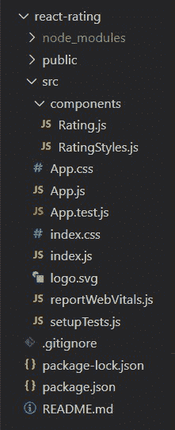
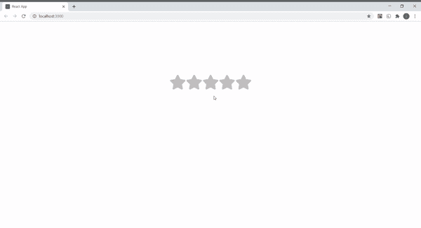

# 如何在 ReactJS 中创建评级组件？

> 原文:[https://www . geeksforgeeks . org/如何创建评级组件 in-reactjs/](https://www.geeksforgeeks.org/how-to-create-a-rating-component-in-reactjs/)

下面的方法介绍了如何在 React JS 中创建评级组件。

**先决条件:**

*   npm 和创建-反应-应用命令的基本知识。
*   样式组件的基本知识。
*   [**<u>基础知识使用状态()</u>**T5【反应钩。](https://www.geeksforgeeks.org/what-is-usestate-in-react/)

**基本设置:**您将使用 [**<u>创建-反应-app</u>**](https://www.geeksforgeeks.org/reactjs-setting-development-environment/) 命令开始一个新项目:

```jsx
npx create-react-app react-rating
```

现在，通过在终端中键入给定的命令，进入您的**反应评级**文件夹。

```jsx
cd react-rating
```

**所需模块:**通过在终端中键入给定的命令，安装本项目所需的依赖项。

```jsx
npm install --save styled-components
npm install --save react-icons
```

现在在 src 中创建**组件**文件夹，然后转到组件文件夹，创建两个文件**评级. js** 和**评级. js** 。

**项目结构:**项目中的文件结构会是这样的。



**示例:**在本例中，我们将设计一个评级组件，为此，我们需要操作 App.js 文件和其他创建的组件文件。

我们创建一个状态，第一个元素速率作为初始状态，值为 0，第二个元素作为函数**设置速率()**来更新状态。范围从 0 到 4 的索引号被分配给新初始化的变量**加上一个 1。当使用[**<u>Map()方法</u>**](https://www.geeksforgeeks.org/javascript-array-map-method/) 映射数组时，我们将 givenRating 变量的值与五个单选按钮中的每一个相关联(例如，第一个按钮为 1，依此类推)。**

我们借助 [**<u>onClick 函数</u>**](https://www.geeksforgeeks.org/how-to-change-the-state-of-react-component-on-click/) 更新状态的值，该函数将其值设置为每当被调用时都给予更新。例如，如果我们点击第四颗星(从左开始)，我们知道与这颗星(或单选按钮)相关联的 givenRating 的值是 4。这个值 4 分配给我们的州。现在条件运算符的作用开始发挥了。只有那些值等于或小于 4 的单选按钮才会被选中(或更改其颜色)。因此，我们获得了四星评级。

## Rating.js

```jsx
import React, { useState } from "react";
import { FaStar } from "react-icons/fa";
import { Container, Radio, Rating } from "./RatingStyles";
const Rate = () => {
  const [rate, setRate] = useState(0);
  return (
    <Container>
      {[...Array(5)].map((item, index) => {
        const givenRating = index + 1;
        return (
          <label>
            <Radio
              type="radio"
              value={givenRating}
              onClick={() => {
                setRate(givenRating);
                alert(`Are you sure you want to give ${givenRating} stars ?`);
              }}
            />
            <Rating>
              <FaStar
                color={
                  givenRating < rate || givenRating === rate
                    ? "000"
                    : "rgb(192,192,192)"
                }
              />
            </Rating>
          </label>
        );
      })}
    </Container>
  );
};

export default Rate;
```

## RatingStyles.js

```jsx
import styled from 'styled-components';

export const Container = styled.div`
   display: flex;
   justify-content: center;
   align-items: center;
   min-height: 60vh;
   font-size: 60px;
`
export const Radio = styled.input`
   display: none;
`
export const Rating = styled.div`
   cursor: pointer;
`
```

## App.js

```jsx
import './App.css';
import Rating from './components/Rating';

function App() {
  return (
     <Rating />
  );
}

export default App;
```

**运行应用程序的步骤:**从项目的根目录使用以下命令运行应用程序:

```jsx
npm start
```

**输出:**现在打开浏览器，转到 **http://localhost:3000/** ，会看到如下输出:

