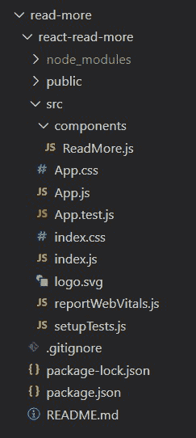
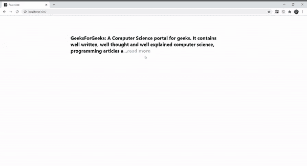

# 如何在 ReactJS 中创建一个 Read More 组件？

> 原文:[https://www . geeksforgeeks . org/如何在 reactjs/](https://www.geeksforgeeks.org/how-to-create-a-read-more-component-in-reactjs/) 中创建-读取更多组件

下面的例子讲述了如何使用[**<u>【useState()</u>**](https://www.geeksforgeeks.org/what-is-usestate-in-react/)钩子在 React JS 中创建一个 Read More 组件。

**先决条件:**

*   npm 和创建-反应-应用命令的基本知识。
*   useState() React 钩子的基本知识。

**基本设置:**您将使用以下命令使用 [**<u>创建-反应-app</u>**](https://www.geeksforgeeks.org/reactjs-setting-development-environment/) 启动一个新项目:

```
npx create-react-app react-read-more
```

现在，通过在终端中键入给定的命令，进入您的**反应-阅读-更多**文件夹。

```
cd react-read-more
```

现在在 src 中创建**组件**文件夹，然后转到组件文件夹并创建一个文件 **ReadMore.js** 。

**项目结构:**项目中的文件结构会是这样的。



**示例:**在本例中，我们将设计一个 Read more 组件，为此，我们需要操作 App.js 文件和其他创建的组件文件。

显示&隐藏文字，这就是 [**<u>的作用所在【使用状态()】</u>** 的](https://www.geeksforgeeks.org/what-is-usestate-in-react/)钩起作用。我们创建了一个功能组件 **Read More()** ，其中我们创建了一个状态，第一个元素**isredmore**作为初始状态，其值为 true，第二个元素作为功能**setisredmore()**用于更新状态。然后一个名为**的函数被创建，每当调用它时，它将状态 isReadMore 的值设置为当前值的反方。**

状态 isReadMore 的值决定了在条件运算符的帮助下需要显示多少文本。当我们的状态值为真时，借助[**<u>string . slice()</u>**](https://www.geeksforgeeks.org/javascript-string-slice/)只显示我们文本的前 150 个字符。您可以根据自己的选择选择任意数量的字符。最后还显示了一个**【阅读更多】**链接。否则，它会显示整个文本，并在末尾显示一个**“显示较少”**链接。

当我们点击“阅读更多”链接时，toggleReadMore 会在 [**<u>onClick 功能</u>**](https://www.geeksforgeeks.org/how-to-change-the-state-of-react-component-on-click/) 的帮助下将状态值设置为 false，因此我们会看到整个文本的末尾有一个“显示更少”的链接。当我们点击“显示较少”链接时，它会将状态值设置为 true，这只会显示文本的一部分，并在其末尾显示“阅读更多”链接。

我们将文本写在不同的功能组件 **Content()** 和中，并用 **< ReadMore >** 标记将其括起来，因此它成为 ReadMore()函数的子级。这就是为什么我们首先在 ReadMore()函数中破坏子属性，这样我们就可以在我们的**文本**字符串中访问它的值，并实现上面讨论的逻辑。

## ReadMore.js .阅读更多信息

```
import React, { useState } from "react";
import "../App.css";

const ReadMore = ({ children }) => {
  const text = children;
  const [isReadMore, setIsReadMore] = useState(true);
  const toggleReadMore = () => {
    setIsReadMore(!isReadMore);
  };
  return (
    <p className="text">
      {isReadMore ? text.slice(0, 150) : text}
      <span onClick={toggleReadMore} className="read-or-hide">
        {isReadMore ? "...read more" : " show less"}
      </span>
    </p>
  );
};

const Content = () => {
  return (
    <div className="container">
      <h2>
        <ReadMore>
          GeeksforGeeks: A Computer Science portal for geeks. 
          It contains well written, well thought and well explained
          computer science, programming articles and quizzes. 
          It provides a variety of services for you to learn, so thrive
          and also have fun! Free Tutorials, Millions of Articles, Live, 
          Online and Classroom Courses ,Frequent Coding Competitions,
          Webinars by Industry Experts, Internship opportunities, and Job
          Opportunities. Knowledge is power!
        </ReadMore>
      </h2>
    </div>
  );
};

export default Content;
```

## App.css 文件

```
.container{
  position: absolute;
  top: 10%;
  left: 23%;
  width: 50%;
}

.text{
  display: inline;
  width: 100%;
}

.read-or-hide{
  color: rgb(192,192,192);
  cursor: pointer;
}
```

## App.js

```
import Content from './components/ReadMore'

function App() {
  return (
     <Content />
  );
}

export default App;
```

**运行应用程序的步骤:**从项目的根目录使用以下命令运行应用程序:

```
npm start
```

**输出:**现在打开浏览器，转到 **http://localhost:3000/** ，会看到如下输出:

