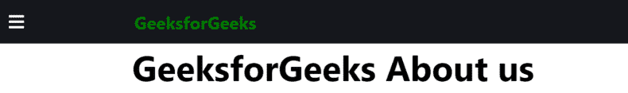
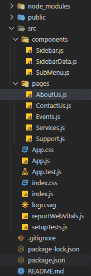

# 如何在 ReactJS 中创建带有下拉菜单的响应侧边栏？

> 原文:[https://www . geeksforgeeks . org/如何创建带有下拉菜单的响应侧边栏-in-reactjs/](https://www.geeksforgeeks.org/how-to-create-a-responsive-sidebar-with-dropdown-menu-in-reactjs/)

侧边栏是网站设计的一个重要元素，因为它允许用户快速访问网站中的任何部分。

**项目一瞥:**



**先决条件:**

1.  国家预防机制
2.  创建-反应-应用
3.  react-路由器-dom
4.  使用状态反应挂钩

**基本设置:**您将使用 [**<u>创建-反应-app</u>**](https://www.geeksforgeeks.org/reactjs-setting-development-environment/) 开始一个新项目，因此打开您的终端并键入:

```
npx create-react-app react-sidebar-dropdown
```

现在，通过在终端中键入给定的命令，转到您的**反应-侧栏-下拉菜单**文件夹:

```
cd react-sidebar-dropdown
```

**所需模块:**通过在终端中键入给定的命令，安装本项目所需的依赖项。

```
npm install react-router-dom
npm install --save styled-components
npm install --save react-icons
```

现在在 src 中创建**组件**文件夹，然后转到组件文件夹，创建三个文件**侧边栏. js** 、**侧边栏. js** 和**子菜单. js** 。

在 src 中再创建一个名为 **pages** 的文件夹，在 pages 中再创建一个名为 **AboutUs.js** 、 **ContactUs.js** 、 **Events.js** 、 **Services.js** 、 **Support.js** 的文件。

**项目结构:**项目中的文件结构会是这样的。



**Filename- Sidebar.js:** 打开&关闭侧边栏视图，这就是[**<u>useState(</u>)**](https://www.geeksforgeeks.org/what-is-usestate-in-react/)hook 发挥作用的地方。

我们创建一个状态，第一个元素侧边栏作为初始状态，值为 false，第二个元素作为函数**设置侧边栏()**来更新状态。然后创建一个名为**show 侧栏(**)的函数，每当调用侧栏时，该函数将侧栏的值设置为与其当前值相反。

该功能是借助[**<u>【onClick()</u>**](https://www.geeksforgeeks.org/how-to-change-the-state-of-react-component-on-click/)功能与菜单栏图标和十字图标配合使用。当我们点击栏图标查看侧导航链接时，它将状态值设置为 true，显示侧边栏，并出现一个十字图标来代替栏图标。当我们想要关闭侧边栏时，我们只需点击十字图标，它就会在关闭侧边栏后被替换为条形图标，因为现在状态的值被设置为 false。

## java 描述语言

```
import React, { useState } from "react";
import styled from "styled-components";
import { Link } from "react-router-dom";
import * as FaIcons from "react-icons/fa";
import * as AiIcons from "react-icons/ai";
import { SidebarData } from "./SidebarData";
import SubMenu from "./SubMenu";
import { IconContext } from "react-icons/lib";

const Nav = styled.div`
  background: #15171c;
  height: 80px;
  display: flex;
  justify-content: flex-start;
  align-items: center;
`;

const NavIcon = styled(Link)`
  margin-left: 2rem;
  font-size: 2rem;
  height: 80px;
  display: flex;
  justify-content: flex-start;
  align-items: center;
`;

const SidebarNav = styled.nav`
  background: #15171c;
  width: 250px;
  height: 100vh;
  display: flex;
  justify-content: center;
  position: fixed;
  top: 0;
  left: ${({ sidebar }) => (sidebar ? "0" : "-100%")};
  transition: 350ms;
  z-index: 10;
`;

const SidebarWrap = styled.div`
  width: 100%;
`;

const Sidebar = () => {
  const [sidebar, setSidebar] = useState(false);

  const showSidebar = () => setSidebar(!sidebar);

  return (
    <>
      <IconContext.Provider value={{ color: "#fff" }}>
        <Nav>
          <NavIcon to="#">
            <FaIcons.FaBars onClick={showSidebar} />
          </NavIcon>
          <h1
            style={{ textAlign: "center", 
                     marginLeft: "200px", 
                     color: "green" }}
          >
            GeeksforGeeks
          </h1>
        </Nav>
        <SidebarNav sidebar={sidebar}>
          <SidebarWrap>
            <NavIcon to="#">
              <AiIcons.AiOutlineClose onClick={showSidebar} />
            </NavIcon>
            {SidebarData.map((item, index) => {
              return <SubMenu item={item} key={index} />;
            })}
          </SidebarWrap>
        </SidebarNav>
      </IconContext.Provider>
    </>
  );
};

export default Sidebar;
```

**文件名- SidebarData.js** :

## java 描述语言

```
import React from "react";
import * as FaIcons from "react-icons/fa";
import * as AiIcons from "react-icons/ai";
import * as IoIcons from "react-icons/io";
import * as RiIcons from "react-icons/ri";

export const SidebarData = [
  {
    title: "About Us",
    path: "/about-us",
    icon: <AiIcons.AiFillHome />,
    iconClosed: <RiIcons.RiArrowDownSFill />,
    iconOpened: <RiIcons.RiArrowUpSFill />,

    subNav: [
      {
        title: "Our Aim",
        path: "/about-us/aim",
        icon: <IoIcons.IoIosPaper />,
      },
      {
        title: "Our Vision",
        path: "/about-us/vision",
        icon: <IoIcons.IoIosPaper />,
      },
    ],
  },
  {
    title: "Services",
    path: "/services",
    icon: <IoIcons.IoIosPaper />,
    iconClosed: <RiIcons.RiArrowDownSFill />,
    iconOpened: <RiIcons.RiArrowUpSFill />,

    subNav: [
      {
        title: "Service 1",
        path: "/services/services1",
        icon: <IoIcons.IoIosPaper />,
        cName: "sub-nav",
      },
      {
        title: "Service 2",
        path: "/services/services2",
        icon: <IoIcons.IoIosPaper />,
        cName: "sub-nav",
      },
      {
        title: "Service 3",
        path: "/services/services3",
        icon: <IoIcons.IoIosPaper />,
      },
    ],
  },
  {
    title: "Contact",
    path: "/contact",
    icon: <FaIcons.FaPhone />,
  },
  {
    title: "Events",
    path: "/events",
    icon: <FaIcons.FaEnvelopeOpenText />,

    iconClosed: <RiIcons.RiArrowDownSFill />,
    iconOpened: <RiIcons.RiArrowUpSFill />,

    subNav: [
      {
        title: "Event 1",
        path: "/events/events1",
        icon: <IoIcons.IoIosPaper />,
      },
      {
        title: "Event 2",
        path: "/events/events2",
        icon: <IoIcons.IoIosPaper />,
      },
    ],
  },
  {
    title: "Support",
    path: "/support",
    icon: <IoIcons.IoMdHelpCircle />,
  },
];
```

**文件名-子菜单. js:** 下拉链接的逻辑**，**再次使用[**<u>useState()</u>**](https://www.geeksforgeeks.org/what-is-usestate-in-react/)钩子完成。

我们创建一个状态，第一个元素 subnav 作为初始状态，值为 false，第二个元素作为函数 **setSubnav()** 来更新状态。然后创建一个名为 **showSubnav()** 的函数，每当调用该函数时，它都会将 Subnav 的值设置为与其当前值相反。

该功能与打开图标和关闭图标一起使用。当我们单击打开图标查看下拉链接时，它会将状态值设置为 true，显示下拉菜单，并出现一个关闭图标来代替打开图标。当我们想要关闭下拉链接时，我们只需点击关闭图标，在关闭下拉菜单后，它会被打开的图标替换，因为现在状态的值被设置为 false。

由于每个侧边链接都没有下拉菜单，它首先检查一个边线是否有一个 subNav 属性，该属性是从我们在 **SidebarData.js** 文件中创建的对象数组中用它定义的。如果该属性存在，那么它执行上述逻辑，否则侧链接正常出现，没有任何打开和关闭图标。

## java 描述语言

```
import React, { useState } from "react";
import { Link } from "react-router-dom";
import styled from "styled-components";

const SidebarLink = styled(Link)`
  display: flex;
  color: #e1e9fc;
  justify-content: space-between;
  align-items: center;
  padding: 20px;
  list-style: none;
  height: 60px;
  text-decoration: none;
  font-size: 18px;

  &:hover {
    background: #252831;
    border-left: 4px solid green;
    cursor: pointer;
  }
`;

const SidebarLabel = styled.span`
  margin-left: 16px;
`;

const DropdownLink = styled(Link)`
  background: #252831;
  height: 60px;
  padding-left: 3rem;
  display: flex;
  align-items: center;
  text-decoration: none;
  color: #f5f5f5;
  font-size: 18px;

  &:hover {
    background: green;
    cursor: pointer;
  }
`;

const SubMenu = ({ item }) => {
  const [subnav, setSubnav] = useState(false);

  const showSubnav = () => setSubnav(!subnav);

  return (
    <>
      <SidebarLink to={item.path} 
      onClick={item.subNav && showSubnav}>
        <div>
          {item.icon}
          <SidebarLabel>{item.title}</SidebarLabel>
        </div>
        <div>
          {item.subNav && subnav
            ? item.iconOpened
            : item.subNav
            ? item.iconClosed
            : null}
        </div>
      </SidebarLink>
      {subnav &&
        item.subNav.map((item, index) => {
          return (
            <DropdownLink to={item.path} key={index}>
              {item.icon}
              <SidebarLabel>{item.title}</SidebarLabel>
            </DropdownLink>
          );
        })}
    </>
  );
};

export default SubMenu;
```

现在我们完成了组件文件夹，现在我们操作页面。在 src/pages 中编辑项目侧栏的各种页面:

**档案名称- AboutUs.js:**

## java 描述语言

```
import React from "react";

export const AboutUs = () => {
  return (
    <div className="home">
      <h1>GeeksforGeeks About us</h1>
    </div>
  );
};

export const OurAim = () => {
  return (
    <div className="home">
      <h1>GeeksforGeeks Aim</h1>
    </div>
  );
};

export const OurVision = () => {
  return (
    <div className="home">
      <h1>GeeksforGeeks Vision</h1>
    </div>
  );
};
```

**文件名-** **联系人:**

## java 描述语言

```
import React from "react";

const Contact = () => {
  return (
    <div className="contact">
      <h1>GeeksforGeeks Contact us</h1>
    </div>
  );
};

export default Contact;
```

**文件名-** **事件. js:**

## java 描述语言

```
import React from "react";

export const Events = () => {
  return (
    <div className="events">
      <h1>GeeksForGeeks Events</h1>
    </div>
  );
};

export const EventsOne = () => {
  return (
    <div className="events">
      <h1>GeeksforGeeks Event1</h1>
    </div>
  );
};

export const EventsTwo = () => {
  return (
    <div className="events">
      <h1>GeeksforGeeks Event2</h1>
    </div>
  );
};
```

**文件名-服务. js:**

## java 描述语言

```
import React from "react";

export const Services = () => {
  return (
    <div className="services">
      <h1>GeeksforGeeks Services</h1>
    </div>
  );
};

export const ServicesOne = () => {
  return (
    <div className="services">
      <h1>GeeksforGeeks Service1</h1>
    </div>
  );
};

export const ServicesTwo = () => {
  return (
    <div className="services">
      <h1>GeeksforGeeks Service2</h1>
    </div>
  );
};

export const ServicesThree = () => {
  return (
    <div className="services">
      <h1>GeeksforGeeks Service3</h1>
    </div>
  );
};
```

 <course-video>**文件名-** **支持. js:**

## java 描述语言

```
import React from "react";

const Support = () => {
  return (
    <div className="support">
      <h1>GeeksforGeeks Support us</h1>
    </div>
  );
};

export default Support;
```</course-video>