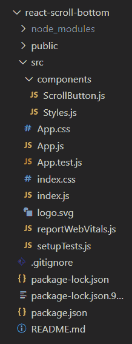
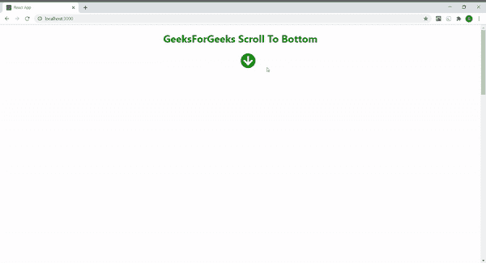
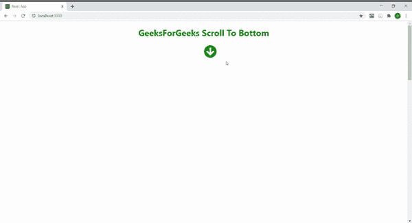

# 如何在 ReactJS 中创建滚动到底按钮？

> 原文:[https://www . geesforgeks . org/如何创建滚动到底部的按钮 in-reactjs/](https://www.geeksforgeeks.org/how-to-create-a-scroll-to-bottom-button-in-reactjs/)

你会看到，有很多聊天应用，比如 WhatsApp、Telegram 等，都在使用一个有用的功能，比如如果你在聊天窗口中间，你想去页面底部，那么你可以用这个按钮像 [**<u>一样自动向下滚动，跳到内容</u>**](https://www.geeksforgeeks.org/how-to-scroll-to-a-particular-element-or-skip-to-content-in-reactjs/) 。以下示例介绍了如何使用[**<u>useState()</u>**](https://www.geeksforgeeks.org/what-is-usestate-in-react/)钩子在 React JS 中创建滚动到底部按钮。

**先决条件:**

*   npm 和创建-反应-应用命令的基本知识。
*   样式组件的基本知识。
*   [**<u>基础知识使用状态()</u>**T5【反应钩。](https://www.geeksforgeeks.org/what-is-usestate-in-react/)

**基本设置:**你将使用 [**<u>创建-反应-app</u>**](https://www.geeksforgeeks.org/reactjs-setting-development-environment/) 开始一个新项目，所以打开你的终端并输入。

```
npx create-react-app react-scroll-bottom
```

现在，通过在终端中键入给定的命令，转到您的**反应-滚动-底部**文件夹。

```
cd react-scroll-bottom
```

**所需模块:**通过在终端中键入给定的命令，安装本项目所需的依赖项。

```
npm install --save styled-components
npm install --save react-icons
```

现在在 src 中创建**组件**文件夹，然后转到组件文件夹，创建两个文件 **ScrollButton.js** 和**style . js**。

**项目结构:**项目中的文件结构会是这样的。



**示例:**在本例中，我们将设计一个带有“滚动到底部”按钮的网页，为此，我们需要操作 App.js 文件和其他创建的组件文件。

我们创建一个状态，第一个元素作为初始状态可见，其值为真，第二个元素作为函数**设置可见()**来更新状态。然后创建一个名为**的函数，当我们向下滚动页面时，该函数将状态值设置为假。否则，状态值设置为真。**

然后创建一个名为 **scrollToBottom** 的函数，其中我们使用 [**<u>scrollTo 方法</u>**](https://www.geeksforgeeks.org/how-to-scroll-to-a-particular-element-or-skip-to-content-in-reactjs/) 将页面滚动到底部。现在我们的状态用于向用户显示/隐藏**滚动到底部**图标。当用户点击该图标时，功能**滚动至底部**被触发为 [**<u>onClick()事件</u>**](https://www.geeksforgeeks.org/javascript-events/) ，将我们的页面平滑滚动至底部。也可以用**【自动】**行为代替**【平滑】**。向下滚动页面时，函数 toggleVisible 也会通过 [**<u>窗口作为事件被触发，addEventListener 属性</u>**](https://www.geeksforgeeks.org/javascript-addeventlistener-with-examples/) 将 Visible 状态设置为 false，从而隐藏我们的图标。当我们自己向上滚动回到页面顶部时，状态值更新为 true，图标再次开始显示。

## scroll button . js-卷动按钮. js

```
import React, {useState} from 'react'; 
import {FaArrowCircleDown} from 'react-icons/fa'; 
import { Button } from './Styles'; 

const ScrollButton = () =>{ 

  const [visible, setVisible] = useState(true) 

  const toggleVisible = () => { 
    const scrolled = document.documentElement.scrollTop; 
    if (scrolled > 0){ 
      setVisible(false) 
    }  
    else if (scrolled <= 0){ 
      setVisible(true) 
    } 
  }; 

  const scrollToBottom = () =>{ 
    window.scrollTo({ 
      top: document.documentElement.scrollHeight, 
      behavior: 'auto'
      /* you can also use 'auto' behaviour 
         in place of 'smooth' */
    }); 
  }; 

  window.addEventListener('scroll', toggleVisible); 

  return ( 
    <Button> 
     <FaArrowCircleDown onClick={scrollToBottom}  
     style={{display: visible ? 'inline' : 'none'}} /> 
    </Button> 
  ); 
} 

export default ScrollButton;
```

## Styles.js

```
import styled from 'styled-components'; 

export const Header = styled.h1` 
   text-align: center; 
   left: 50%;
   color: green; 
`; 

export const Content = styled.div` 
   overflowY: scroll; 
   height: 2500px; 
`; 

export const Button = styled.div` 
   position: fixed;  
   width: 100%; 
   left: 50%; 
   height: 20px; 
   font-size: 3rem; 
   z-index: 1; 
   cursor: pointer; 
   color: green; 
`
```

## App.js

```
import { Fragment } from 'react'; 
import ScrollButton from './components/ScrollButton'; 
import { Content, Header } from './components/Styles'; 

function App() { 
  return ( 
    <Fragment> 
      <Header>GeeksForGeeks Scroll To Bottom</Header> 
      <ScrollButton /> 
      <Content /> 
      <Header>Thanks for visiting</Header> 
    </Fragment> 
  ); 
} 

export default App;
```

**运行应用程序的步骤:**从项目的根目录使用以下命令运行应用程序:

```
npm start
```

**输出:**现在打开浏览器，转到 **http://localhost:3000/** ，会看到如下输出。

*   **使用默认行为(自动):**看它如何直接跳到底部。



*   **使用平滑行为:**看它是如何平滑到底的。

