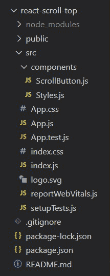
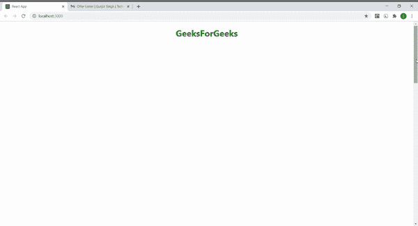
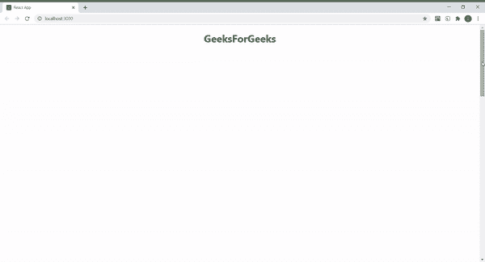

# 如何在 React JS 中创建滚动到顶部按钮？

> 原文:[https://www . geesforgeks . org/如何创建一个滚动到顶部的按钮-in-react-js/](https://www.geeksforgeeks.org/how-to-create-a-scroll-to-top-button-in-react-js/)

你会看到有很多网站都在使用一个有用的功能，比如如果你在滚动网页，现在你在那个页面的底部，那么你可以使用这个按钮像 [**一样自动向上滚动，跳到内容**](https://www.geeksforgeeks.org/how-to-scroll-to-a-particular-element-or-skip-to-content-in-reactjs/) 。以下示例介绍了使用 [**<u>【使用状态()</u>**](https://www.geeksforgeeks.org/what-is-usestate-in-react/) 钩子在 React JS 中创建滚动到顶部按钮。

**先决条件:**

*   npm 和创建-反应-应用命令的基本知识。
*   样式组件的基本知识。
*   [的基本知识使用状态()](https://www.geeksforgeeks.org/what-is-usestate-in-react/)反应钩子。

**基本设置:**你将使用 [**<u>创建-反应-app</u>**](https://www.geeksforgeeks.org/reactjs-setting-development-environment/) 开始一个新项目，所以打开你的终端并输入。

```jsx
npx create-react-app react-scroll-top
```

现在，通过在终端中键入给定的命令，转到您的**反应-滚动-顶部**文件夹。

```jsx
cd react-scroll-top
```

**所需模块:**通过在终端中键入给定的命令，安装本项目所需的依赖项。

```jsx
npm install --save styled-components
npm install --save react-icons
```

现在在 src 中创建**组件**文件夹，然后转到组件文件夹，创建两个文件 **ScrollButton.js** 和**style . js**。

**项目结构:**项目中的文件结构会是这样的。



**示例:**在本例中，我们将设计一个带有“滚动到顶部”按钮的网页，为此，我们需要操作 App.js 文件和其他创建的组件文件。

我们创建一个状态，第一个元素作为初始状态可见，第二个元素作为函数**设置可见()**来更新状态。然后创建一个名为**的函数，当我们向下滚动页面超过 300 像素时，该函数将状态值设置为真(您可以根据自己的选择选择任何值)。否则，状态值设置为 false。**

然后创建一个名为**scroltotop**的函数，其中我们使用[**<u>scroltoto 方法</u>**](https://www.geeksforgeeks.org/how-to-scroll-to-a-particular-element-or-skip-to-content-in-reactjs/) 将页面滚动到顶部。当我们向下滚动页面超过 300px 时，函数 toggleVisible 通过[**<u>window . addevent listener 属性</u>**](https://www.geeksforgeeks.org/javascript-addeventlistener-with-examples/) 作为事件被触发，并将 Visible 状态设置为 true。现在我们的状态用于向用户显示**滚动到顶部**图标。当用户点击该图标时，函数 scrollToTop 被触发为 [**<u>onClick()事件</u>**](https://www.geeksforgeeks.org/javascript-events/) ，该事件将我们的页面平滑地滚动到顶部。也可以用**“自动”**行为代替**“平滑”**。

## scroll button . js-卷动按钮. js

```jsx
import React, {useState} from 'react';
import {FaArrowCircleUp} from 'react-icons/fa';
import { Button } from './Styles';

const ScrollButton = () =>{

  const [visible, setVisible] = useState(false)

  const toggleVisible = () => {
    const scrolled = document.documentElement.scrollTop;
    if (scrolled > 300){
      setVisible(true)
    } 
    else if (scrolled <= 300){
      setVisible(false)
    }
  };

  const scrollToTop = () =>{
    window.scrollTo({
      top: 0, 
      behavior: 'smooth'
      /* you can also use 'auto' behaviour
         in place of 'smooth' */
    });
  };

  window.addEventListener('scroll', toggleVisible);

  return (
    <Button>
     <FaArrowCircleUp onClick={scrollToTop} 
     style={{display: visible ? 'inline' : 'none'}} />
    </Button>
  );
}

export default ScrollButton;
```

## Styles.js

```jsx
import styled from 'styled-components';

export const Heading = styled.h1`
   text-align: center;
   color: green;
`;

export const Content = styled.div`
   overflowY: scroll;
   height: 2500px;
`;

export const Button = styled.div`
   position: fixed; 
   width: 100%;
   left: 50%;
   bottom: 40px;
   height: 20px;
   font-size: 3rem;
   z-index: 1;
   cursor: pointer;
   color: green;
`
```

## App.js

```jsx
import { Fragment } from 'react';
import ScrollButton from './components/ScrollButton';
import { Content, Heading } from './components/Styles';

function App() {
  return (
    <Fragment>
      <Heading>GeeksForGeeks</Heading>
      <Content />
      <ScrollButton />
    </Fragment>
  );
}

export default App;
```

**运行应用程序的步骤:**从项目的根目录使用以下命令运行应用程序:

```jsx
npm start
```

**输出:**现在打开浏览器，转到 **http://localhost:3000/** ，会看到如下输出。

*   **使用默认行为(自动):**看它如何直接跳到顶部。



*   **使用平滑行为:**看它如何平滑地到达顶部。

