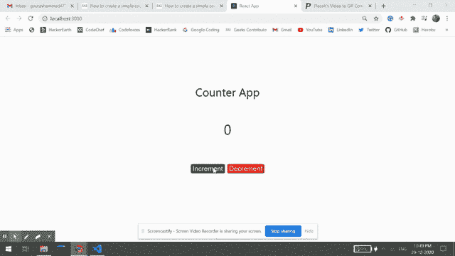

# 如何使用 ReactJS 创建一个简单的计数器？

> 原文:[https://www . geeksforgeeks . org/如何使用-reactjs/](https://www.geeksforgeeks.org/how-to-create-a-simple-counter-using-reactjs/) 创建一个简单的计数器

**React** 是一个用于创建交互 UI 的前端开源 JavaScript 库。它由脸书开发和维护。它可以用于单页和移动应用程序的开发。

我们将创建一个简单的应用程序，其中我们有两个按钮，一个增加一个减少。

**初始设置:**npx 是一个 CLI 工具，用于安装和管理 npm 注册表中的依赖关系。NPX 预捆绑了 npm 5.2+，否则我们可以使用以下命令安装它:

```jsx
npm i -g npx    // -g flag indicates global installation
```

**创建反应应用程序:**

**步骤 1:** 使用以下命令创建一个反应应用程序:

```jsx
npx create-react-app counter
```

**步骤 2:** 创建项目文件夹(即计数器)后，使用以下命令移动到该文件夹:

```jsx
cd counter
```

**项目结构:**如下图。


项目结构

**文件名:App.js:**

## java 描述语言

```jsx
import React, { useState } from "react";

// Importing app.css is css file to add styling
import "./App.css";

const App = () => {
  //  Counter is a state initialized to 0
  const [counter, setCounter] = useState(0)

  // Function is called everytime increment button is clicked
  const handleClick1 = () => {
    // Counter state is incremented
    setCounter(counter + 1)
  }

  // Function is called everytime decrement button is clicked
  const handleClick2 = () => {
    // Counter state is decremented
    setCounter(counter - 1)
  }

  return (
    <div style={{
      display: 'flex',
      flexDirection: 'column',
      alignItems: 'center',
      justifyContent: 'center',
      fontSize: '300%',
      position: 'absolute',
      width: '100%',
      height: '100%',
      top: '-15%',
    }}>
      Counter App
      <div style={{
        fontSize: '120%',
        position: 'relative',
        top: '10vh',
      }}>
        {counter}
      </div>
      <div className="buttons">
        <button style={{
          fontSize: '60%',
          position: 'relative',
          top: '20vh',
          marginRight: '5px',
          backgroundColor: 'green',
          borderRadius: '8%',
          color: 'white',
        }}
          onClick={handleClick1}>Increment</button>
        <button style={{
          fontSize: '60%',
          position: 'relative',
          top: '20vh',
          marginLeft: '5px',
          backgroundColor: 'red',
          borderRadius: '8%',
          color: 'white',
        }}
          onClick={handleClick2}>Decrement</button>
      </div>
    </div>
  )
}

export default App
```

**运行应用程序的步骤:**从项目的根目录使用以下命令运行应用程序:

```jsx
npm start
```

**输出:**

