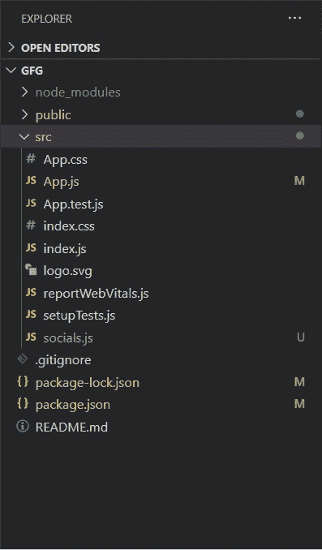

# 如何在 ReactJS 中创建快速拨号组件？

> 原文:[https://www . geeksforgeeks . org/如何创建快速拨号组件 in-reactjs/](https://www.geeksforgeeks.org/how-to-create-a-speed-dial-component-in-reactjs/)

材料用户界面实验室托管新的令人兴奋的组件，这些组件还没有完全为核心库做好准备。快速拨号组件就像一个有多个浮动操作按钮的对话框。它可以用于进行任何主要操作，如共享、复制、打印等。更易访问，让用户体验更好。

**创建反应应用程序并安装模块:**

*   **步骤 1:** 使用以下命令创建一个反应应用程序:

    ```
    npx create-react-app gfg
    ```

    *   **第 2 步:**创建项目文件夹后，即 gfg **，**使用以下命令移动到该文件夹:

    ```
    cd gfg
    ```

    *   **步骤 3:** 创建 ReactJS 应用程序后，使用以下命令安装 **material-ui** 模块:

    ```
    npm install @material-ui/core
    npm install @material-ui/icons
    npm install @material-ui/lab
    ```

    在 **src** 文件夹中创建一个文件**social . js**:我们将创建一个示例组件“social”，使用快速拨号组件显示网站的所有社交句柄。在 **src** 文件夹中创建一个新文件**social . js**，我们将在其中定义我们的组件。

    **项目结构:**如下图。

    

    **物料界面快速拨号:**

    快速拨号组件可用于将多个主要操作显示为浮动操作按钮。它的一些有用的道具:

    *   **隐藏:**设置快速拨号是隐藏还是可见
    *   **方向:**设置浮动动作按钮的方向，即上、下、右、左。
    *   **图标:**快速拨号图标
    *   **打开/关闭:**当快速拨号被打开和关闭时的处理函数。

    **示例:**

    ## socials.js

    ```
    import React from 'react';
    import SpeedDial from '@material-ui/lab/SpeedDial';
    import SpeedDialIcon from '@material-ui/lab/SpeedDialIcon';
    import SpeedDialAction from '@material-ui/lab/SpeedDialAction';
    import InstagramIcon from '@material-ui/icons/Instagram';
    import GitHubIcon from '@material-ui/icons/GitHub';
    import LinkedInIcon from '@material-ui/icons/LinkedIn';
    import TwitterIcon from '@material-ui/icons/Twitter';
    import EditIcon from '@material-ui/icons/Edit';

    const style = {
        margin: 0,
        right: 20,
        bottom: 20,
        position: 'fixed',
    };

    const actions = [
        { icon: <GitHubIcon style={{ fill: '#000000' }} />, 
        name: 'GitHub', link: "https://www.google.com/" },
        { icon: <LinkedInIcon style={{ fill: '#000000' }} />, 
        name: 'LinkedIn', link: "https://www.google.com/" },
        { icon: <TwitterIcon style={{ fill: '#000000' }} />, 
        name: 'Twitter', link: "https://www.google.com/" },
        { icon: <InstagramIcon style={{ fill: '#000000' }} />, 
        name: 'Instagram', link: "https://www.google.com/" },
    ];

    export default function Socials() {
        const [open, setOpen] = React.useState(false);
        const handleOpen = () => {
            setOpen(true);
        };

        const handleClose = () => {
            setOpen(false);
        };
        return (
            <div>
                <SpeedDial
                    ariaLabel="SpeedDial openIcon example"
                    style={style}
                    hidden={false}
                    icon={<SpeedDialIcon openIcon={<EditIcon />} />}
                    onClose={handleClose}
                    onOpen={handleOpen}
                    open={open}
                >
                    {actions.map((action) => (
                        <SpeedDialAction
                            key={action.name}
                            icon={action.icon}
                            tooltipTitle={action.name}
                            onClick={handleClose}
                            href={action.link}
                        />
                    ))}
                </SpeedDial>
            </div>
        );
    }
    ```

    ## App.js

    ```
    import React, { Component } from 'react';
    import CssBaseline from '@material-ui/core/CssBaseline';
    import Container from '@material-ui/core/Container';
    import Typography from '@material-ui/core/Typography';
    import Socials from './socials';

    class App extends Component {
        render() {
            return (
                <React.Fragment>
                    <CssBaseline />
                    <br></br>
                    <Container maxWidth="sm">
                        <Typography component="h1" variant="h1" 
                        align="center" gutterBottom>
                            Geeks for Geeks
                        </Typography>
                        <br />
                        <Typography component="h3" variant="h3" 
                        align="center" gutterBottom>
                            Speed Dial Demo
                        </Typography>
                    </Container>
                    <br /><br />
                    <Socials></Socials>
                </React.Fragment>
            );
        }
    }

    export default App;
    ```

    **运行应用程序的步骤:**从项目的根目录使用以下命令运行应用程序:

    ```
    npm start
    ```

    **输出:**现在打开浏览器，转到***http://localhost:3000/***，会看到如下输出:

    