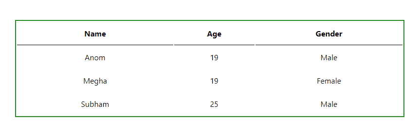

# 如何在 ReactJS 中创建表？

> 原文:[https://www . geeksforgeeks . org/how-to-create-in-table-reactjs/](https://www.geeksforgeeks.org/how-to-create-a-table-in-reactjs/)

在本文中，我们将在 React.js 中创建一个简单的表，就像您在普通的 HTML 项目中创建的一样。此外，我们将使用普通的 CSS 样式。

**先决条件:**本项目的先决条件是:

*   [反应](https://www.geeksforgeeks.org/react-js-introduction-working/)
*   [功能组件](https://www.geeksforgeeks.org/reactjs-functional-components/)
*   [JavaScript 为 6](https://www.geeksforgeeks.org/introduction-to-es6/)
*   [HTML 表格& CSS](https://www.geeksforgeeks.org/html-tables/)

**创建反应应用程序:**

**步骤 1:** 在终端中键入以下命令，创建一个 react 应用程序。

```jsx
npx create-react-app react-table
```

**步骤 2:** 现在，通过运行以下命令进入项目文件夹，即**反应表**。

```jsx
cd react-table
```

**项目结构:**如下图:


**例 1:** 这里 App.js 是默认组件。首先，我们将看到如何使用硬编码值创建一个表。稍后我们将看到如何动态呈现表中数组的数据。

**文件名:App.js**

## java 描述语言

```jsx
import './App.css';

function App() {
  return (
    <div className="App">
      <table>
        <tr>
          <th>Name</th>
          <th>Age</th>
          <th>Gender</th>
        </tr>
        <tr>
          <td>Anom</td>
          <td>19</td>
          <td>Male</td>
        </tr>
        <tr>
          <td>Megha</td>
          <td>19</td>
          <td>Female</td>
        </tr>
        <tr>
          <td>Subham</td>
          <td>25</td>
          <td>Male</td>
        </tr>
      </table>
    </div>
  );
}

export default App;
```

在上面的例子中，我们只是简单地使用了 HTML 表格元素，即、、

| and | Elements. |

**示例 2:** 现在让我们看看如何从数组中动态呈现数据。我们可以简单地使用内置的 Array.map()方法，而不是使用循环手动迭代数组。Array.map()方法允许您迭代数组并使用回调函数修改其元素。回调函数将在数组的每个元素上执行。在这种情况下，我们将在每次迭代中返回一个表行。

**文件名:App.js**

## java 描述语言

```jsx
import './App.css';

// Example of a data array that
// you might receive from an API
const data = [
  { name: "Anom", age: 19, gender: "Male" },
  { name: "Megha", age: 19, gender: "Female" },
  { name: "Subham", age: 25, gender: "Male"},
]

function App() {
  return (
    <div className="App">
      <table>
        <tr>
          <th>Name</th>
          <th>Age</th>
          <th>Gender</th>
        </tr>
        {data.map((val, key) => {
          return (
            <tr key={key}>
              <td>{val.name}</td>
              <td>{val.age}</td>
              <td>{val.gender}</td>
            </tr>
          )
        })}
      </table>
    </div>
  );
}

export default App;
```

**文件名:App.css** 现在，让我们编辑名为 **App.css** 的文件来设置表格的样式。

## 半铸钢ˌ钢性铸铁(Cast Semi-Steel)

```jsx
.App {
  width: 100%;
  height: 100vh;
  display: flex;
  justify-content: center;
  align-items: center;
}

table {
  border: 2px solid forestgreen;
  width: 800px;
  height: 200px;
}

th {
  border-bottom: 1px solid black;
}

td {
  text-align: center;
}
```

**运行应用程序的步骤:**从项目的根目录使用以下命令运行应用程序:

```jsx
npm start
```

**输出:**现在打开浏览器，转到 **http://localhost:3000/** ，会看到如下输出:

