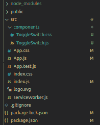
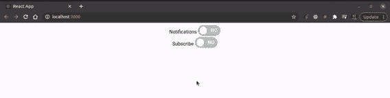

# 如何在 React 中创建切换开关作为可重用组件？

> 原文:[https://www . geeksforgeeks . org/如何创建作为可重用组件的切换开关/](https://www.geeksforgeeks.org/how-to-create-a-toggle-switch-in-react-as-a-reusable-component/)

在本文中，我们将在 React 中创建一个切换开关作为可重用组件。切换开关组件将是一个小型的可重用组件，能够在未来的项目中重用。我们将开发一个简单的演示拨动开关反应应用程序，使用这个定制的拨动开关组件。我们将使用带有一些样式的通用 HTML 标签来创建这个可重用的组件。您也可以使用材料用户界面- [链接](https://www.geeksforgeeks.org/how-to-create-switch-in-reactjs/)创建开关。

创建反应应用程序:

*   **步骤 1:** 使用以下命令创建一个反应应用程序:

    ```
    npx create-react-app toggle-switch
    ```

*   **步骤 2:** 创建项目文件夹(即切换开关)后，使用以下命令移动到该文件夹:

    ```
    cd toggle-switch
    ```

**项目结构:**如下图:



**示例:**

## App.js

```
import React, { Component } from "react";
import ToggleSwitch from "./components/ToggleSwitch";

class App extends Component {
  render() {
    return (
      <React.Fragment>
        <ToggleSwitch label="Notifications" />
        <ToggleSwitch label="Subscribe" />
      </React.Fragment>
    );
  }
}
export default App;
```

## 切换开关.js

```
import React from "react";
import "./ToggleSwitch.css";

const ToggleSwitch = ({ label }) => {
  return (
    <div className="container">
      {label}{" "}
      <div className="toggle-switch">
        <input type="checkbox" className="checkbox" 
               name={label} id={label} />
        <label className="label" htmlFor={label}>
          <span className="inner" />
          <span className="switch" />
        </label>
      </div>
    </div>
  );
};

export default ToggleSwitch;
```

## 切换开关.css

```
.container {
  text-align: center;
}
.toggle-switch {
  position: relative;
  width: 75px;
  display: inline-block;
  text-align: left;
  top: 8px;
}
.checkbox {
  display: none;
}
.label {
  display: block;
  overflow: hidden;
  cursor: pointer;
  border: 0 solid #bbb;
  border-radius: 20px;
}
.inner {
  display: block;
  width: 200%;
  margin-left: -100%;
  transition: margin 0.3s ease-in 0s;
}
.inner:before,
.inner:after {
  float: left;
  width: 50%;
  height: 36px;
  padding: 0;
  line-height: 36px;
  color: #fff;
  font-weight: bold;
  box-sizing: border-box;
}
.inner:before {
  content: "YES";
  padding-left: 10px;
  background-color: #060;
  color: #fff;
}
.inner:after {
  content: "NO";
  padding-right: 10px;
  background-color: #bbb;
  color: #fff;
  text-align: right;
}
.switch {
  display: block;
  width: 24px;
  margin: 5px;
  background: #fff;
  position: absolute;
  top: 0;
  bottom: 0;
  right: 40px;
  border: 0 solid #bbb;
  border-radius: 20px;
  transition: all 0.3s ease-in 0s;
}
.checkbox:checked + .label .inner {
  margin-left: 0;
}
.checkbox:checked + .label .switch {
  right: 0px;
}
```

**运行应用程序的步骤:**从项目的根目录使用以下命令运行应用程序:

```
npm start
```

**输出:**现在打开浏览器，转到***http://localhost:3000/***，会看到如下输出:

