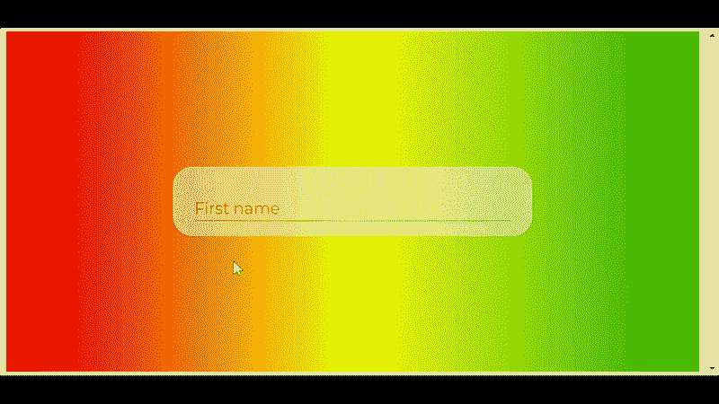

# 如何在 ReactJS 中创建半透明的文本输入？

> 原文:[https://www . geeksforgeeks . org/如何创建半透明文本输入 in-reactjs/](https://www.geeksforgeeks.org/how-to-create-a-translucent-text-input-in-reactjs/)

在本文中，我们将学习如何在 ReactJS 中创建半透明的文本输入。

**先决条件:**

1.  JavaScript 知识(ES6)
2.  HTML/CSS 的知识。
3.  ReactJS 的基本知识。

**用于构建本应用程序的反作用挂钩有:**

*   [反应使用状态](https://www.geeksforgeeks.org/reactjs-usestate-hook/)

**JavaScript 模块:**

*   [样式组件](https://www.npmjs.com/package/styled-components)
*   [成帧器-运动](https://www.npmjs.com/package/framer-motion)

**创建反应应用程序和安装模块:**

*   **步骤 1:** 现在，您将使用 create-react-app 启动一个新项目，因此请打开您的终端并键入:

    ```jsx
    npx create-react-app translucent-input-box
    ```

*   **步骤 2:** 创建项目文件夹(即半透明输入框)后，使用以下命令移动到该文件夹。

    ```jsx
    cd translucent-input-box
    ```

*   **步骤 3:** 添加项目期间需要的 npm 包:

    ```jsx
    npm install framer-motion styled-components
    ```

*   **步骤 5:** 现在打开新创建的项目，打开 **src** 文件夹，删除以下文件(可选):

    *   logo .. .svg
    *   serviceWorker.js
    *   setupTests.js
    *   index.css
    *   App.test.js(如果有)

创建名为**的文件夹，输入**并创建以下文件:

*   Component.jsx
*   Component.motion.js
*   component . style . js

**项目结构:**会是这样的。


项目结构

**进场:**

*   我们将使用**成帧器运动**和**样式的组件**创建半透明的动画文本输入。
*   **包装、输入、标签、下划线**是*组件. jsx* 文件**中用来组成文本输入框的样式组件。**
*   在 *Component.jsx* 文件中，我们使用来自 *Component.motion.js* 文件的带有自定义动画变体的成帧器-motion 来制作文本输入框的动画。
*   React **useState** hook 用于管理*值*的状态，该值用作占位符属性&，在激活时也将其设置为标签。
*   成帧器-运动**使用循环**钩子类似于反作用使用状态钩子。它在一系列用于动画的视觉属性中循环。它用于在动画变体之间切换或循环。

### 实施:

## App.js

```jsx
import React, { useState } from "react";
import "./App.css";

import Input from "./Input";

const App = () => {
  // The useState hook is used to manage the state of 
  // "value" that is used as placeholder attribute
  // and also to set it as a label when clicked
  const [value, setValue] = useState("");

  return (
    <div className="App">
      <div className="container">
       {/* "Input" component created using styled-components
       and animated using framer-motion
       */}
        <Input
          value={value}
          onChange={(id, value) => setValue(value)}
          label={"First name"}
        />
      </div>
    </div>
  );
};

export default App;
```

## index.js

```jsx
import React from "react";
import ReactDOM from "react-dom";

import App from "./App";

const rootElement = document.getElementById("root");
ReactDOM.render(
  <React.StrictMode>
    <App />
  </React.StrictMode>,
  rootElement
);
```

## App.css

```jsx
.App {
  font-family: "Times New Roman", Times, serif;
  text-align: center;

  width: auto;
  height: 98vh;

  display: flex;
  justify-content: center;
  align-items: center;

  overflow: hidden;
  background: #1e9600; /* fallback for old browsers */
  background: -webkit-linear-gradient(
    to right,
    #ff0000,
    #fff200,
    #1e9600
  ); /* Chrome 10-25, Safari 5.1-6 */
  background: linear-gradient(
    to right,
    #ff0000,
    #fff200,
    #1e9600
  );
}

.container {
  border-radius: 25px;

  width: 50vw;
  height: 20vh;

  display: flex;
  justify-content: center;
  align-items: center;

  opacity: 0.5;
  background-color: #f1f1f1;
}

Input {
  text-decoration: none;
  background-color: #f1f1f1;
  width: 40%;
}
```

## Component.jsx

```jsx
import React from "react";
import { Wrapper, Input, Label, Underline } from "./Component.styles";
import { motionLabel, motionUnderline } from "./Component.motion";
import { useCycle } from "framer-motion";

export default ({ label, value, onChange, id, errors }) => {
  const onTapStart = (event, info) => {
    focus === "inactive" && cycleFocus();
    return blur === "inactive" && cycleBlur();
  };
  const onBlur = event => {
    value === "" && cycleFocus();
    cycleBlur();
  };
  const [focus, cycleFocus] = useCycle("inactive", "active");
  const [blur, cycleBlur] = useCycle("inactive", "active");
  return (
   {/* Wrapper,Label,Underline - custom styled-components with 
          some of its attributes
   */}
   {/* These all collectively make the animated input box which 
   then given transluscent background using CSS
   */} 
    <Wrapper>
      <Input
        onTap={onTapStart}
        placeholder={label}
        onBlur={e => onBlur(id)}
        onChange={e => onChange(id, e.target.value)}
        type={"text"}
        required
        value={value}
      />
      <Label {...motionLabel(focus)}>{label}</Label>
      <Underline {...motionUnderline(blur)} />
    </Wrapper>
  );
};
```

## Component.motion.js

```jsx
const variantsWrapper = {
  initial: {},
  in: {},
  out: {},
  hover: {},
  tap: {}
};

const variantsLabel = {
  active: {
    x: -15,
    y: -20,
    scale: 0.7
  },
  inactive: { x: 0, y: 0, scale: 1 }
};
const variantsUnderline = {
  active: {
    width: "100%",
    transition: {
      ease: "easeIn",
      duration: 0.2
    }
  },
  inactive: {
    width: "0",
    transition: {
      ease: "easeIn",
      duration: 0.1
    }
  }
};

export const motionLabel = state => {
  return {
    animate: state,
    variants: variantsLabel
  };
};

export const motionUnderline = state => {
  return {
    animate: state,
    variants: variantsUnderline
  };
};

export const animationWrapper = {
  initial: "initial",
  animate: "in",
  exit: "out",
  whileHover: "hover",
  whileTap: "tap",
  variants: variantsWrapper
};
```

## component . style . js

```jsx
import styled from "styled-components";
import { motion } from "framer-motion";

// Below are the styled-components used to 
// make the animated text input box

export const Wrapper = styled(motion.div)`
  position: relative;
  width: 80%;
  padding: 18px;
  padding-bottom: 30px;
  border-bottom: 1px solid #2f528f;
`;

export const Label = styled(motion.span)`
  align-self: center;
  position: absolute;
  left: 0;
  top: 50%;
  grid-area: input;
  font-family: Montserrat;
  font-size: 18px;
  line-height: 18px;
  text-align: left;
  pointer-events: none;
  font-weight: normal;
  /* background: green; */
`;

export const Input = styled(motion.input)`
  height: 18px;
  font-size: 18px;
  -webkit-appearance: none;
  background: transparant !important;
  position: absolute;
  left: 0;
  top: 50%;
  padding: 0;
  padding-bottom: 5px;
  margin: 0;
  color: black;
  border: none;
  box-shadow: none !important;
  font-weight: normal;
  &:focus {
    outline: none;
  }
  &::placeholder {
    color: #f1f1f1;
  }
`;

export const Underline = styled(motion.div)`
  position: absolute;
  background-color: #2f528f;
  bottom: 0;
  left: 0;
  width: 100%;
  height: 3px;
`;
```

**运行应用程序的步骤:**从项目的根目录使用以下命令运行应用程序:

```jsx
npm start
```

**输出:**现在打开浏览器，转到 **http://localhost:3000/** ，会看到如下输出:

