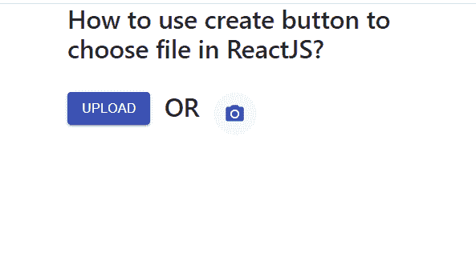

# 如何在 ReactJS 中创建上传文件按钮？

> 原文:[https://www . geesforgeks . org/如何创建-上传-文件-按钮-in-reactjs/](https://www.geeksforgeeks.org/how-to-create-a-upload-file-button-in-reactjs/)

众所周知，上传是任何应用程序中非常重要的和步骤，因此我们可以使用以下方法在 ReactJS 中创建一个简单的上传文件按钮。React 的 Material UI 有这个组件可供我们使用，非常容易集成。

**创建反应应用程序并安装模块:**

**步骤 1:** 使用以下命令创建一个反应应用程序:

```
npx create-react-app foldername
```

**步骤 2:** 创建项目文件夹(即文件夹名**)后，使用以下命令移动到该文件夹中:**

```
cd foldername
```

**步骤 3:** 创建 ReactJS 应用程序后，使用以下命令安装 **material-ui** 模块:

```
npm install @material-ui/core
npm install @material-ui/icons
```

**项目结构:**如下图。


项目结构

**文件名-App.js:** 现在在 **App.js** 文件中写下以下代码。在这里，App 是我们编写代码的默认组件。

## java 描述语言

```
import React from 'react';
import Button from '@material-ui/core/Button';
import PhotoCamera from '@material-ui/icons/PhotoCamera';
import IconButton from '@material-ui/core/IconButton';

const App = () => {

  return (
    <div style={{
      display: 'flex',
      margin: 'auto',
      width: 400,
      flexWrap: 'wrap',
    }}>
      <div style={{ width: '100%', float: 'left' }}>
        <h3>How to use create button to choose file in ReactJS?</h3> <br />
      </div>
      <input
        type="file"
        accept="image/*"
        style={{ display: 'none' }}
        id="contained-button-file"
      />
      <label htmlFor="contained-button-file">
        <Button variant="contained" color="primary" component="span">
          Upload
        </Button>
      </label>
      <h3>  OR  </h3>
      <input accept="image/*" id="icon-button-file"
        type="file" style={{ display: 'none' }} />
      <label htmlFor="icon-button-file">
        <IconButton color="primary" aria-label="upload picture"
        component="span">
          <PhotoCamera />
        </IconButton>
      </label>
    </div>
  );
}

export default App;
```

**运行应用程序的步骤:**从项目的根目录使用以下命令运行应用程序:

```
npm start
```

**输出:**现在打开浏览器，转到***http://localhost:3000/***，会看到如下输出:



现在点击任何一个按钮，现在你可以选择任何文件上传。这就是我们如何在 ReactJS 中创建上传文件按钮。