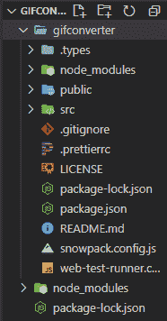
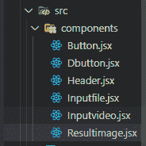

# 如何使用 ReactJS 创建视频转 GIF 转换器？

> 原文:[https://www . geeksforgeeks . org/如何创建视频到 gif 转换器-使用-reactjs/](https://www.geeksforgeeks.org/how-to-create-a-video-to-gif-converter-using-reactjs/)

当您考虑 gif 图像时，必须将视频转换为. GIF 格式的图像。对于这个项目，我们使用的是用 C 编程语言编写的 **FFMPEG** 库实用程序。在 web Assembly 的支持下，它可以很容易地在浏览器中运行，而不需要任何服务器，这里我们也使用了 ReactJS 库，使它变得简单易懂。

您可以从以下链接了解网页组件:

*   [网络组装——下一件大事！](https://www.geeksforgeeks.org/webassembly-the-next-big-thing/)

此外，您还可以了解 FFMPEG，它是一个免费的开源软件项目，由一大套库和程序组成，用于处理视频、音频和其他多媒体文件和流，您可以从 https://ffmpeg.org/链接查看。

**FFMPEG:** FFmpeg.wasm 是 FFMPEG 的一个 WebAssembly 端口，你可以通过 npm 安装，像其他任何 JavaScript 模块一样在 Node 或者浏览器中使用。创建一个简单的客户端代码转换器，将数据流式传输到视频元素中。

在做这个项目之前，你有一个关于 ReactJS 的实践经验，因为我们使用的是 useState 的 react hook。那么，好了，有了这个概念，继续为项目创建目录。

*   按照以下命令创建我们的带有雪包的 React 应用:

    > npx create-雪包-app gif 转换器-模板@雪包/app-模板-react

*   安装完成后，上述命令通过以下命令安装另一个名为 FFMPEG 的包:

    ```jsx
    npm install @ffmpeg/ffmpeg  @ffmpeg/core
    ```

*   为了我们的造型目的，您可以通过以下命令安装造型组件。它很可能是 CSS，但当我们使用 JavaScript 时，它会创建用户定义的变量，在该变量中，我们可以编写 CSS 属性，它也用于制作组件，而无需制作新的 JSX 文件。

    ```jsx
    npm i styled-components
    ```

**项目结构:**项目的所有安装已经完成，我们现在开始开发我们的 aiming 项目。现在您可以看到项目目录如下所示，并且您的所有依赖项都已成功安装。



现在打开命令提示符，键入以下命令，通过运行以下命令启动服务器。然后你的浏览器在运行你的应用的端口号 **8080** 中打开，如果你的浏览器看起来像这样，那么你就来对地方了。

```jsx
cd gifconverter
npm start
```

现在在代码编辑器中打开项目文件夹，在 **src** 目录下创建一个名为 components 的文件夹，并在该文件夹下创建各种 JSX 组件文件，如下所示

**src/组件:**

*   Button.jsx 按钮
*   dbutton . jsx 文件
*   Header.jsx
*   Inputfile.jsx
*   Inputvideo.jsx
*   结果 img.jsx



创建上述 JSX 组件后，让我们开始为我们的项目添加代码:

**Filename- Button.jsx:** 这个组件是一个 convert 按钮，当你点击它的时候会自动把. mp4 文件改成。gif 文件。

## java 描述语言

```jsx
import React from "react";
import styled from "styled-components";

const Btn = styled.button`
  background-color: #000;
  color: #fff;
  border-radius: 18px;
  border: 1px solid #000;
  outline: none;
  font-weight: 700;
  cursor: pointer;
  font-size: 1.2em;
  padding: 10px;
  min-width: 20%;
  transition: all 0.2s ease-in-out;
  :hover {
    background-color: #3f3f3f;
    color: #efefef;
  }
`;

export const Button = ({ convertToGif }) => {
  return <Btn onClick={convertToGif}>Convert</Btn>;
};
```

**文件名- Dbutton.jsx:** 这个组件是一个下载按钮，你可以在这里下载。从. mp4 文件转换后的 gif 图像。

## java 描述语言

```jsx
import React from "react";
import styled from "styled-components";

const Btn = styled.a`
  display: flex;
  left: 0;
  right: 0;
  margin: 20px auto;
  margin-top: -20px;
  background-color: #000;
  color: #fff;
  border-radius: 35.5px;
  border: 1px solid #000;
  outline: none;
  font-weight: 700;
  cursor: pointer;
  font-size: 1.2em;
  padding: 10px;
  padding-left: 50px;
  max-width: 10%;
  text-decoration: none;
  transition: all 0.2s ease-in-out;
  :hover {
    background-color: #3f3f3f;
    color: #efefef;
  }
`;

export const Dbutton = ({ gif, download }) => {
  return (
    <Btn href={gif} download onClick={(e) => download(e)}>
      Download
    </Btn>
  );
};
```

**档案名称标头. jsx:**

## java 描述语言

```jsx
import React from "react";
import styled from "styled-components";

const H1 = styled.h1`
  margin: 0;
  padding: 12px;
  background-color: #000;
  color: #fff;
  font-family: sans-serif;
  font-size: 3em;
`;

export const Header = () => {
  return (
    <div>
      <H1>video to gif converter</H1>
    </div>
  );
};
```

**Filename- Inputfile.jsx:** 该组件用于获取视频文件(. mp4 文件)的用户输入

## java 描述语言

```jsx
import React from "react";
import styled from "styled-components";

const Section = styled.div`
  display: flex;
  left: 0;
  right: 0;
  margin: 50px auto;
  width: 30%;
  border: 2px dashed #000;
  border-radius: 18px;
  padding: 10px;
`;

export const Inputfile = ({ setVideo }) => {
  return (
    <Section>
      <input type="file" onChange={(e) => setVideo(e.target.files?.item(0))} />
    </Section>
  );
};
```

**文件名 - Inputvideo.jsx：**

## java 描述语言

```jsx
import React from "react";
import styled from "styled-components";

const Video = styled.video`
  width: 40%;
  margin: 20px;
  border: 1px dashed #045ca3;
`;

export const Inputvideo = ({ video }) => {
  return <Video controls width="250" src={URL.createObjectURL(video)} />;
};
```