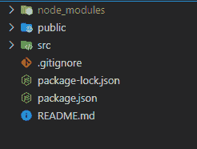
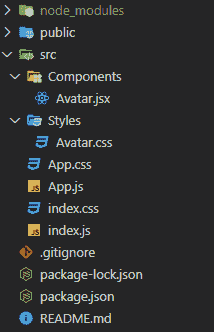
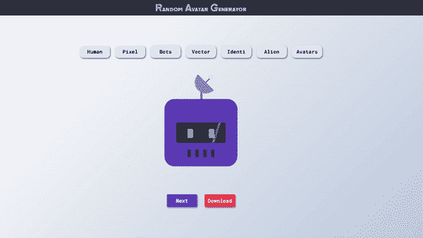

# 如何在 ReactJS 中创建头像生成器应用？

> 原文:[https://www . geeksforgeeks . org/如何创建头像生成器-app-in-reactjs/](https://www.geeksforgeeks.org/how-to-create-an-avatar-generator-app-in-reactjs/)

在本文中，我们将制作一个简单的头像生成器应用程序，生成随机图像。在这个头像生成器中，我们有几个不同类别的按钮可供选择，下一个按钮用于生成随机图像，还有一个下载按钮用于最终下载您喜欢的头像。

**先决条件:**本项目的先决条件是:

*   反应
*   功能组件
*   反作用钩
*   反应 Axios & API
*   Javascript ES6

**基本设置:**通过以下命令启动项目:

```
npx create-react-app avatarApp
```

现在，转到项目文件夹，即 avatarApp:

```
cd avatarApp
```



现在，转到 **src** 文件夹，创建一个**组件**文件夹和一个**样式**文件夹。在组件文件夹下，创建文件“ **Avatar.jsx** ”，在样式文件夹下，创建文件“ **Avatar.css**



*   现在，打开控制台，安装 [Axios](https://www.npmjs.com/package/axios) npm 包:

```
npm install axios
```

*   **index.js:**

## java 描述语言

```
import React from 'react';
import ReactDOM from 'react-dom';
import './index.css';
import App from './App';

ReactDOM.render(
  <React.StrictMode>
    <App />
  </React.StrictMode>,
  document.getElementById('root')
);
```

*   **App.js:** App 组件渲染单个头像组件

## java 描述语言

```
import './App.css';
import Avatar from './Components/Avatar';

function App() {
  return (
    <div className="App">
      <Avatar />
    </div>
  );
}
export default App;
```

*   **App.css:** 这将我们应用的背景设置为一个不错的 css 渐变

```
.App {
  margin: 0;
  padding: 0;
  background-color: #b8c6db;
  background-image: linear-gradient(315deg, #b8c6db 0%, #f5f7fa 74%);
}
```

*   **Avatar.jsx:** 这个文件包含了所有的逻辑。我们将使用一个名为 [*【迪赛贝尔化身】*](https://avatars.dicebear.com/) 的免费开源应用编程接口(无需授权)根据几个参数获取随机化身。

## java 描述语言

```
import React, { useState } from 'react';
import '../Styles/Avatar.css';
import Axios from 'axios';

const Avatar = () => {

    // Setting up the inital states using react hook 'useState'
    const [sprite, setSprite] = useState("bottts");
    const [seed, setSeed] = useState(1000);

    // Function to set the current sprite type
    function handleSprite(spritetype) {
        setSprite(spritetype);
    }

    // Function to generate random seeds for the API
    function handleGenerate() {
        let x = Math.floor(Math.random() * 1000);
        setSeed(x);
    }

    // Function to download image and save it in our computer
    function downloadImage() {
        Axios({
            method: "get",
            url: `https://avatars.dicebear.com/api/${sprite}/${seed}.svg`,
            responseType: "arraybuffer"
        })
        .then((response) => {
            var link = document.createElement("a");
            link.href = window.URL.createObjectURL(
                new Blob([response.data], 
                { type: "application/octet-stream" })
            );
            link.download = `${seed}.svg`;
            document.body.appendChild(link);
            link.click();
            setTimeout(function () {
                window.URL.revokeObjectURL(link);
            }, 200);
        })
        .catch((error) => { });
    }

    return (
        <div className="container">
            <div className="nav">
                <p>Random Avatar Generator</p>
            </div>
            <div className="home">
                <div className="btns">
                    <button onClick={() => { 
                        handleSprite("avataaars") }}>Human</button>
                    <button onClick={() => { 
                        handleSprite("human") }}>Pixel</button>
                    <button onClick={() => { 
                        handleSprite("bottts") }}>Bots</button>
                    <button onClick={() => { 
                        handleSprite("jdenticon") }}>Vector</button>
                    <button onClick={() => { 
                        handleSprite("identicon") }}>Identi</button>
                    <button onClick={() => { 
                        handleSprite("gridy") }}>Alien</button>
                    <button onClick={() => { 
                        handleSprite("micah") }}>Avatars</button>
                </div>
                <div className="avatar">
                    
                </div>
                <div className="generate">
                    <button id="gen" onClick={() => { 
                        handleGenerate() }}>Next</button>
                    <button id="down" onClick={() => { 
                        downloadImage() }}>Download</button>
                </div>
            </div>
        </div>
    )
}

export default Avatar;
```

*   **Avatar.css:** 用这个文件来装饰我们的 app

```
@import url('https://fonts.googleapis.com/css2?family=Roboto+Mono:wght@400;600;700&display=swap');
@import url('https://fonts.googleapis.com/css2?family=Zen+Tokyo+Zoo&display=swap');

.nav{
    height: 6vh;
    width: 100%;
    background-color: #313442;
    display: flex;
    justify-content: center;
    align-items: center;
    color: white;
    font-family: 'Zen Tokyo Zoo', cursive;
    font-size: 35px;
}
.home{
    box-sizing: border-box;
    height: 94vh;
    width: 100%;
    gap: 15px;
    display: flex;
    flex-direction: column;
    justify-content: center;
    align-items: center;
}
.avatar{
    height: 50%;
    width: 50%;
    max-width: 400px;
    max-height: 400px;
    margin-top: 40px;
    margin-bottom: 45px;
}
.btns{
    display: flex;
    flex-wrap: wrap;
    align-items: center;
    justify-content: center;
}
button{
    width: 6em;
    height: 2.5em;
    margin: 10px;
    font-size: 20px;
    font-weight: 600;
    font-family: 'Roboto Mono', monospace;
    background-color: rgb(231, 231, 231);
    box-shadow: 2px 3px 5px rgb(102, 101, 101);
    border-radius: 15px;
    border: none;
    transition: 0.2s;
}
button:active{
    box-shadow: none;
}
.btns > button:hover{
    background-color: #ffffff;
}
#gen{
    background-color: #4361ee;
    color: white;
}
#down{
    background-color: #EB3349;
    color: white;
}
```

*   **保存所有文件，启动服务器:**

```
npm start
```

在浏览器中打开[<u>http://localhost:3000/</u>](http://localhost:3000/)URL。它会显示结果。 ***我们的应用程序现在已经完成，现在应该可以工作了。***

