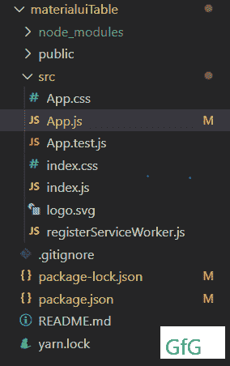
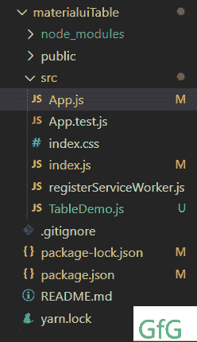
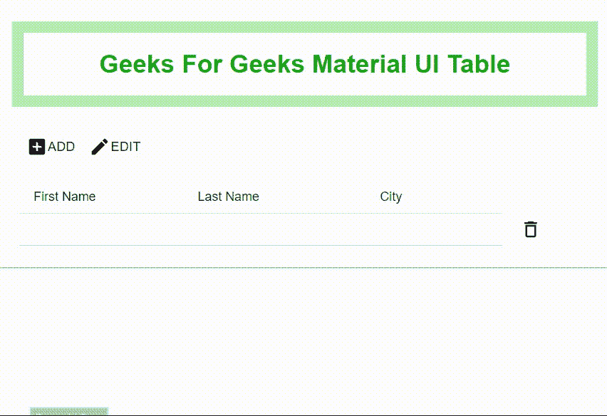

# 如何使用 ReactJS 创建带有添加删除和搜索过滤器的可编辑表？

> 原文:[https://www . geeksforgeeks . org/如何使用-reactjs/](https://www.geeksforgeeks.org/how-to-create-an-editable-table-with-add-delete-and-search-filter-using-reactjs/) 创建可编辑的表-添加-删除-搜索-筛选

表格用于显示一组数据。在某些项目中，您需要实现具有可编辑/不可编辑模式的动态表，用户可以在其中添加或删除任何行。另外，React 的 Material UI 有一个可定制的表格组件，它非常容易集成，但是没有这样的功能来单独处理行的添加和删除。我们将使用 React.js 和 Material UI，并在其中实现这些功能。

**创建反应应用程序并安装模块:**

*   **步骤 1:** 使用以下命令创建一个 React 应用程序。

    ```
    npx create-react-app foldername
    ```

*   **步骤 2:** 创建项目文件夹(即文件夹名)后，使用以下命令移动到该文件夹。

    ```
    cd foldername
    ```

*   **步骤 3:** 创建 React.js 应用程序后，使用以下命令安装 **material-ui** 模块。

    ```
    npm install @material-ui/core
    npm install @material-ui/icons
    npm install @material-ui/lab
    ```

**默认项目结构:**如下图。



初始项目结构

**改变项目结构:**我们不需要一些像 App.css、logo.svg 这样的文件，去掉它们，添加一个新的文件 TableDemo.js，我们的表组件将驻留在这个文件中。



更改项目结构

**示例:**现在相应地在 App.js 和 TableDemo.js 文件中写下以下代码。在这里，App 是我们的默认组件，我们已经替换了默认代码。

## App.js

```
import React from "react";
import TableDemo from "./TableDemo";

function App() {
    return (
        <div>
            {/* Header with inline css */}
            <h1
                style={{
                    display: 'flex', justifyContent: 'center', padding: '15px',
                    border: '13px solid #b4f0b4', color: 'rgb(11, 167, 11)'
                }}>
                Geeks For Geeks Material UI Table
            </h1>
            {/* Table component below header */}
            <TableDemo />
        </div>
    )
}

export default App;
```

## table demo . js-表格演示

```
import React, { useState } from "react";
import CreateIcon from "@material-ui/icons/Create";
import {
    Box, Button, Snackbar, Table,
    TableBody, TableCell, TableHead, TableRow
} from "@material-ui/core";
import DeleteOutlineIcon from "@material-ui/icons/DeleteOutline";
import AddBoxIcon from "@material-ui/icons/AddBox";
import DoneIcon from "@material-ui/icons/Done";
import ClearIcon from "@material-ui/icons/Clear";
import { makeStyles } from "@material-ui/core/styles";
import Alert from "@material-ui/lab/Alert";
import Dialog from "@material-ui/core/Dialog";
import DialogActions from "@material-ui/core/DialogActions";
import DialogContent from "@material-ui/core/DialogContent";
import DialogContentText from "@material-ui/core/DialogContentText";
import DialogTitle from "@material-ui/core/DialogTitle";

// Creating styles
const useStyles = makeStyles({
    root: {
        "& > *": {
            borderBottom: "unset",
        },
    },
    table: {
        minWidth: 650,
    },
    snackbar: {
        bottom: "104px",
    },
});

function TableDemo() {
    // Creating style object
    const classes = useStyles();

    // Defining a state named rows
    // which we can update by calling on setRows function
    const [rows, setRows] = useState([
        { id: 1, firstname: "", lastname: "", city: "" },
    ]);

    // Initial states
    const [open, setOpen] = React.useState(false);
    const [isEdit, setEdit] = React.useState(false);
    const [disable, setDisable] = React.useState(true);
    const [showConfirm, setShowConfirm] = React.useState(false);

    // Function For closing the alert snackbar
    const handleClose = (event, reason) => {
        if (reason === "clickaway") {
            return;
        }
        setOpen(false);
    };

    // Function For adding new row object
    const handleAdd = () => {
        setRows([
            ...rows,
            {
                id: rows.length + 1, firstname: "",
                lastname: "", city: ""
            },
        ]);
        setEdit(true);
    };

    // Function to handle edit
    const handleEdit = (i) => {
        // If edit mode is true setEdit will 
        // set it to false and vice versa
        setEdit(!isEdit);
    };

    // Function to handle save
    const handleSave = () => {
        setEdit(!isEdit);
        setRows(rows);
        console.log("saved : ", rows);
        setDisable(true);
        setOpen(true);
    };

    // The handleInputChange handler can be set up to handle
    // many different inputs in the form, listen for changes 
    // to input elements and record their values in state
    const handleInputChange = (e, index) => {
        setDisable(false);
        const { name, value } = e.target;
        const list = [...rows];
        list[index][name] = value;
        setRows(list);
    };

    // Showing delete confirmation to users
    const handleConfirm = () => {
        setShowConfirm(true);
    };

    // Handle the case of delete confirmation where 
    // user click yes delete a specific row of id:i
    const handleRemoveClick = (i) => {
        const list = [...rows];
        list.splice(i, 1);
        setRows(list);
        setShowConfirm(false);
    };

    // Handle the case of delete confirmation 
    // where user click no 
    const handleNo = () => {
        setShowConfirm(false);
    };

  return (
    <TableBody>
      <Snackbar
        open={open}
        autoHideDuration={2000}
        onClose={handleClose}
        className={classes.snackbar}
      >
        <Alert onClose={handleClose} severity="success">
          Record saved successfully!
        </Alert>
      </Snackbar>
      <Box margin={1}>
        <div style={{ display: "flex", justifyContent: "space-between" }}>
          <div>
            {isEdit ? (
              <div>
                <Button onClick={handleAdd}>
                  <AddBoxIcon onClick={handleAdd} />
                  ADD
                </Button>
                {rows.length !== 0 && (
                  <div>
                    {disable ? (
                      <Button disabled align="right" onClick={handleSave}>
                        <DoneIcon />
                        SAVE
                      </Button>
                    ) : (
                      <Button align="right" onClick={handleSave}>
                        <DoneIcon />
                        SAVE
                      </Button>
                    )}
                  </div>
                )}
              </div>
            ) : (
              <div>
                <Button onClick={handleAdd}>
                  <AddBoxIcon onClick={handleAdd} />
                  ADD
                </Button>
                <Button align="right" onClick={handleEdit}>
                  <CreateIcon />
                  EDIT
                </Button>
              </div>
            )}
          </div>
        </div>
        <TableRow align="center"> </TableRow>

        <Table
          className={classes.table}
          size="small"
          aria-label="a dense table"
        >
          <TableHead>
            <TableRow>
              <TableCell>First Name</TableCell>
              <TableCell>Last Name</TableCell>
              <TableCell align="center">City</TableCell>
              <TableCell align="center"> </TableCell>
            </TableRow>
          </TableHead>
          <TableBody>
            {rows.map((row, i) => {
              return (
                <div>
                  <TableRow>
                    {isEdit ? (
                      <div>
                        <TableCell padding="none">
                          <input
                            value={row.firstname}
                            name="firstname"
                            onChange={(e) => handleInputChange(e, i)}
                          />
                        </TableCell>
                        <TableCell padding="none">
                          <input
                            value={row.lastname}
                            name="lastname"
                            onChange={(e) => handleInputChange(e, i)}
                          />
                        </TableCell>
                        <TableCell padding="none">
                          <select
                            style={{ width: "100px" }}
                            name="city"
                            value={row.city}
                            onChange={(e) => handleInputChange(e, i)}
                          >
                            <option value=""></option>
                            <option value="Karanja">Karanja</option>
                            <option value="Hingoli">Hingoli</option>
                            <option value="Bhandara">Bhandara</option>
                            <option value="Amaravati">Amaravati</option>
                            <option value="Pulgaon">Pulgaon</option>
                          </select>
                        </TableCell>
                      </div>
                    ) : (
                      <div>
                        <TableCell component="th" scope="row">
                          {row.firstname}
                        </TableCell>
                        <TableCell component="th" scope="row">
                          {row.lastname}
                        </TableCell>
                        <TableCell component="th" scope="row" align="center">
                          {row.city}
                        </TableCell>
                        <TableCell
                          component="th"
                          scope="row"
                          align="center"
                        ></TableCell>
                      </div>
                    )}
                    {isEdit ? (
                      <Button className="mr10" onClick={handleConfirm}>
                        <ClearIcon />
                      </Button>
                    ) : (
                      <Button className="mr10" onClick={handleConfirm}>
                        <DeleteOutlineIcon />
                      </Button>
                    )}
                    {showConfirm && (
                      <div>
                        <Dialog
                          open={showConfirm}
                          onClose={handleNo}
                          aria-labelledby="alert-dialog-title"
                          aria-describedby="alert-dialog-description"
                        >
                          <DialogTitle id="alert-dialog-title">
                            {"Confirm Delete"}
                          </DialogTitle>
                          <DialogContent>
                            <DialogContentText id="alert-dialog-description">
                              Are you sure to delete
                            </DialogContentText>
                          </DialogContent>
                          <DialogActions>
                            <Button
                              onClick={() => handleRemoveClick(i)}
                              color="primary"
                              autoFocus
                            >
                              Yes
                            </Button>
                            <Button
                              onClick={handleNo}
                              color="primary"
                              autoFocus
                            >
                              No
                            </Button>
                          </DialogActions>
                        </Dialog>
                      </div>
                    )}
                  </TableRow>
                </div>
              );
            })}
          </TableBody>
        </Table>
      </Box>
    </TableBody>
  );
}

export default TableDemo;
```

**运行应用程序的步骤:**从项目的根目录使用以下命令运行应用程序。

```
npm start
```

**输出:**现在打开浏览器，转到 **http://localhost:3000/** ，会看到如下输出。



表格功能演示

**说明:**

*   useState()是 ReactJs 中的一个钩子，它允许功能组件拥有一个状态。我们在这个函数中传递初始状态，它返回一个变量和一个函数来更新那个状态。使用这个我们可以处理编辑/非编辑模式和相应显示的按钮。
*   最初，表格将以非编辑模式显示。单击编辑后，表格行将在编辑模式下修改，用户可以添加任意多的行或删除任意行。
*   在编辑模式下，当用户试图更改行数据时，编辑按钮将被更改为保存。点击保存后，会弹出保存提示信息。
*   当用户试图删除一行时，将显示确认删除。如果用户选择*是*，则该特定行将被删除，如果用户选择*否*，则该行不会被删除。
*   观察上面的输出，注意变化。您也可以根据自己的选择修改这些更改。