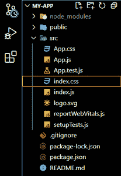
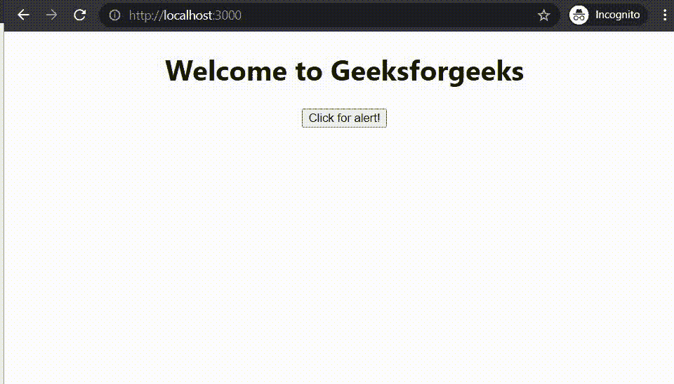

# 如何在 React 中创建事件？

> 原文:[https://www . geeksforgeeks . org/如何创建反应中事件/](https://www.geeksforgeeks.org/how-to-create-an-event-in-react/)

我们今天创建的每一个现代网页都倾向于用户交互。当用户与 web 应用程序交互时，触发事件。这个事件可以是鼠标点击、按键，或者像连接电池和充电器这样罕见的事情。从开发人员的角度来看，我们需要‘倾听’这样的事件，然后让我们的应用程序做出相应的响应。这被称为事件处理，为网页提供动态界面。像 JavaScript DOM 一样，React 也为我们提供了一些内置的方法来创建一个监听器，从而响应特定的事件。

现在我们将看看在 React 中创建事件时需要记住的某些规则。

*   **camelCase 约定:**在给 react 事件命名时，我们使用 camelCase 而不是小写。这仅仅意味着我们写*【onClick】***而不是*【onClick】。***
*   ****将事件作为函数传递:**在 React 中，我们传递一个用花括号括起来的函数作为事件侦听器或事件处理程序，这与 HTML 不同，在 HTML 中，我们将事件处理程序或事件侦听器作为字符串传递。**
*   ****防止默认:**仅仅在 JSX 元素内部返回 false 并不能防止在 react 中的默认行为。相反，我们必须直接在事件处理函数内部调用“*preventDefault”*方法。**

****语法:****

```
function Component(){
 doSomething(e){
   e.preventDefault();
   // Some more response to the event
 }
return (
   <button onEvent={doSomething}></button>
 );
}
```

**现在看完上面的语法，一个问题必须进来，那就是‘e’对象是什么，它从哪里来。实际上，e 是一个合成事件。这是一个用包装器包装浏览器实际事件的对象。这个对象是跨浏览器的。**

****创建反应应用程序:****

*   ****步骤 1:** 使用以下命令创建一个反应应用程序:**

    ```
    npx create-react-app name_of_the_app
    ```

*   ****步骤 2:** 创建 react 应用程序后，使用以下命令根据您的应用程序名称移动到目录:**

    ```
    cd name_of_the_app
    ```

****项目结构:**现在在编辑器中打开应用程序文件夹。您将看到以下文件结构:**

****

****方法:**现在按照以下步骤修改源代码目录中的默认 App.js 文件:**

*   **确保已导入“反应”。并导入“App.css”文件，因为它包含应用程序组件的一些 css 样式。**
*   **用“类名”应用清除内写的所有内容。**
*   **在这个分区中创建一个标题和一个按钮。**
*   **在按钮内部创建一个 onClick 事件，并在其中传递“eventHandler”函数。我们在“应用程序”组件的顶部定义该功能。**
*   **在函数中添加警报，这样我们就可以监听事件，并在事件发生时生成警报。**

****示例:****

## **App.js**

```
import React from 'react';

function App() {
  function eventHandler(){
    alert('Geeksforgeeks is the best platform to learn coding!');
  }

  return (
    <div className='App'>
      <h1>Welcome to Geeksforgeeks</h1>
      <button onClick={eventHandler}>Click for alert!</button>
    </div>
  );
}

export default App;
```

****运行应用程序的步骤:**打开终端，在终端中写下以下命令。**

```
npm start
```

****输出:**打开浏览器，输入 localhost:3000，看到如下输出。**

****