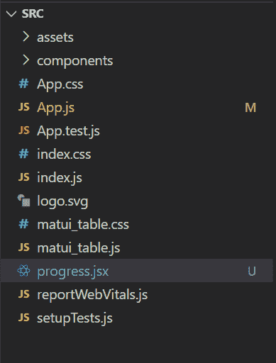
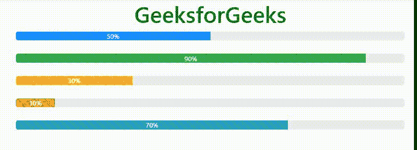

# 如何使用 react-bootstrap 创建动画进度条？

> 原文:[https://www . geesforgeks . org/如何创建-动画-进度条-使用-反应-引导/](https://www.geeksforgeeks.org/how-to-create-animated-progress-bar-using-react-bootstrap/)

进度条用于显示计算机上进程的进度。进度条显示流程完成了多少，还剩下多少。您可以使用在网页上添加进度条

*   来自“反应-引导/进度栏”的进度栏
*   预定义的引导类。：

在本文中，我们将学习使用 Bootstrap 类在 react 中构建一个进度条

**创建反应步骤:**要构建反应应用程序，请执行以下步骤:

**步骤 1:** 使用以下命令创建一个 react 应用程序

```jsx
npx create-react-app foldername
```

**步骤 2:** 完成后，使用以下命令将目录更改为新创建的应用程序

```jsx
cd foldername
```

**步骤 3:** 安装引导依赖项

```jsx
npm install bootstrap
```

**运行应用程序的步骤:**输入以下命令运行应用程序。

```jsx
npm start
```

**项目结构:**



## App.js

```jsx
import Progress from "./Progress";
function App() {
return (
    <div className="App">
      <Progress />
    </div>
  );
}

export default App;
```

## Progress.jsx

```jsx
import React from "react";
import ProgressBar from 'react-bootstrap/ProgressBar'
function Progress() {
    return (
        <div>
            <h1 style={{ color: 'green' }}>
                <center>GeeksforGeeks</center>
            </h1>

            <div class="container">
            <div className="progress-bar bg-primary
                            progress-bar-striped
                            progress-bar-animated"
                            style={{width:'50%'}}>50%</div>
            <br></br>
            <div className="progress-bar bg-success
                            progress-bar-striped 
                            progress-bar-animated" 
                            style={{width:'90%'}}>90%</div>
            <br></br>
            <div className="progress-bar bg-warning 
                            progress-bar-striped
                            progress-bar-animated" 
                            style={{width:'30%'}}>30%</div>
            <br></br>
            <div className="progress-bar bg-danger
                            progress-bar-striped 
                            progress-bar-animated"
                            style={{width:'10%'}}>10%</div>
            <br></br>
            <div className="progress-bar bg-info 
                            progress-bar-striped 
                            progress-bar-animated" 
                            style={{width:'70%'}}>70%</div>
            </div>     
        </div>
    )
}

export default Progress;
```

**输出:**

