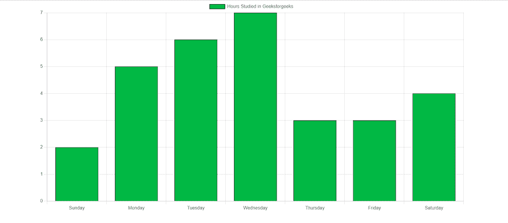

# 如何使用 React Bootstrap 创建条形图？

> 原文:[https://www . geesforgeks . org/如何创建条形图-使用-反应-引导/](https://www.geeksforgeeks.org/how-to-create-bar-chart-using-react-bootstrap/)

条形图或条形图是一种用矩形条表示数据类别的图形，矩形条的长度和高度与它们所表示的值成比例。条形图可以水平或垂直绘制。条形图描述了离散类别之间的比较。图中的一个轴代表被比较的特定类别，而另一个轴代表对应于这些类别的测量值。

**创建反应应用程序并安装模块:**

*   **步骤 1:** 使用以下命令创建一个 React 应用程序。

    ```jsx
    npx create-react-app foldername
    ```

*   **步骤 2:** 创建项目文件夹(即文件夹名)后，使用以下命令移动到该文件夹。

    ```jsx
    cd foldername
    ```

*   **步骤 3:** 创建 ReactJS 应用程序后，使用以下命令安装所需的模块。

    ```jsx
    npm install --save mdbreact react-chartjs-2
    ```

*   **第四步:**在 index.js 中添加 Bootstrap CSS 和 fontawesome CSS。

    ```jsx
    import '@fortawesome/fontawesome-free/css/all.min.css';  
    import 'bootstrap-css-only/css/bootstrap.min.css';  
    import 'mdbreact/dist/css/mdb.css';
    ```

**项目结构:**如下图。


项目结构

**示例:**现在在 **App.js** 文件中写下以下代码。在这里，App 是我们编写代码的默认组件。

## java 描述语言

```jsx
import React from "react";
import { MDBContainer } from "mdbreact";
import { Bar } from "react-chartjs-2";

const App = () => {

  // Sample data
  const data = {
    labels: ["Sunday", "Monday", "Tuesday",
      "Wednesday", "Thursday", "Friday", "Saturday"],
    datasets: [
      {
        label: "Hours Studied in Geeksforgeeks",
        data: [2, 5, 6, 7, 3, 3, 4],
        backgroundColor: "#02b844",
        borderWidth: 1,
        borderColor: "#000000",
      }
    ]
  }

  return (
    <MDBContainer>
      <Bar data={data}
        style={{ maxHeight: '600px' }}
      />
    </MDBContainer>
  );
}

export default App;
```

**运行应用程序的步骤:**从项目的根目录使用以下命令运行应用程序:

```jsx
npm start
```

**输出:**现在打开浏览器，转到***http://localhost:3000/***，会看到如下输出:

