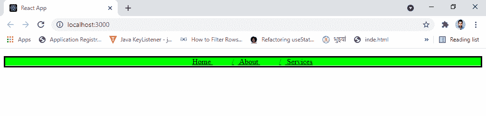

# 如何在 React with Plain CSS 中创建面包屑组件？

> 原文:[https://www . geesforgeks . org/how-create-bread-in-component-react-in-plain-CSS/](https://www.geeksforgeeks.org/how-to-create-breadcrumb-component-in-react-with-plain-css/)

在 ReactJS 中，我们可以用普通 CSS 轻松创建一个面包屑组件。因为我们只需要用 JSX 代码创建一个新的组件来获得面包屑的基本 HTML 代码，然后我们必须应用 CSS 效果来进行一些更改并使其外观最佳。

ReactJS 是一个基于组件的 web 框架，用于在 Frontend 中制作可重用的组件。**面包屑**用来给出一个高级的 Navbar，我们可以在 Frontend 中使用它来使遍历我们的网站具有交互性。

**方法:**要制作面包屑，我们需要的基本 CSS 如下所示。

*   **步骤 1:** 制作一个要包含在导航栏面包屑中的项目的内嵌列表。其代码如下:

    ```jsx
    li {
       display:inline;
       padding: 10px 16px;  
       text-decoration:underline;
    } 
    ```

    填充用于在导航栏中的项目之间留出一些间隙，文本装饰用于使文本显示为带下划线。

*   **第二步:**通过添加一些字符来分隔列表项，如斜线或逗号等，从而对面包屑进行样式化。为此，我们必须在 CSS 中使用如下所示的(::before):

    ```jsx
    li,li:before {
       padding: 8px;
       color: black;
       content:"/";
     }
    ```

*   **第三步:**我们还可以设置背景颜色和边框，让我们的面包屑看起来很好看。

**创建反应应用程序并安装模块:**

*   **步骤 1:** 使用以下命令创建一个反应应用程序:

    ```jsx
    npx create-react-app GFGHosting
    ```

*   **第 2 步:**创建项目文件夹后，即**后，**使用以下命令移动到该文件夹:

    ```jsx
    cd GFGHosting
    ```

**项目结构:**如下图。


项目结构

**示例:**现在在 **App.js** 文件中写下以下代码。在这里，App 是我们编写代码的默认组件。

## App.js

```jsx
import React from 'react'

function App() {
  return (
    <div className="App">
      <nav>
        <ol>
          <li> Home </li>
          <li> About </li>
          <li> Services</li>
        </ol>
      </nav>
    </div>
  );
}

export default App;
```

## index.css

```jsx
ol{
   text-align : center;
   border:solid;
 }

   li{
   display: inline;
   padding: 10px 16px;  
   text-decoration:underline;
 }  

   li+li:before {
   padding: 8px;
   color: black;
   content:"/";
 }

   nav{
   background-color:lime;
   height : 20px;
   width : 100%;  
 }
```

**运行应用程序的步骤:**从项目的根目录使用以下命令运行应用程序:

```jsx
npm start
```

**输出:**现在打开浏览器，转到***http://localhost:3000/***，会看到如下输出:



面包屑被创建